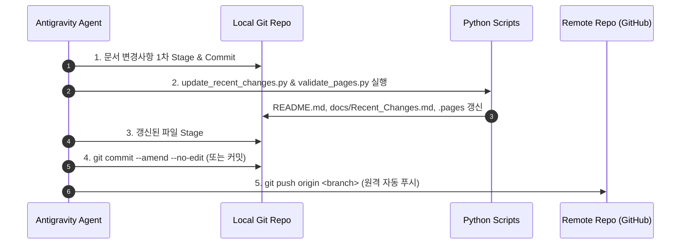

# Git Workflow & Automation Skill Guide

이 스킬은 Git 형상 관리, 한글 Conventional Commits 작성 표준, 문서 자동 동기화 및 안전한 원격 저장소 푸시 절차를 정의합니다.

---

## 1. Conventional Commits 한글 작성 표준

모든 커밋 메시지는 간결하고 명확한 한글로 작성하며, 아래 Prefix 규칙을 준수합니다.

| Type | 설명 | 예시 |
| :--- | :--- | :--- |
| `docs:` | 문서 생성, 수정, 번역 및 가이드라인 갱신 | `docs: Antigravity CLI 스킬 설치 및 설정 가이드 추가` |
| `feat:` | 새로운 기능, 툴, 스크립트 추가 | `feat: 새로운 문서 자동 백업 스크립트 추가` |
| `fix:` | 버그 수정, 오탈자, 깨진 링크, 오류 패치 | `fix: .pages 네비게이션 경로 오탈자 수정` |
| `refactor:` | 코드 구조 개선, 디렉터리 정리 (기능 변경 없음) | `refactor: Infrastructure 문서 카테고리 구조 재정리` |
| `chore:` | 빌드 설정, 의존성 패키지(`requirements.txt`), 환경 설정 수정 | `chore: mkdocs-material 플러그인 의존성 추가` |

### 📌 커밋 메시지 규칙
- 제목은 50자 이내, 명령조(명사형/동사 원형)로 간결하게 작성
- 본문이 필요한 경우 변경 이유(Why)와 주요 내용(What)을 bullet point로 명시

---

## 2. 문서 변경 시 표준 5단계 동기화 및 푸시 절차 (Strict Sequence)

문서(`docs/` 하위 마크다운 파일) 변경 작업이 발생하면 **반드시 다음 순서를 엄격히 준수**하여 실행합니다.



### 상세 실행 명령어

1. **1단계: 문서 변경 사항 1차 커밋**
   ```bash
   git add docs/
   git commit -m "docs: <작업 내용 요약>"
   ```

2. **2단계: 최근 변경 이력 갱신 및 .pages 유효성 검증 스크립트 실행**
   ```bash
   python3 scripts/update_recent_changes.py && python3 scripts/validate_pages.py
   ```

3. **3단계: 자동 갱신된 인덱스 파일 스테이징**
   ```bash
   git add README.md docs/Recent_Changes.md docs/**/.pages
   ```

4. **4단계: 커밋에 포함 (Amend 또는 신규 커밋)**
   ```bash
   git commit --amend --no-edit
   ```

5. **5단계: 원격 저장소 자동 푸시**
   ```bash
   git push origin main
   ```

---

## 3. Git 안전 수칙 및 체크리스트

1. **민감 정보 노출 방지**:
   - API Key, 비밀번호, 토큰, `.env` 파일이 커밋에 포함되지 않도록 `.gitignore` 상태 항상 점검
2. **깨끗한 작업 트리 유지**:
   - 작업 완료 후 항상 `git status`로 Untracked 파일이나 불필요한 임시 파일이 없는지 확인
3. **충돌(Conflict) 방지**:
   - 작업 시작 전 최신 원격 변경 사항 동기화 (`git pull --rebase origin main`)
