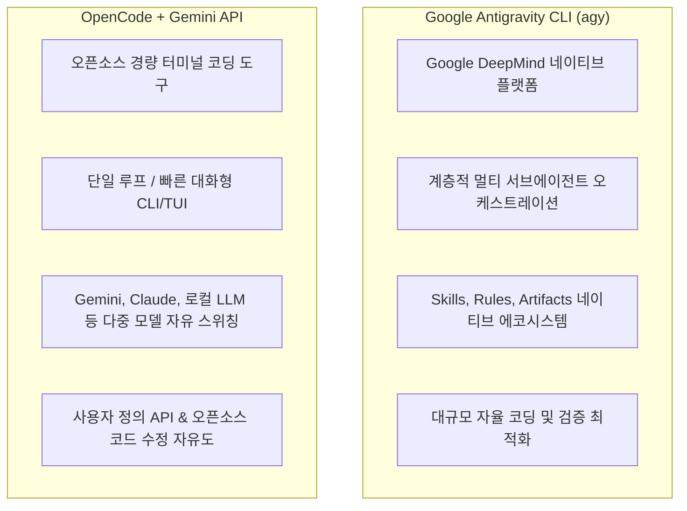

# Antigravity CLI (agy) vs OpenCode (with Gemini) 비교 가이드

AI 기반의 코딩 어시스턴트 및 에이전트 도구 생태계가 발전함에 따라, **Google Antigravity CLI (`agy`)**와 오픈소스 기반의 **OpenCode (+ Google Gemini API)** 간의 선택 기준과 각각의 장단점을 비교 정리합니다.

---

## 1. 개요 및 포지셔닝

- **Antigravity CLI (`agy`)**: Google DeepMind 팀이 설계한 차세대 자율형 AI 에이전트 코딩 플랫폼입니다. 단순한 텍스트 챗봇을 넘어 동적 서브에이전트(Subagents) 생성, 백그라운드 태스크 스케줄링, 프로젝트 룰/스킬 시스템, 리치 아티팩트(Artifacts) 렌더링을 지원하는 **풀스택 에이전트 오케스트레이션 환경**입니다.
- **OpenCode (+ Gemini)**: 터미널 환경에서 빠르고 가볍게 동작하는 **오픈소스 AI 코딩 어시스턴트**입니다. 사용자의 Gemini API Key를 연동하여 코드베이스 검색, 파일 수정, 쉘 명령 실행을 대화형 TUI 인터페이스로 제공하며 언제든 다양한 LLM 백엔드로 교체할 수 있는 유연성을 지닙니다.

---

## 2. 상세 항목별 비교

| 비교 항목 | **Antigravity CLI (`agy`)** | **OpenCode + Gemini** |
| :--- | :--- | :--- |
| **개발 주체 및 라이선스** | Google 공식 에이전트 플랫폼 | 오픈소스 커뮤니티 프로젝트 |
| **에이전트 아키텍처** | **멀티 서브에이전트 (Multi-Subagents)** 계층/병렬 처리 지원 | 기본 **단일 에이전트 (Single Agent)** 대화 루프 |
| **태스크 및 스케줄링** | 백그라운드 태스크 비동기 관리 및 스케줄러 (`/schedule`, `manage_task`) 지원 | 동기식/단일 터미널 세션 중심 |
| **프로젝트 메모리 & 규칙** | `.agent/rules`, `.agent/skills`, 글로벌 메모리 등 구조적 지식 보존 | 설정 파일(`AGENTS.md` / `config.json`) 또는 시스템 프롬프트 |
| **확장성 (Extensibility)** | **Skills**, **MCP Servers**, **Subagent Definitions**, **Artifacts** | 프롬프트 커스텀, 플러그인 및 오픈소스 소스코드 직접 수정 |
| **모델 지원 및 교체** | Gemini 최신 모델(Gemini 3.0/3.7 등) 네이티브 튜닝 및 최적화 | Gemini뿐만 아니라 Claude, OpenAI, 로컬 LLM(Ollama) 등으로 자유 전환 |
| **UI 및 인터랙션** | 터미널 CLI + IDE 연동 + 리치 Markdown/Mermaid/다이얼로그 인터랙션 | 가볍고 빠른 터미널 TUI / 콘솔 인터페이스 |
| **API 키 및 비용 제어** | 공식 통합 환경 (사전 구성된 인프라) | 사용자 자체 Gemini API Key 사용 (할당량/비용 투명한 직접 제어) |

---

## 3. 핵심 기능 심층 분석

### 1) 서브에이전트(Subagents) 및 병렬 오케스트레이션
- **AGY**: 대규모 리팩토링이나 심층 분석 시 메인 에이전트가 리서치 전용 서브에이전트(`research`)나 독립 작업 에이전트를 백그라운드로 스폰하여 여러 작업을 동시에 분할 처리할 수 있습니다.
- **OpenCode**: 사용자와 에이전트 간 1:1 대화 흐름을 유지하며 직관적이고 빠르게 단일 작업을 완수하는 데 최적화되어 있습니다.

### 2) 스킬(Skills) 및 워크플로우 자동화
- **AGY**: `.agents/skills/<name>/SKILL.md` 표준을 통해 프로젝트별 자동화 스크립트(예: Git 커밋/푸시 규칙, 검증 스크립트 선행 실행)를 캡슐화하고 에이전트가 상황에 맞게 능동적으로 활성화합니다.
- **OpenCode**: 주로 프롬프트 지시사항이나 환경 설정을 통해 동작을 제어합니다.

### 3) 모델 유연성 및 자율도
- **OpenCode**: 특정 빅테크 생태계에 락인되지 않고, 작업 성격에 따라 모델을 Gemini $\leftrightarrow$ Claude $\leftrightarrow$ 로컬 DeepSeek 등으로 유연하게 변경할 수 있다는 점이 가장 큰 강점입니다.
- **AGY**: Google Gemini의 최신 추론 역량(Thinking), 대규모 컨텍스트 윈도우, 정확한 도구 호출(Tool Calling)에 완벽히 정렬되어 있어 일관된 고품질 출력을 보장합니다.

---

## 4. 상황별 추천 가이드

### 🚀 Antigravity CLI (`agy`)를 사용하는 것이 더 좋은 경우
1. **복잡한 아키텍처 설계 및 대규모 리팩토링**:
   - 수십 개 이상의 파일을 분석하고 다단계 계획(`/plan`)을 수립하여 순차적/병렬적으로 구현해야 할 때.
2. **프로젝트 컨벤션 및 Git 워크플로우 강제**:
   - 커밋 메시지 규칙, 자동 문서 동기화, 사전 유효성 검사 등 표준화된 스킬(Skills)을 완벽하게 준수해야 할 때.
3. **자율적 장시간 작업 (`/goal`)**:
   - 목표를 달성할 때까지 자율적으로 디버깅, 빌드 테스트, 재시도를 반복 수행하는 심층 작업.

### ⚡ OpenCode (+ Gemini)를 사용하는 것이 더 좋은 경우
1. **가볍고 빠른 터미널 인터랙션**:
   - 단일 스크립트 작성, 특정 함수 디버깅, 빠른 질문-답변 루프를 가벼운 TUI 환경에서 수행하고 싶을 때.
2. **다중 모델 비교 및 로컬 환경 운용**:
   - Gemini와 타사 LLM(Claude 3.7 Sonnet, GPT-4o 등) 또는 로컬 프라이빗 모델(Ollama) 간의 결과를 비교하며 작업해야 할 때.
3. **도구 자체를 커스터마이징**:
   - 오픈소스 기반으로 도구 내부 동작이나 프롬프트를 완전히 제어하고 확장하고 싶을 때.

---

## 5. 결론 및 실무 권장 전략

실제 개발 워크플로우에서는 두 도구를 다음과 같이 조합하여 상호보완적으로 활용하는 것이 효과적입니다:

1. **메인 개발 드라이버**: 복잡한 프로젝트 라이프사이클 관리, 스킬 및 룰 기반 자동화, 대규모 리팩토링에는 **`AGY`**를 주력 에이전트로 활용합니다.
2. **보조/경량 작업**: 가벼운 터미널 작업이나 타 모델(Claude/로컬 LLM) 교차 검증이 필요한 경우 **`OpenCode`**를 보조 도구로 병행합니다.
