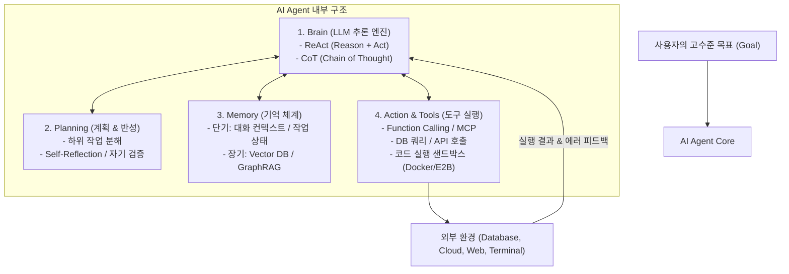

# AI Agent 개발 직군의 의미와 실전 엔지니어링 가이드

최근 IT 채용 시장에서 **'AI Agent 개발자 (AI Agent Engineer / Agentic System Engineer)'**의 채용 수요가 급증하고 있습니다. 이 직군이 기존 AI 연구원이나 일반 백엔드 개발자와 무엇이 다른지, 그리고 실제로 AI 에이전트를 어떻게 개발하는지 그 아키텍처와 기술 스택, 실무 엔지니어링 기법을 정리합니다.

---

## 1. AI Agent 개발 직군의 등장 배경과 의미

### 1.1 챗봇(Chatbot) vs AI Agent의 결정적 차이

기존의 생성형 AI 도입(GenAI 1세대)이 **"질문 $\rightarrow$ 답변"**의 단순 텍스트 생성과 수동적인 RAG에 머물렀다면, **AI Agent(2세대)**는 사람의 지속적인 개입 없이 **스스로 목표를 달성하는 자율 시스템**입니다.

| 구분 | 단순 LLM 챗봇 (Chatbot) | AI Agent (자율 에이전트) |
| :--- | :--- | :--- |
| **동작 방식** | 단일 턴 질의응답 (Input $\rightarrow$ Output) | 목표 지향적 자율 반복 루프 (Goal $\rightarrow$ Loop) |
| **능동성** | 수동적 (사용자의 지시마다 응답) | 능동적 (스스로 세부 작업을 분해하고 계획 수립) |
| **행동 반경** | 텍스트 생성에 국한 | **외부 도구(API, DB, 웹 브라우저, 쉘) 직접 조작** |
| **오류 복구** | 잘못된 답변 시 사용자가 다시 질문해야 함 | **실행 실패 시 에러 로그를 읽고 스스로 코드/계획 수정** |

### 1.2 채용 시장에서 의미하는 바

> [!NOTE]
> AI Agent 개발자는 **"LLM 모델을 밑바닥부터 사전학습(Pre-training)하는 AI 연구원"이 아닙니다.**  
> 상용 및 오픈소스 파운데이션 모델(Claude, GPT, Gemini, LLaMA)을 **두뇌(Reasoning Engine)**로 삼아, 기업의 레거시 시스템, 데이터베이스, API, 샌드박스 실행 환경과 결합하여 **신뢰성 있게 비즈니스 업무를 끝까지 수행하는 소프트웨어 시스템을 구축하는 엔지니어**입니다.

본질적으로 **"고급 백엔드/분산 시스템 엔지니어링 + LLM 오케스트레이션 + 결정론적 가드레일 설계"**의 융합 직군입니다.

---

## 2. AI Agent의 4대 핵심 아키텍처

AI Agent는 크게 4가지 컴포넌트로 구성됩니다.



1. **Brain (추론 엔진)**: 주어진 상태를 분석하고 다음에 취할 행동을 결정하는 거대 언어 모델.
2. **Planning (계획 수립 및 분해)**:
   - 복잡한 문제를 여러 개의 작은 단계(Sub-tasks)로 분해.
   - 실행 결과를 평가하고 실패 시 다른 전략을 세우는 자기 반성(Self-Reflection).
3. **Memory (기억 장치)**:
   - **단기 기억 (Short-term)**: 현재 태스크 진행 상황, 이전 도구 호출 결과, 컨텍스트 윈도우.
   - **장기 기억 (Long-term)**: Vector DB(RAG)를 통한 과거 지식 검색, 사용자 프로필, 세션 히스토리.
4. **Tools & Action (도구 사용)**:
   - 외부 세계와 상호작용하는 수단 (REST API, SQL 실행, 웹 브라우징, 터미널 명령어).
   - 최근에는 Anthropic 주도의 **MCP (Model Context Protocol)** 표준이 적극 채택되고 있습니다.

---

## 3. AI Agent 개발은 실제로 어떻게 하는가?

실무에서 AI Agent를 프로덕션 레벨로 개발하는 4단계 프로세스입니다.

### 1단계: 에이전트 패턴(Agentic Patterns) 설계

에이전트에게 무작정 "알아서 해"라고 맡기면 무한 루프나 환각(Hallucination)에 빠집니다. 엄격한 흐름 제어가 필요합니다.

1. **ReAct 패턴 (Reasoning + Acting)**: "생각(Thought) $\rightarrow$ 행동(Action) $\rightarrow$ 관찰(Observation)"을 반복하는 가장 기본적인 루프.
2. **Plan-and-Execute**: 먼저 전체 계획서(Plan)를 작성한 뒤, 각 스텝을 순차적으로 실행하고 필요 시 계획을 동적으로 재조정.
3. **Multi-Agent 오케스트레이션**: 한 에이전트가 모든 것을 하지 않고 역할을 분리:
   - **기획자 (Planner)**: 작업 지시 및 분해
   - **실행자 (Worker/Coder)**: 특정 도구 실행 및 작업 구현
   - **평가자 (Critic/Evaluator)**: 결과물이 요구사항을 충족했는지 검증 (통과 못 하면 Worker에게 반려)
4. **Human-in-the-Loop (HITL)**: 결제, DB 삭제, 메일 발송 등 위험한 작업 실행 직전에 사람의 최종 승인을 받는 브레이크포인트 삽입.

---

### 2단계: 핵심 기술 스택 선정

| 영역 | 주요 프레임워크 및 도구 | 실무 특징 |
| :--- | :--- | :--- |
| **에이전트 오케스트레이션** | **LangGraph**, LlamaIndex Workflows, CrewAI, AutoGen | **LangGraph**가 상태 머신(StateGraph), 순환 루프 제어, 영속성(Persistence) 지원으로 프로덕션 표준으로 가장 선호됨 |
| **도구 및 인터페이스** | **MCP (Model Context Protocol)**, OpenAI Function Calling, Pydantic | 도구 입출력을 `Pydantic`으로 엄격하게 검증하여 타입 안정성 확보 |
| **코드 실행 격리 (Sandbox)** | **E2B Sandbox**, Docker Container, Firecracker | 에이전트가 생성한 Python/Bash 코드를 호스트 시스템과 분리된 안전한 격리 컨테이너에서 실행 |
| **지식 검색 (RAG)** | Qdrant, Pinecone, Milvus, GraphRAG, Hybrid Search | 단순 벡터 검색을 넘어 키워드(BM25) + 벡터 하이브리드 검색 및 Reranker 결합 |
| **구조화된 출력** | Instructor, Outlines, LangChain Structured Outputs | LLM 응답을 무조건 파싱 가능한 JSON/Schema로 강제 |

---

### 3단계: 프로덕션 신뢰성 엔지니어링 (가장 핵심적인 채용 평가 요소)

채용 시장에서 "장난감 챗봇"과 "시니어 에이전트 엔지니어"를 가르는 핵심은 **비결정론적인 LLM을 결정론적인 비즈니스 로직으로 감싸 통제할 수 있는가**입니다.

1. **토큰 예산 및 루프 가드레일**:
   - 에이전트가 실패를 거듭하며 무한 루프를 돌지 않도록 최대 반복 횟수(`max_iterations=10`) 및 토큰 예산 강제.
2. **에러 핸들링과 Self-Healing**:
   - 도구 호출(API, SQL)에서 에러가 발생했을 때 에러 메시지를 다시 LLM 프롬프트에 주입하여 자가 수정 유도.
3. **상태 관리 및 타임트래블 (Checkpointer)**:
   - LangGraph의 Checkpointer(Redis, PostgreSQL)를 활용해 대화 중간 상태를 영속화하고, 오류 발생 시 이전 체크포인트로 롤백.
4. **보안 가드레일 (Prompt Injection 방어)**:
   - 외부 웹 검색 데이터나 사용자 입력에 숨겨진 프롬프트 주입 공격을 무력화하기 위한 시스템 프롬프트 격리 및 출력 검증.

---

### 4단계: 평가(Eval)와 관찰 가능성(Observability)

에이전트는 디버깅이 매우 어렵기 때문에 모니터링 파이프라인이 필수적입니다.

- **트레이싱 (Tracing)**: **LangSmith**, **Langfuse**, **Arize Phoenix**를 연동하여 에이전트가 어떤 생각(Thought)을 거쳐 어떤 Tool을 호출했고 비용이 얼마나 들었는지 단계별 실행 궤적(Trajectory)을 시각화.
- **LLM-as-a-Judge**: 에이전트의 최종 산출물이 사용자의 요구사항을 만족했는지 상위 모델(예: Claude 3.5 Sonnet / GPT-4o)을 심사위원으로 두어 자동 정량 평가 파이프라인 구축.

---

## 4. 실전 코드 예시 (LangGraph 기반 Tool-Calling Agent 흐름)

```python
from typing import Annotated, TypedDict
from langchain_anthropic import ChatAnthropic
from langgraph.graph import StateGraph, START, END
from langgraph.prebuilt import ToolNode
from langchain_core.tools import tool

# 1. State 정의
class AgentState(TypedDict):
    messages: list

# 2. 도구 정의
@tool
def query_database(sql: str) -> str:
    """SQL 쿼리를 실행하여 데이터베이스 결과를 반환합니다."""
    # 실제 DB 실행 로직
    return f"Result for: {sql}"

tools = [query_database]
model = ChatAnthropic(model="claude-3-5-sonnet-20241022").bind_tools(tools)

# 3. 노드 함수 정의
def call_model(state: AgentState):
    response = model.invoke(state["messages"])
    return {"messages": state["messages"] + [response]}

def should_continue(state: AgentState):
    last_message = state["messages"][-1]
    # LLM이 도구 호출을 요청했으면 tool 노드로, 아니면 종료
    if last_message.tool_calls:
        return "tools"
    return END

# 4. StateGraph 워크플로우 구성 (루프 형성)
workflow = StateGraph(AgentState)
workflow.add_node("agent", call_model)
workflow.add_node("tools", ToolNode(tools))

workflow.add_edge(START, "agent")
workflow.add_conditional_edges("agent", should_continue, ["tools", END])
workflow.add_edge("tools", "agent")  # 도구 실행 결과를 들고 다시 agent로 복귀 (반복 루프)

app = workflow.compile()
```

---

## 5. 채용 시장에서 요구하는 인재상 및 필수 역량 요약

1. **소프트웨어 엔지니어링 기본기 (Python/TypeScript, 비동기 프로그래밍, 분산 아키텍처)**
2. **상태 머신(State Machine) 및 그래프 기반 워크플로우 설계 능력 (LangGraph 등)**
3. **외부 프로토콜 연동 및 샌드박스 격리 지식 (MCP, Docker, OpenAPI)**
4. **결정론적 가드레일 (환각 통제, Pydantic 검증, 예산/루프 제한)**
5. **Observability & Eval 파이프라인 구축 경험 (LangSmith, Langfuse, 자동 평가)**

---

## 🔗 관련 문서

- [MCP (Model Context Protocol) 서버 개발 가이드](MCP_Server_Development_Guide.md)
- [AI 코딩 에이전트 오케스트레이터 (Orca & Paseo)](AI_Coding_Agent_Orchestrators_Orca_Paseo.md)
- [Antigravity CLI 스킬 및 확장 가이드](Antigravity_CLI_Skills_Guide.md)
