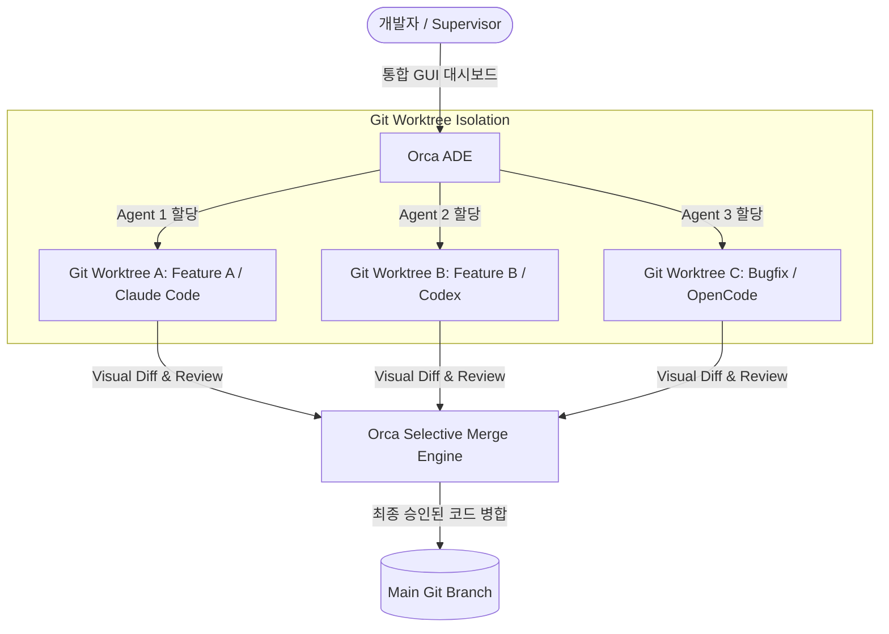
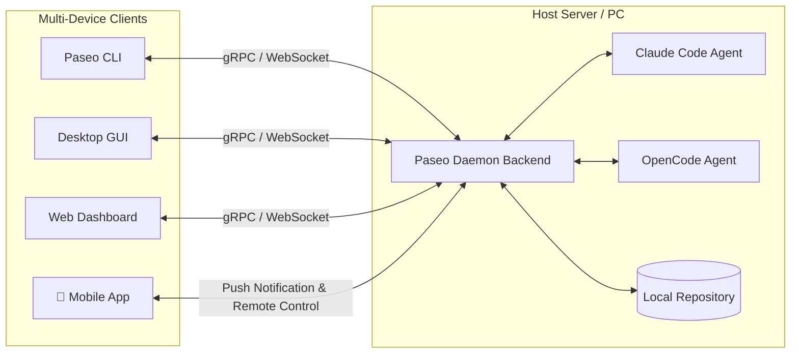
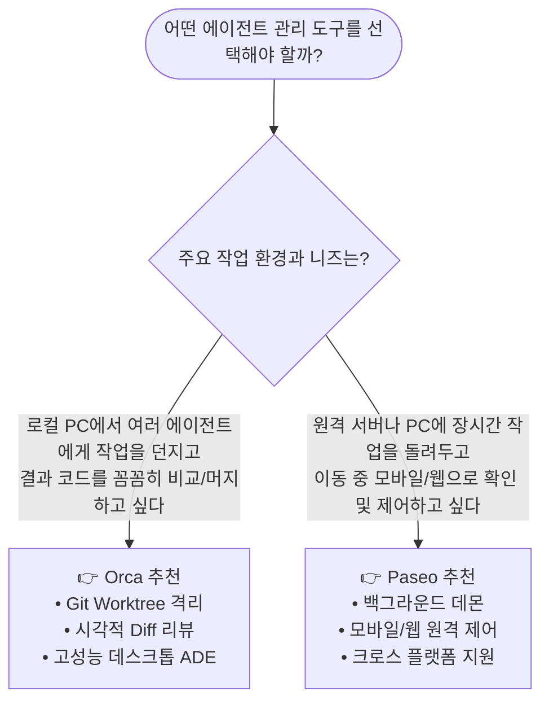
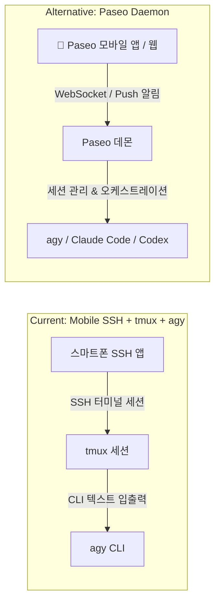
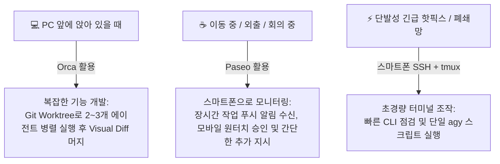

# AI 코딩 에이전트 오케스트레이터: Orca vs Paseo

최근 Claude Code, OpenAI Codex, OpenCode, Aider 등 자율형 AI 코딩 에이전트(Autonomous AI Coding Agents)가 발전함에 따라, 단일 에이전트 조작을 넘어 **여러 에이전트를 동시에 병렬로 실행하고 조율하는 오케스트레이터(Orchestrator) / 에이전트 개발 환경(ADE)**이 필수 도구로 부상하고 있습니다.

이 분야의 대표적인 양대 도구인 **Orca**와 **Paseo**의 아키텍처, 핵심 기능, 차이점 및 선택 가이드를 정리합니다.

---

## 1. 등장 배경: 왜 에이전트 오케스트레이터가 필요한가?

단일 터미널에서 AI 에이전트를 실행할 때 다음과 같은 실무적 한계가 발생합니다:

1. **파일 덮어쓰기 충돌(Race Condition)**: 같은 디렉토리에서 여러 에이전트를 동시에 실행하면 서로의 코드를 덮어써서 충돌이 발생합니다.
2. **컨텍스트 및 토큰 한계**: 하나의 에이전트 세션에 너무 많은 작업을 몰아주면 컨텍스트 윈도우가 오염되고 성능이 저하됩니다.
3. **작업 가시성 부족**: 여러 터미널 창을 띄워두면 어떤 에이전트가 어떤 브랜치에서 무엇을 수정하고 있는지 추적하기 어렵습니다.
4. **원격 모니터링 한계**: 장시간 실행되는 대규모 리팩토링이나 빌드/테스트 작업을 외출 중이나 모바일에서 확인하고 지시하기 어렵습니다.

이를 해결하기 위해 에이전트 격리 실행, 시각적 Diff 병합, 원격 제어를 전담하는 도구가 등장했습니다.

---

## 2. Orca (Agent Development Environment - ADE)

**Orca**(Stably AI 개발)는 여러 AI 코딩 에이전트를 한 화면에서 시각적으로 지휘하는 **데스크톱 중심의 에이전트 개발 환경(ADE, Agent Development Environment)**입니다.

### 💡 Orca의 핵심 특징

1. **Git Worktree 기반의 완벽한 작업 격리**:
   * 각 에이전트에게 독립된 Git Worktree(임시 브랜치)를 자동 생성하여 배정합니다.
   * 여러 에이전트가 동시에 실행되어도 파일 충돌이 원천적으로 발생하지 않습니다.
2. **Review-First & Selective Merge (선별적 코드 병합)**:
   * 에이전트들이 생성한 결과물의 Diff를 시각적으로 나란히 비교할 수 있습니다.
   * 여러 에이전트에게 동일한 문제 해결을 시킨 후(경쟁 모드), 가장 우수한 코드나 특정 파일만 골라서 메인 브랜치에 병합할 수 있습니다.
3. **통합 개발자 도구 (Fleet Command Center)**:
   * 터미널, 내장 브라우저, GitHub/Linear 이슈 트래커가 하나의 데스크톱 앱 내에 통합되어 있어 에이전트 감독관(Supervisor) 역할을 수행하기에 최적화되어 있습니다.
4. **토큰 및 비용 가시성**:
   * 에이전트별 실시간 토큰 소비량과 실행 비용을 대시보드에서 직관적으로 모니터링합니다.

---

## 3. Paseo (Self-Hosted Control Plane)

**Paseo**는 로컬 PC나 원격 서버에 **데몬(Daemon)**을 상주시킨 후, 어디서든(Desktop, Web, Mobile, CLI) 에이전트를 모니터링하고 제어할 수 있는 **셀프 호스팅 에이전트 제어 플레인(Control Plane)**입니다.

### 💡 Paseo의 핵심 특징

1. **완벽한 멀티 디바이스 패리티 (Cross-Platform)**:
   * 데스크톱뿐만 아니라 **모바일(스마트폰), 웹 브라우저, CLI** 모두에서 동일한 에이전트 세션에 접속할 수 있습니다.
   * 이동 중이거나 자리를 비운 상태에서도 스마트폰으로 에이전트의 진행 상황을 확인하고, 추가 프롬프트를 입력하거나 권한 승인(Approval)을 내릴 수 있습니다.
2. **데몬(Daemon) 기반 백그라운드 지속 실행**:
   * 클라이언트를 종료하거나 네트워크가 끊겨도 호스트 머신의 Paseo 데몬에서 에이전트 작업이 중단 없이 계속 실행됩니다.
3. **원격 호스팅 최적화**:
   * 강력한 GPU 서버나 클라우드 VM에 데몬을 띄워두고 로컬 노트북이나 태블릿에서 가볍게 접속하여 작업하는 환경에 매우 유리합니다.
4. **에이전트 오케스트레이션 및 작업 인계(Handoff)**:
   * 특정 에이전트가 완료한 작업 결과를 다른 모델/에이전트에게 전달하여 후속 작업을 이어가게 하는 유연한 파이프라인을 구성할 수 있습니다.

---

## 4. Orca vs Paseo 종합 비교 분석

| 비교 항목 | **Orca (오르카)** | **Paseo (파세오)** |
| :--- | :--- | :--- |
| **아키텍처 성격** | **ADE (Agent Development Environment)** 시각적 작업 및 코드 리뷰 중심 | **Control Plane (제어 플레인)** 백그라운드 데몬 및 원격 제어 중심 |
| **핵심 강점** | • Git Worktree 기반 충돌 방지 • 다중 에이전트 결과 시각적 비교/선별 머지 • 통합 IDE형 대시보드 | • 모바일/웹/CLI 어디서나 접속 가능 • 원격 서버 데몬 실행 및 백그라운드 유지 • 비동기 알림 및 원격 승인 |
| **지원 플랫폼** | 데스크톱 앱 (macOS, Linux, Windows) | 데스크톱, Web, Mobile (iOS/Android), CLI |
| **에이전트 격리** | Git Worktree 기반 자동 브랜치 격리 | 세션/프로세스 단위 백그라운드 관리 |
| **코드 병합 방식** | GUI 기반 Visual Diff 및 인터랙티브 Merge | CLI / Git 표준 명령어 또는 연동 도구 활용 |
| **호스팅 방식** | 로컬 데스크톱 애플리케이션 | 호스트 머신 데몬 + 다중 클라이언트 접속 |

---

## 5. 상황별 추천 및 선택 가이드

* **Orca를 선택해야 하는 경우**:
  * 여러 AI 에이전트(Claude Code, Codex 등)에게 동일한 기능 구현을 시키고 최적의 코드를 고르고 싶을 때
  * Git 브랜치/Worktree가 복잡하게 얽히는 것을 방지하고 시각적으로 충돌 없이 머지하고 싶을 때
  * 로컬 데스크톱 환경에서 IDE를 보완하는 슈퍼바이저형 워크스페이스가 필요할 때

* **Paseo를 선택해야 하는 경우**:
  * 원격 개발 서버(EC2, 사내 고성능 워크스테이션)에 에이전트를 띄워두고 작업할 때
  * 에이전트에게 수십 분~수 시간 걸리는 대형 작업을 맡겨두고 외출하여 스마트폰으로 모니터링/승인하고 싶을 때
  * 터미널 CLI와 웹, 모바일 등 다양한 기기 간에 매끄러운 세션 전환이 필요할 때

---

## 6. 실전 비교: 스마트폰 SSH + tmux + agy vs Paseo 도입 분석

현재 스마트폰의 SSH 앱(Termius, JuiceSSH 등)으로 서버에 접속하여 `tmux` 환경에서 `agy`(Antigravity CLI)를 구동하는 방식과 **Paseo** 도입 시의 차이점을 5가지 핵심 관점에서 분석합니다.

### 1) 5가지 핵심 관점 비교

| 관점 | 기존 방식 (`스마트폰 SSH + tmux + agy`) | `Paseo` 도입 시 | 실무 체감 차이 |
| :--- | :--- | :--- | :--- |
| **📱 모바일 터치 UX & 조작성** | • 모바일 가상 키보드로 긴 프롬프트 입력 불편 • `Ctrl+B`, 방향키 등 터미널 특수키 조작 번거로움 | • 모바일 최적화 UI (채팅형 입력창) • 도구 실행 승인(Approval) 시 **원터치 버튼** 제공 | **Paseo 압승**: 스마트폰에서의 조작 피로도가 획기적으로 감소 |
| **🔔 작업 완료 인지 (알림)** | • 백그라운드 작업 완료 여부를 모름 • 주기적으로 SSH에 재접속해 확인해야 함 (Polling) | • 에이전트가 작업 완료하거나 질문 시 **스마트폰 푸시 알림(Notification)** 발송 | **Paseo 압승**: 폰을 켜두고 대기할 필요 없이 알림 왔을 때만 확인 가능 |
| **📄 코드 Diff 및 결과 가독성** | • 작은 모바일 터미널 화면에서 ANSI 텍스트 Diff를 스크롤하며 읽기 매우 어려움 | • 모바일 웹/앱 뷰어에서 **구문 강조(Syntax Highlighting)** 및 깔끔한 마크다운/Diff 렌더링 | **Paseo 우수**: 모바일에서도 생성된 코드의 품질을 쉽게 검토 가능 |
| **🔀 멀티 세션 / 멀티 에이전트** | • 여러 창 관리 시 tmux window/pane 전환 단축키 반복 입력 필요 | • 좌측 사이드바/탭에서 세션 목록을 터치 한 번으로 손쉽게 전환 | **Paseo 우수**: 2개 이상의 에이전트를 동시 감시할 때 유리 |
| **🛠️ 인프라 및 리소스 오버헤드** | • **Zero Setup**: 추가 서버 프로그램 없이 SSH + tmux만으로 즉시 구동 | • 호스트 서버에 Paseo 데몬 백엔드 설치 및 포트/인증 설정 필요 | **기존 방식 우수**: 순수 CLI가 가볍고 의존성이 없음 |

---

### 2) 언제 어떤 방식을 쓰는 것이 좋을까? (선택 가이드)

#### 🟢 기존 `스마트폰 SSH + tmux + agy` 유지가 좋은 경우
* `agy`를 **자동 승인 모드(Auto-approve / Non-interactive)**로 띄워두고 단순한 1~2개 작업을 실행할 때
* 서버에 별도 웹 데몬이나 외부 포트를 열기 어려운 폐쇄망/제약된 환경일 때
* 텍스트 터미널 조작에 매우 익숙하고 추가 설정 없이 가볍게 쓰고 싶을 때

#### 🔵 `Paseo` 도입을 강력 추천하는 경우
* 모바일에서 에이전트의 **도구 사용 승인(Approval) 및 인터랙티브 질의응답**이 빈번할 때
* 장시간 걸리는 작업(수십 분 단위)을 돌려두고 **외출 중 스마트폰 푸시 알림**을 받아 확인하고 싶을 때
* 스마트폰 작은 화면에서 복잡한 코드 Diff와 결과를 한눈에 확인하고 싶을 때
* 모바일(이동 중)과 PC(사무실) 간에 끊김 없이 동일한 에이전트 세션을 넘나들며 작업하고 싶을 때

---

### 3) 실무 권장: 3단계 하이브리드 워크플로우 예시

실제 프로덕션 개발에서는 상황에 따라 도구를 조합하여 사용하는 것이 가장 효율적입니다.

1. **사무실/PC 앞 (집중 개발)**:
   * **Orca**를 사용하여 복잡한 기능 구현 시 여러 에이전트를 Git Worktree로 격리 실행하고, 시각적 Diff를 보며 최적의 코드를 메인 브랜치로 머지합니다.
2. **외출/출퇴근/이동 중 (모니터링 & 승인)**:
   * 서버에 띄워둔 **Paseo** 데몬을 통해 스마트폰 푸시 알림을 받고, 폰 화면에서 원터치로 도구 실행을 승인하거나 다음 단계 지시를 내립니다.
3. **단순 점검 및 긴급 조치**:
   * 가벼운 단발성 수정은 현재처럼 **스마트폰 SSH + tmux**로 접속하여 빠르게 처리합니다.
