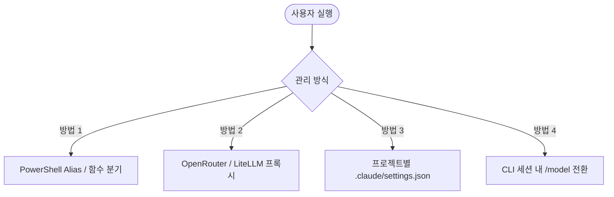

# Claude CLI - 다중 모델(Multi-Model) 및 DeepSeek 연동 가이드 (Windows)

Windows 환경에서 `npm`으로 설치한 **Claude CLI (Claude Code)**를 사용할 때, 단일 모델뿐만 아니라 **DeepSeek, Claude 3.5 Sonnet, GPT-4o, 로컬 Ollama 등 여러 모델을 유연하게 전환하며 사용하는 방법**을 정리합니다.

---

## 1. 다중 모델(Multi-Model) 관리 방식 비교

Claude CLI 환경에서 상황(빠른 질의, 비용 절감, 복잡한 리팩토링, 오프라인 개발 등)에 따라 모델을 다르게 사용할 수 있는 대표적인 4가지 접근 방식입니다.



---

## 2. 방법별 상세 설정 및 사용법

### 방법 1. PowerShell 함수/별칭(Alias) 등록 (가장 추천 ⭐)

Windows PowerShell 프로필(`$PROFILE`)에 각 모델별 실행 함수를 만들어두면, 명령어 하나로 원하는 엔드포인트와 모델을 즉시 호출할 수 있습니다.

#### 1) PowerShell 프로필 편집
```powershell
notepad $PROFILE
```

#### 2) 함수 추가
```powershell
# 1. DeepSeek 전용 실행
function claude-deepseek {
    $env:ANTHROPIC_BASE_URL = "https://api.deepseek.com/v1"
    $env:ANTHROPIC_API_KEY  = "sk-your-deepseek-api-key"
    claude --model deepseek-v4-flash-0731 @args
}

# 2. DeepSeek 추론(R1) 모델 실행
function claude-r1 {
    $env:ANTHROPIC_BASE_URL = "https://api.deepseek.com/v1"
    $env:ANTHROPIC_API_KEY  = "sk-your-deepseek-api-key"
    claude --model deepseek-reasoner @args
}

# 3. 공식 Anthropic Claude (기본)
function claude-sonnet {
    $env:ANTHROPIC_BASE_URL = $null
    $env:ANTHROPIC_API_KEY  = "sk-ant-your-anthropic-key"
    claude --model claude-3-5-sonnet-20241022 @args
}
```

#### 3) 사용 방법
```powershell
# 빠른 초안 및 질의 시
claude-deepseek

# 깊은 논리 추론 및 알고리즘 설계 시
claude-r1

# 복잡한 아키텍처 및 고난도 코딩 시
claude-sonnet
```

---

### 방법 2. 통합 라우터(OpenRouter 또는 LiteLLM) 활용

하나의 엔드포인트에서 모델 식별자 이름만 바꿔 모든 모델을 호출하는 방식입니다.

#### A. OpenRouter 사용 시 (`settings.json`)
OpenRouter API Key 하나로 수백 개의 모델을 즉시 사용할 수 있습니다.

* **`%USERPROFILE%\.claude\settings.json`**:
```json
{
  "env": {
    "ANTHROPIC_BASE_URL": "https://openrouter.ai/api/v1",
    "ANTHROPIC_API_KEY": "sk-or-v1-your-openrouter-key"
  },
  "model": "deepseek/deepseek-v4-flash-0731"
}
```
* 모델 변경 실행:
```powershell
claude --model deepseek/deepseek-chat
claude --model anthropic/claude-3.5-sonnet
claude --model openai/gpt-4o
```

#### B. LiteLLM 로컬 프록시 사용 시
로컬에 LiteLLM 프록시(`litellm --port 4000`)를 띄우고 다양한 프로바이더를 단일 엔드포인트(`http://localhost:4000/v1`)로 묶을 수 있습니다.

```yaml
# litellm_config.yaml
model_list:
  - model_name: deepseek-flash
    litellm_params:
      model: deepseek/deepseek-v4-flash-0731
      api_key: sk-your-deepseek-key
  - model_name: gpt-4o
    litellm_params:
      model: openai/gpt-4o
      api_key: sk-your-openai-key
```

---

### 방법 3. 프로젝트별(Local) `.claude/settings.json` 분리

전역 설정과 프로젝트별 설정을 분리하여, 저장소 특성에 맞게 기본 모델을 다르게 바인딩합니다.

* **전역 설정 (`%USERPROFILE%\.claude\settings.json`)**:
  * 비용이 저렴하고 빠른 `deepseek-v4-flash-0731`을 기본 모델로 설정
* **특정 프로젝트 A (`D:\work\core-engine\.claude\settings.json`)**:
  * 정확도가 최우선인 프로젝트에는 `claude-3-5-sonnet` 설정
* **특정 프로젝트 B (`D:\work\docs-repo\.claude\settings.json`)**:
  * 가벼운 문서 정리용 프로젝트에는 `deepseek-chat` 설정

---

### 방법 4. 대화 세션 내 명령어 전환 (`/model`)

Claude CLI 대화 세션이 실행 중인 상태에서 모델을 변경할 때 사용합니다.

```text
> /model deepseek-v4-flash-0731
Switched model to deepseek-v4-flash-0731
```

---

## 3. 상황별 추천 사용 가이드

| 사용 시나리오 | 권장 모델 | 추천 방식 |
| :--- | :--- | :--- |
| **빠른 질의 / 일상 코딩 / 초안 작성** | `deepseek-v4-flash-0731` / `deepseek-chat` | PowerShell 함수 (`claude-deepseek`) |
| **복잡한 디버깅 / 알고리즘 추론** | `deepseek-reasoner` (R1) | PowerShell 함수 (`claude-r1`) |
| **대규모 리팩토링 / 풀스택 코딩** | `claude-3-5-sonnet-20241022` | 공식 Anthropic API (`claude-sonnet`) |
| **팀 단위 다양한 모델 통합 테스트** | 다중 모델 풀 | OpenRouter 또는 LiteLLM 프록시 |
