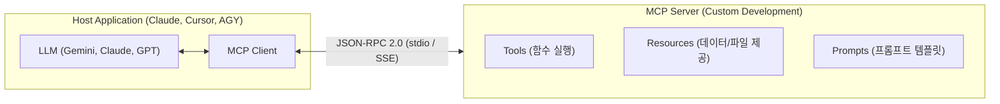

# MCP (Model Context Protocol) 서버 개발 및 연동 가이드

**Model Context Protocol (MCP)**는 LLM(클라이언트)이 외부 도구, 데이터베이스, 로컬 파일 시스템 및 API와 표준화된 방식으로 안전하게 상호작용할 수 있도록 해주는 오픈 프로토콜입니다. 

마치 하드웨어 장치를 연결하는 **"AI 업계의 USB-C 포트"** 역할을 하며, Anthropic, Cursor, Google Antigravity(AGY) 등 다양한 AI 에이전트 도구에서 표준으로 채택하고 있습니다.

---

## 1. MCP 아키텍처 및 핵심 개념



### 1) 3대 핵심 프리미티브 (Primitives)

- **Tools (도구)**: LLM이 특정 작업을 수행하기 위해 호출할 수 있는 실행 가능한 함수(API 요청, DB 쿼리, 계산 등)입니다. 입력 스키마(JSON Schema)와 실행 로직을 정의합니다.
- **Resources (자원)**: LLM이 컨텍스트로 읽을 수 있는 데이터(파일 내용, 데이터베이스 스키마, 로그 등)입니다. REST API의 GET 요청과 유사합니다.
- **Prompts (프롬프트)**: 클라이언트 UI에서 사용자가 호출할 수 있는 재사용 가능한 사전 정의된 프롬프트 템플릿입니다.

### 2) 전송 계층 (Transports)

- **stdio (Standard I/O)**: 가장 널리 사용되는 로컬 통신 방식입니다. 호스트가 서버 프로세스를 자식 프로세스로 띄우고 표준 입출력을 통해 JSON-RPC 메시지를 교환합니다.
- **SSE (Server-Sent Events) / HTTP**: 원격 서버나 마이크로서비스 형태로 호스팅된 MCP 서버와 통신할 때 사용합니다.

---

## 2. Python으로 MCP 서버 만들기 (FastMCP)

Python 환경에서는 공식 MCP SDK의 고수준 추상화 계층인 **`FastMCP`**를 사용하면 데코레이터 기반으로 몇 줄 만에 서버를 구축할 수 있습니다.

### 1) 프로젝트 환경 준비

패키지 관리자로 `uv` 또는 `pip`를 사용합니다.

```bash
# 디렉토리 생성 및 이동
mkdir my-mcp-server && cd my-mcp-server

# 가상환경 생성 및 활성화
python3 -m venv .venv
source .venv/bin/activate

# 공식 MCP 라이브러리 설치
pip install "mcp[cli]" httpx
```

### 2) 서버 코드 작성 (`server.py`)

아래는 날씨 조회 도구(Tool)와 시스템 정보 자원(Resource)을 제공하는 간단한 MCP 서버 예제입니다.

```python
import os
import platform
import httpx
from mcp.server.fastmcp import FastMCP

# 1. FastMCP 서버 인스턴스 생성
mcp = FastMCP("MyAssistantServer")

# 2. Tool 등록: LLM이 호출할 함수 정의 (타입 힌트와 docstring이 LLM의 설명서가 됨)
@mcp.tool()
async def get_weather(city: str) -> str:
    """지정된 도시의 현재 날씨 정보를 조회합니다.
    
    Args:
        city: 도시 이름 (예: Seoul, Tokyo, New York)
    """
    url = f"https://wttr.in/{city}?format=%C+%t"
    async with httpx.AsyncClient() as client:
        response = await client.get(url, timeout=5.0)
        if response.status_code == 200:
            return f"{city}의 현재 날씨: {response.text.strip()}"
        return f"{city}의 날씨 정보를 가져올 수 없습니다. (상태 코드: {response.status_code})"

@mcp.tool()
def calculate_metrics(values: list[float]) -> dict:
    """숫자 리스트의 합계, 평균, 최댓값을 계산합니다."""
    if not values:
        return {"error": "리스트가 비어 있습니다."}
    return {
        "sum": sum(values),
        "average": sum(values) / len(values),
        "max": max(values),
        "min": min(values),
        "count": len(values)
    }

# 3. Resource 등록: LLM이 참조할 수 있는 데이터/파일 URI
@mcp.resource("system://info")
def get_system_info() -> str:
    """호스트 OS 및 시스템 환경 정보를 반환합니다."""
    return f"OS: {platform.system()} {platform.release()}\nArchitecture: {platform.machine()}"

# 4. 서버 실행
if __name__ == "__main__":
    mcp.run(transport="stdio")
```

---

## 3. TypeScript / Node.js로 MCP 서버 만들기

Node.js 환경에서는 공식 `@modelcontextprotocol/sdk`를 사용하여 엄격한 타입 안정성을 가진 서버를 구축합니다.

### 1) 프로젝트 생성 및 패키지 설치

```bash
mkdir my-ts-mcp && cd my-ts-mcp
npm init -y
npm install @modelcontextprotocol/sdk zod
npm install -D typescript @types/node tsx
npx tsc --init
```

### 2) 서버 코드 작성 (`src/index.ts`)

```typescript
import { Server } from "@modelcontextprotocol/sdk/server/index.js";
import { StdioServerTransport } from "@modelcontextprotocol/sdk/server/stdio.js";
import {
  CallToolRequestSchema,
  ListToolsRequestSchema,
} from "@modelcontextprotocol/sdk/types.js";
import { z } from "zod";

// 1. 서버 인스턴스 생성
const server = new Server(
  {
    name: "calculator-mcp",
    version: "1.0.0",
  },
  {
    capabilities: {
      tools: {},
    },
  }
);

// 2. 도구 목록 정의 및 반환
server.setRequestHandler(ListToolsRequestSchema, async () => {
  return {
    tools: [
      {
        name: "add",
        description: "두 개의 숫자를 더합니다.",
        inputSchema: {
          type: "object",
          properties: {
            a: { type: "number", description: "첫 번째 숫자" },
            b: { type: "number", description: "두 번째 숫자" },
          },
          required: ["a", "b"],
        },
      },
    ],
  };
});

// 3. 도구 실행 핸들러
server.setRequestHandler(CallToolRequestSchema, async (request) => {
  if (request.params.name === "add") {
    const { a, b } = request.params.arguments as { a: number; b: number };
    return {
      content: [
        {
          type: "text",
          text: `결과: ${a + b}`,
        },
      ],
    };
  }
  throw new Error(`알 수 없는 도구: ${request.params.name}`);
});

// 4. Stdio 트랜스포트로 구동
async function main() {
  const transport = new StdioServerTransport();
  await server.connect(transport);
  console.error("MCP 서버가 Stdio 모드로 실행되었습니다.");
}

main().catch((err) => {
  console.error("서버 구동 에러:", err);
  process.exit(1);
});
```

---

## 4. MCP 서버 디버깅 및 테스트 (MCP Inspector)

MCP 서버를 AI 클라이언트에 바로 붙이기 전에, Anthropic에서 제공하는 웹 기반 GUI 디버거인 **MCP Inspector**로 사전 테스트할 수 있습니다.

```bash
# Python FastMCP 서버 테스트
npx @modelcontextprotocol/inspector python3 server.py

# TypeScript 서버 테스트
npx @modelcontextprotocol/inspector npx tsx src/index.ts
```

브라우저에서 `http://localhost:5173` 접속 후 등록된 Tool 목록을 확인하고 직접 인수를 넣어 실행 결과를 즉시 검증할 수 있습니다.

---

## 5. AI 클라이언트(호스트)에 연동하기

작성한 MCP 서버를 다양한 클라이언트에 등록하여 사용합니다.

### 1) Antigravity CLI (`agy`) 연동
프로젝트 루트의 설정 파일 또는 글로벌 설정(`~/.gemini/antigravity-cli/config.json`)에 추가합니다:

```json
{
  "mcpServers": {
    "my-assistant": {
      "command": "/절대경로/.venv/bin/python3",
      "args": ["/절대경로/server.py"],
      "env": {
        "API_KEY": "your-key"
      }
    }
  }
}
```

### 2) Claude Desktop 연동

- **macOS**: `~/Library/Application Support/Claude/claude_desktop_config.json`
- **Linux**: `~/.config/Claude/claude_desktop_config.json`
- **Windows**: `%APPDATA%\Claude\claude_desktop_config.json`

```json
{
  "mcpServers": {
    "weather-server": {
      "command": "python3",
      "args": ["/home/user/my-mcp-server/server.py"]
    }
  }
}
```

### 3) Cursor 연동
`Cursor Settings` $\rightarrow$ `Features` $\rightarrow$ `MCP`에서 `+ Add New MCP Server`를 누르고, Type을 `command`로 설정한 뒤 명령어를 입력합니다.

---

## 6. 실무 개발 시 핵심 주의사항 (Best Practices)

### 1) 표준 출력(stdout) 오염 금지 (★ 가장 빈번한 오류)

- `stdio` 트랜스포트 환경에서는 클라이언트와 서버가 `stdout`으로 순수 JSON-RPC 메시지를 주고받습니다.
- 코드 내부에서 `print("디버깅 로그")` 또는 `console.log()`를 실행하면 **JSON-RPC 통신 프레임이 깨져 클라이언트 연결이 끊어집니다**.
- 모든 디버깅 로깅은 반드시 **표준 에러(`stderr`)**를 사용해야 합니다:
  - Python: `sys.stderr.write(...)` 또는 `logging.basicConfig(stream=sys.stderr)`
  - TypeScript: `console.error(...)`

### 2) 명확한 Docstring 및 JSON Schema 작성

- LLM은 함수의 코드 구현이 아니라 **함수명, 설명문(Docstring), 인자 설명(Type Hint / Description)**만을 보고 어떤 도구를 언제 호출할지 판단합니다.
- 언제 써야 하는지, 인자에 어떤 값이 들어가야 하는지 구체적으로 명시할수록 LLM의 도구 선택 정확도가 대폭 향상됩니다.

### 3) 에러 처리와 `isError` 플래그

- 도구 실행 중 에러가 발생했을 때 프로세스 자체를 Crash(`exit(1)`)시키지 마십시오.
- 클라이언트에게 정상 JSON-RPC 응답 내에 `isError: true`와 함께 실패 원인 문자열을 반환해야 LLM이 실패 원인을 인지하고 다른 방식으로 재시도할 수 있습니다.

---

## References

- [Model Context Protocol 공식 문서](https://modelcontextprotocol.io/)
- [Anthropic MCP GitHub 저장소](https://github.com/modelcontextprotocol)
- [FastMCP GitHub & Guide](https://github.com/jlowin/fastmcp)
- [Awesome MCP Servers (오픈소스 서버 모음)](https://github.com/modelcontextprotocol/servers)
