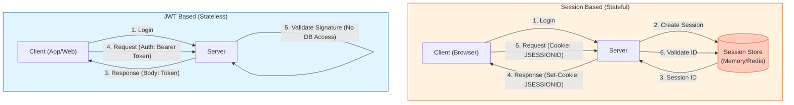

# JWT (JSON Web Token) 및 인증 방식 비교

**JWT(JSON Web Token)**는 당사자 간에 정보를 JSON 객체로 안전하게 전송하기 위한 개방형 표준(RFC 7519)입니다. 주로 **Stateless(무상태)** 인증 방식에 사용됩니다.

이 문서에서는 JWT의 구조뿐만 아니라, 전통적인 **Cookie & Session** 방식과의 차이점을 중심으로 설명합니다.

## 1. 기본 개념: Cookie & Session

웹 HTTP 프로토콜은 본래 **Stateless(무상태)** 프로토콜이므로, 이전 요청자가 누구인지 기억하지 못합니다. 이를 보완하기 위해 쿠키와 세션을 사용합니다.

### 1.1 Cookie (쿠키)
*   **정의:** 클라이언트(브라우저) 로컬에 저장되는 Key-Value 형태의 작은 데이터 파일입니다.
*   **특징:**
    *   서버가 Response 헤더(`Set-Cookie`)에 담아 보내면 브라우저가 저장합니다.
    *   이후 요청 시마다 Request 헤더(`Cookie`)에 자동으로 담겨 서버로 전송됩니다.
    *   보안에 취약할 수 있습니다(탈취, 변조 가능).

### 1.2 Session (세션)
*   **정의:** 민감한 정보는 서버 측에 저장하고, 클라이언트에게는 그 정보에 접근할 수 있는 **식별자(Session ID)**만 쿠키로 부여하는 방식입니다.
*   **특징:**
    *   사용자 정보가 서버 메모리나 DB에 저장되므로 보안성이 쿠키보다 높습니다.
    *   **Stateful:** 서버가 사용자의 상태를 계속 저장하고 있어야 합니다.

---

## 2. JWT (JSON Web Token)

### 2.1 구조 (Structure)
`Header.Payload.Signature` (xxxxx.yyyyy.zzzzz)

1.  **Header:** 토큰 타입(`JWT`)과 해싱 알고리즘(`HS256` 등).
2.  **Payload:** 실제 데이터(Claims). 유저 ID, 유효기간 등. **(암호화되지 않음! 민감 정보 금지)**
3.  **Signature:** 헤더+페이로드+비밀키를 조합한 서명값. (변조 방지)

### 2.2 동작 원리 (Stateless)
서버는 별도의 세션 저장소를 두지 않고, JWT 자체를 검증(Verify)하는 것만으로 사용자를 식별합니다.

### 2.3 내부 동작 상세 (서명 생성 및 검증 예시)

JWT의 핵심은 **서명(Signature)**을 통해 데이터의 무결성을 보장하는 것입니다. 서버는 자신이 가진 `Secret Key`로 서명을 생성하고, 나중에 돌아온 토큰의 서명이 자신이 만든 것과 일치하는지 확인합니다.

#### 1) 토큰 생성 과정 (Signing)

**Step 1: Header & Payload 정의**
```json
// Header
{
  "alg": "HS256",
  "typ": "JWT"
}

// Payload
{
  "sub": "1234567890",
  "name": "John Doe",
  "iat": 1516239022
}
```

**Step 2: Base64Url 인코딩**
JSON을 문자열로 변환 후 Base64Url로 인코딩합니다.
*   Encoded Header = `eyJhbGciOiJIUzI1NiIsInR5cCI6IkpXVCJ9`
*   Encoded Payload = `eyJzdWIiOiIxMjM0NTY3ODkwIiwibmFtZSI6IkpvaG4gRG9lIiwiaWF0IjoxNTE2MjM5MDIyfQ`

**Step 3: Signature 생성**
인코딩된 두 값을 점(`.`)으로 연결하고, 서버의 비밀키(`your-256-bit-secret`)를 사용하여 해싱합니다.

```java
// 슈도 코드 (Pseudo-code)
data = "eyJhbG..." + "." + "eyJzdWI..."; // Header + . + Payload
signature = HMACSHA256(data, "your-256-bit-secret");
encodedSignature = Base64UrlEncode(signature);
```

**Step 4: 최종 JWT 조합**
`Header` + `.` + `Payload` + `.` + `Signature`

#### 2) 토큰 검증 과정 (Verification)

클라이언트로부터 토큰을 받은 서버는 다음 과정을 수행합니다.

1.  토큰을 `.`으로 분리하여 Header와 Payload를 얻습니다.
2.  서버가 가진 **동일한 비밀키**를 사용하여, 받은 Header와 Payload로 서명을 다시 계산해봅니다.
3.  **계산된 서명** == **토큰에 포함된 서명** 인지 확인합니다.
    *   **일치:** 서버가 발급한 토큰이 맞으며, 중간에 내용이 변조되지 않았음이 증명됩니다.
    *   **불일치:** 해커가 Payload를 조작했거나(서명이 달라짐), 비밀키를 모르는 상태에서 위조한 토큰입니다.

---

## 3. JWT vs Session 방식 비교

### 3.1 비교표

| 특징 | Session / Cookie | JWT (Token-based) |
| :--- | :--- | :--- |
| **저장 위치** | 사용자 정보는 **서버**에 저장 (Session ID만 클라이언트에) | 사용자 정보(Payload)가 토큰에 포함되어 **클라이언트**에 저장 |
| **서버 부하** | 사용자 수만큼 서버 메모리/DB 사용량 증가 | 서명 검증 연산(CPU)만 필요, 별도 저장소 불필요 |
| **확장성 (Scale-out)** | 여러 서버 간 세션 동기화(Clustering) 또는 Redis 필요 | **Stateless**하므로 서버를 늘려도 별도 처리가 필요 없음 |
| **보안** | Session ID 탈취 시 위험 (서버에서 강제 만료 가능) | Access Token 탈취 시 위험 (유효기간 만료 전까지 통제 어려움) |
| **데이터 크기** | 작음 (Session ID만 전송) | 큼 (Payload에 정보가 많을수록 커짐) |

### 3.2 아키텍처 비교 다이어그램



## 4. 결론: 언제 무엇을 쓸까?

*   **Session 방식 추천:**
    *   로그인 유저 수가 적거나, 단일 서버 환경인 경우.
    *   보안이 매우 중요하여 즉각적인 강제 로그아웃 기능이 필요한 경우.
*   **JWT 방식 추천:**
    *   **MSA (Microservices Architecture)** 환경 (서버 간 세션 공유가 힘듦).
    *   모바일 앱과 웹을 동시에 지원해야 하는 경우.
    *   서버 확장(Scale-out)이 잦은 대용량 트래픽 서비스.
