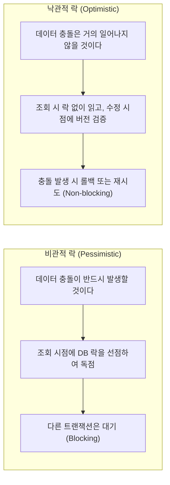
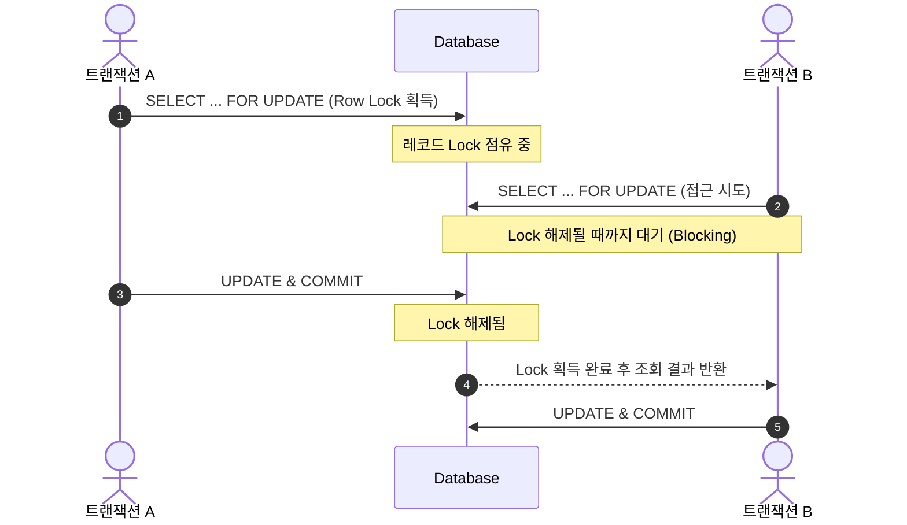
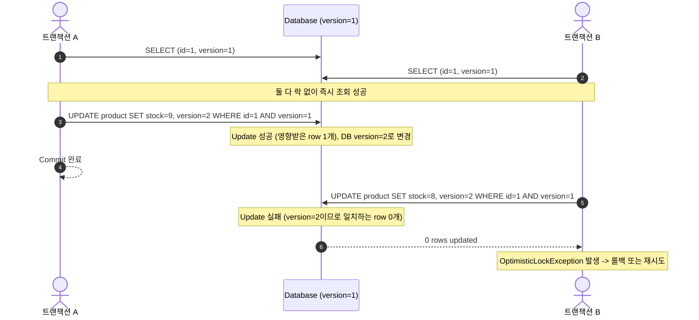
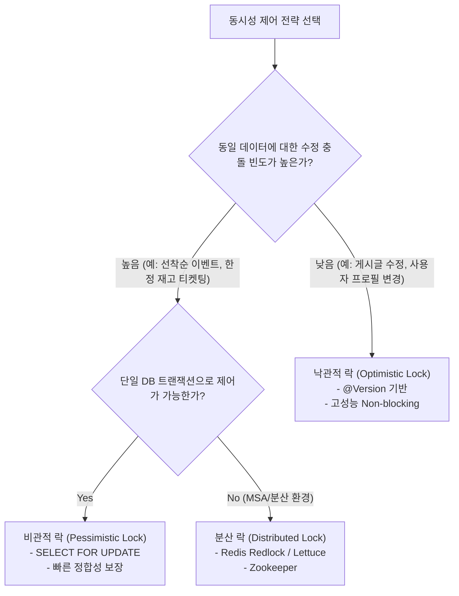

# 비관적 락(Pessimistic Lock) vs 낙관적 락(Optimistic Lock)

데이터베이스 및 멀티스레드/멀티트랜잭션 환경에서 동일한 데이터(레코드)에 동시에 접근하여 수정할 때, **데이터의 일관성과 무결성(Data Integrity)**을 보장하기 위해 사용하는 대표적인 동시성 제어(Concurrency Control) 기법입니다.

---

## 1. 핵심 철학 및 개념 비교



---

## 2. 비관적 락 (Pessimistic Lock)

### 1) 동작 원리
트랜잭션이 데이터를 조회하는 시점에 **데이터베이스 레벨의 락(Lock)**을 획득하여, 해당 트랜잭션이 커밋되거나 롤백될 때까지 다른 트랜잭션이 해당 데이터를 수정하거나(경우에 따라 읽거나) 접근하지 못하도록 차단(Blocking)합니다.



### 2) 주요 유형 및 SQL 구문
- **배타 락 (Exclusive Lock, `FOR UPDATE`)**:
  - 쓰기 및 읽기 락을 모두 차단합니다.
  - 해당 트랜잭션이 완료되기 전까지 다른 트랜잭션은 수정 및 배타적 조회가 불가능합니다.
  ```sql
  -- 데이터 조회 시점에 배타 락 선점
  SELECT id, stock_quantity 
  FROM product 
  WHERE id = 1 
  FOR UPDATE;
  ```
- **공유 락 (Shared Lock, `LOCK IN SHARE MODE` / `FOR SHARE`)**:
  - 다른 트랜잭션이 읽는 것은 허용하지만, 수정(쓰기)하는 것은 차단합니다.

### 3) JPA 적용 예시
```java
public interface ProductRepository extends JpaRepository<Product, Long> {
    
    // 비관적 쓰기 락 (SELECT ... FOR UPDATE 실행)
    @Lock(LockModeType.PESSIMISTIC_WRITE)
    @Query("SELECT p FROM Product p WHERE p.id = :id")
    Optional<Product> findByIdWithPessimisticLock(@Param("id") Long id);
}
```

### 4) 장점과 단점
- **장점**:
  - 충돌이 발생하기 전에 데이터베이스 수준에서 원천 차단하므로 **강력한 정합성과 무결성**이 보장됩니다.
  - 충돌로 인한 롤백 및 재시도 로직을 애플리케이션에서 별도로 구현할 필요가 없습니다.
- **단점 및 주의점**:
  - 락을 획득하기 위해 다른 트랜잭션이 대기하므로 **동시 처리량(Throughput)이 감소**하고 대기 시간이 증가합니다.
  - 트랜잭션 간 상호 자원을 점유한 상태에서 대기할 경우 **데드락(Deadlock)** 위험이 존재합니다.
  - **대응책**: `NOWAIT` 또는 `WAIT timeout` 옵션을 사용하여 무한 대기 및 커넥션 풀 고갈을 방지해야 합니다.
    ```sql
    SELECT * FROM product WHERE id = 1 FOR UPDATE NOWAIT;
    ```

---

## 3. 낙관적 락 (Optimistic Lock)

### 1) 동작 원리
데이터베이스의 물리적인 락 메커니즘을 사용하지 않고, **애플리케이션 레벨에서 버전 관리 컬럼(`version`, `timestamp` 등)을 통해 정합성을 검증**합니다. 데이터를 읽을 때는 락 없이 자유롭게 조회하고, 데이터를 갱신(UPDATE)하는 시점에 읽었던 버전과 현재 DB의 버전이 일치하는지 확인합니다.



### 2) 실제 SQL 동작 메커니즘
```sql
-- 1. 데이터 조회
SELECT id, stock_quantity, version FROM product WHERE id = 1;

-- 2. 비즈니스 로직 수행 후 데이터 갱신 시 버전 조건 추가
UPDATE product 
SET stock_quantity = 9, version = version + 1 
WHERE id = 1 AND version = 1;

-- 3. 갱신된 row 수가 0이면 다른 트랜잭션이 먼저 변경한 것이므로 예외 발생
```

### 3) JPA 적용 예시
엔티티에 `@Version` 어노테이션을 선언하면 JPA가 UPDATE 시 자동으로 버전 검증 쿼리를 생성하고, 충돌 시 `OptimisticLockException`(Spring에서는 `ObjectOptimisticLockingFailureException`)을 던집니다.

```java
@Entity
public class Product {
    @Id
    @GeneratedValue(strategy = GenerationType.IDENTITY)
    private Long id;

    private int stockQuantity;

    @Version
    private Long version; // JPA가 자동으로 관리하는 버전 필드
}
```

```java
@Service
@RequiredArgsConstructor
public class ProductService {
    private final ProductRepository productRepository;

    @Transactional
    public void decreaseStockWithRetry(Long productId, int quantity) {
        int maxRetries = 3;
        while (maxRetries-- > 0) {
            try {
                Product product = productRepository.findById(productId)
                    .orElseThrow(() -> new IllegalArgumentException("상품 없음"));
                product.decreaseStock(quantity);
                return; // 성공 시 종료
            } catch (ObjectOptimisticLockingFailureException e) {
                if (maxRetries == 0) {
                    throw new BusinessException("동시 요청 충돌로 처리에 실패했습니다. 다시 시도해주세요.");
                }
                // 잠시 대기 후 재시도 (Exponential Backoff 등 적용 가능)
                try { Thread.sleep(50); } catch (InterruptedException ignored) {}
            }
        }
    }
}
```

### 4) 장점과 단점
- **장점**:
  - DB 레벨의 물리적 락(Lock)을 걸지 않으므로 트랜잭션 대기(Blocking)가 없어 **동시 읽기/쓰기 성능과 처리량이 우수**합니다.
  - 데드락(Deadlock)이 발생하지 않습니다.
- **단점 및 주의점**:
  - 충돌이 발생하면 트랜잭션이 롤백되거나 애플리케이션에서 **재시도(Retry) 로직**을 직접 처리해야 합니다.
  - 동시 수정 충돌이 빈번하게 발생하는 환경에서는 잦은 롤백과 재시도로 인해 오히려 비관적 락보다 시스템 부하가 커질 수 있습니다.

---

## 4. 비관적 락 vs 낙관적 락 종합 비교

| 비교 항목 | **비관적 락 (Pessimistic Lock)** | **낙관적 락 (Optimistic Lock)** |
| :--- | :--- | :--- |
| **락 획득 시점** | 데이터 조회 시 (`SELECT ... FOR UPDATE`) | 데이터 수정 시 (`UPDATE ... WHERE version = ?`) |
| **제어 주체** | **Database (DBMS)** | **Application (애플리케이션/JPA)** |
| **동작 방식** | Blocking (선점 및 대기) | Non-blocking (충돌 시 사후 처리) |
| **정합성 보장 수준** | 매우 높음 (원천적 충돌 차단) | 높음 (버전 불일치 감지 및 차단) |
| **동시 처리 성능** | 충돌이 적을 때 상대적으로 낮음 | 충돌이 적을 때 매우 높음 |
| **데드락 위험** | **있음** (트랜잭션 대기 큐 형성) | **없음** |
| **충돌 시 비용** | 대기 시간 발생 | 롤백 및 애플리케이션 재시도 오버헤드 |
| **적합한 환경** | 충돌 빈도가 높고 데이터 무결성이 절대적인 경우 | 읽기 비율이 높고 충돌 빈도가 낮은 경우 |

---

## 5. 실무 선택 기준 가이드



1. **낙관적 락(Optimistic Lock)을 선택해야 하는 경우**:
   - 대부분의 엔터프라이즈 CRUD 환경 (게시판, 회원 정보, 주문 내역 등).
   - 트래픽 중 읽기(Read) 비중이 압도적으로 높고 동시 수정(Write) 충돌이 드문 시스템.
   - 사용자에게 "다른 사용자가 먼저 수정했습니다"라는 안내를 보여주는 것이 자연스러운 비즈니스.

2. **비관적 락(Pessimistic Lock)을 선택해야 하는 경우**:
   - 충돌이 매우 빈번하게 발생하는 한정 수량 재고 차감, 포인트/계좌 잔액 이체, 선착순 결제.
   - 롤백 시 비용(외부 결제 API 취소 등)이 커서 사전 차단이 유리한 경우.

3. **분산 시스템(MSA)으로의 확장 고려**:
   - 여러 마이크로서비스 또는 분산 DB 환경에서는 단일 DB의 비관적/낙관적 락만으로 동시성을 제어하기 어려우므로, **Redis(Redisson) 기반 분산 락**이나 메시지 큐(Kafka 순차 파티셔닝)를 함께 검토해야 합니다.

---

## References

- [MySQL 8.0 Reference Manual - Locking Reads](https://dev.mysql.com/doc/refman/8.0/en/innodb-locking-reads.html)
- [Hibernate ORM Guide - Optimistic and Pessimistic Locking](https://docs.jboss.org/hibernate/orm/current/userguide/html_single/Hibernate_User_Guide.html#locking)
- [Martin Fowler - Patterns of Enterprise Application Architecture (Optimistic/Pessimistic Offline Lock)](https://martinfowler.com/eaaCatalog/optimisticOfflineLock.html)
