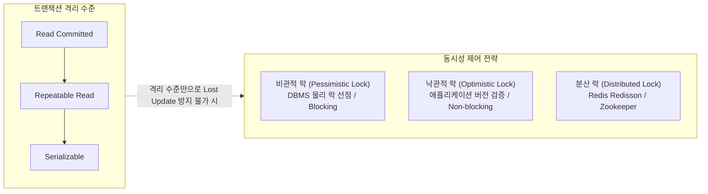
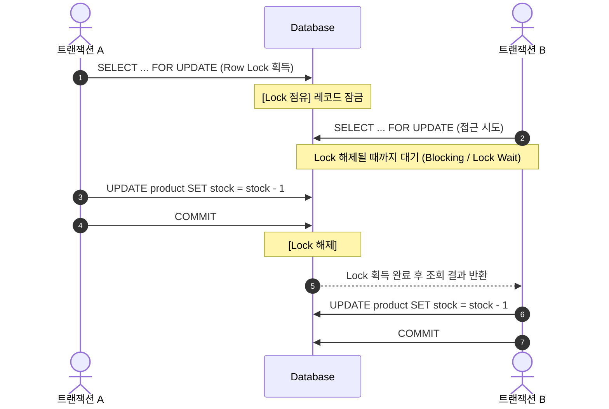
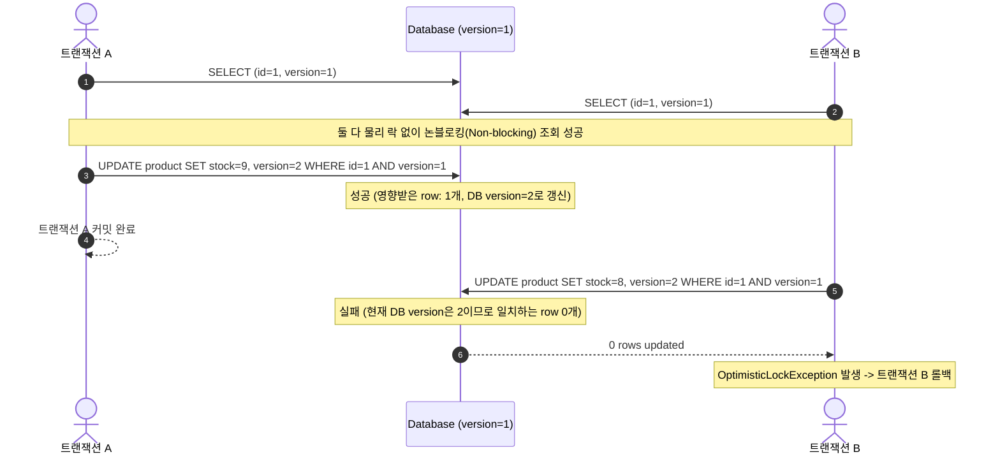
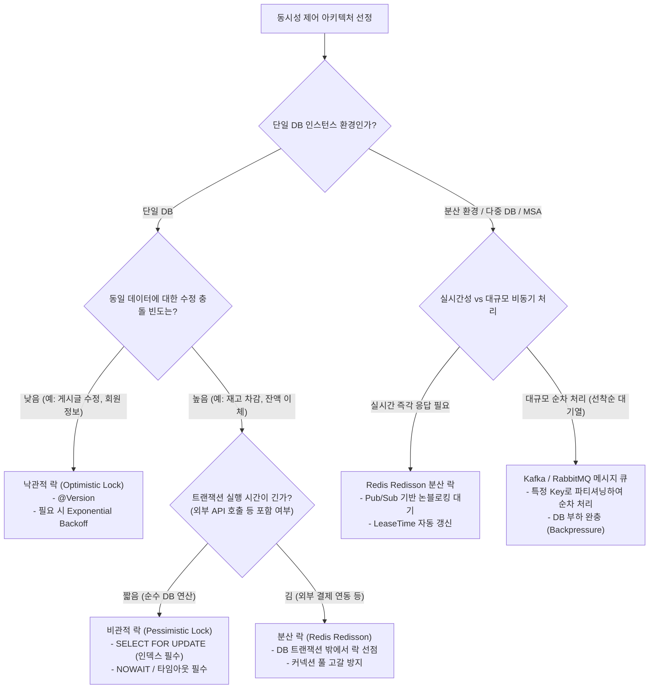

# 비관적 락(Pessimistic Lock) vs 낙관적 락(Optimistic Lock) & 실무 동시성 제어 전략

동일한 자원(데이터베이스 레코드)에 여러 트랜잭션이 동시에 접근하여 수정할 때, **데이터 무결성(Data Integrity)**과 **동시성(Concurrency)** 사이의 균형을 맞추는 핵심 전략을 심층 정리합니다.

---

## 1. 동시성 제어의 본질과 트랜잭션 격리 수준

데이터베이스에서 동시성 제어(Concurrency Control)는 여러 트랜잭션이 동시에 실행될 때 **갱신 손실(Lost Update)**, **오염된 읽기(Dirty Read)**, **반복 불가능한 읽기(Non-Repeatable Read)**, **팬텀 읽기(Phantom Read)**를 방지하기 위해 사용됩니다.



> [!NOTE]
> 대부분의 RDBMS 기본 격리 수준인 `Read Committed`나 `Repeatable Read` 환경에서도, **"조회 후 연산하여 갱신하는 패턴(Read-Modify-Write)"**에서는 트랜잭션 격리 수준만으로 두 트랜잭션 간의 갱신 손실(Lost Update)을 완전히 막을 수 없습니다. 따라서 명시적인 **비관적 락**이나 **낙관적 락** 전략이 필수적입니다.

---

## 2. 비관적 락 (Pessimistic Concurrency Control)

### 1) 개념 및 동작 흐름
"데이터 충돌이 반드시 발생할 것이다"라고 비관적으로 가정하고, **데이터를 읽는 시점(SELECT)에 데이터베이스 물리적 Lock을 획득**하여 트랜잭션이 끝날 때까지 다른 트랜잭션의 접근을 차단(Blocking)합니다.



---

### 2) RDBMS 엔진별 실제 구현 및 주의점

#### MySQL (InnoDB)의 세부 락 메커니즘
MySQL InnoDB의 락은 테이블이나 튜플 자체가 아니라 **인덱스 레코드(Index Record)**에 걸립니다.

- **레코드 락 (Record Lock)**: 인덱스 레코드 자체에 거는 락.
- **갭 락 (Gap Lock)**: 인덱스 레코드 사이의 빈 공간에 거는 락 (새로운 레코드 삽입 방지).
- **넥스트 키 락 (Next-Key Lock)**: 레코드 락 + 갭 락의 조합 (`Repeatable Read` 기본 락).

> [!WARNING]
> **인덱스가 없는 컬럼으로 `FOR UPDATE`를 수행할 때의 대참사**
> ```sql
> -- status 컬럼에 인덱스가 없는 경우
> SELECT * FROM orders WHERE status = 'PENDING' FOR UPDATE;
> ```
> 인덱스가 없으면 InnoDB는 풀 테이블 스캔(Full Table Scan)을 진행하며 **스캔한 모든 레코드와 갭에 락(Next-Key Lock)을 획득**합니다. 사실상 테이블 전체가 잠겨 서비스 전체가 마비될 수 있습니다. 비관적 락 대상 컬럼은 **반드시 인덱스가 적용**되어 있어야 합니다.

#### PostgreSQL의 세분화된 락 모드
PostgreSQL은 MVCC와 연계된 고도화된 락 모드를 지원합니다:

- `FOR UPDATE`: 레코드 갱신 및 삭제를 차단하는 강력한 배타 락.
- `FOR NO KEY UPDATE`: 기본키/유니크 키를 제외한 컬럼을 수정할 때 사용. 외래키(FK) 참조 트랜잭션과의 불필요한 락 경합을 방지하여 성능 향상.
- `FOR SHARE`: 동시 쓰기를 차단하되 다른 트랜잭션의 읽기 및 `FOR SHARE`는 허용.
- `FOR KEY SHARE`: 키 값 수정을 제외한 동시 읽기 허용.

---

### 3) 대기 시간 제어: `NOWAIT` 및 `SKIP LOCKED`

무한정 대기로 인한 커넥션 고갈(HikariCP exhaustion)을 방지하기 위해 타임아웃 옵션을 적극 활용합니다:

```sql
-- 1. Lock 획득 실패 시 대기하지 않고 즉시 에러 반환
SELECT * FROM product WHERE id = 1 FOR UPDATE NOWAIT;

-- 2. 이미 Lock이 걸린 행은 건너뛰고 잠기지 않은 행만 조회 (작업 큐 패턴에 최적)
SELECT * FROM task_queue 
WHERE status = 'READY' 
ORDER BY id ASC 
LIMIT 1 
FOR UPDATE SKIP LOCKED;
```

---

### 4) Spring Data JPA 구현

```java
public interface ProductRepository extends JpaRepository<Product, Long> {

    // 비관적 쓰기 락 (SELECT ... FOR UPDATE)
    @Lock(LockModeType.PESSIMISTIC_WRITE)
    @QueryHints({@QueryHint(name = "jakarta.persistence.lock.timeout", value = "3000")}) // 3초 타임아웃
    @Query("SELECT p FROM Product p WHERE p.id = :id")
    Optional<Product> findByIdWithPessimisticWriteLock(@Param("id") Long id);

    // 비관적 읽기 락 (SELECT ... FOR SHARE)
    @Lock(LockModeType.PESSIMISTIC_READ)
    @Query("SELECT p FROM Product p WHERE p.id = :id")
    Optional<Product> findByIdWithPessimisticReadLock(@Param("id") Long id);
}
```

---

## 3. 낙관적 락 (Optimistic Concurrency Control)

### 1) 개념 및 동작 흐름
"데이터 충돌은 거의 일어나지 않을 것이다"라고 낙관적으로 가정합니다. **DB 레벨의 물리적 락을 걸지 않고**, 엔티티의 버전 필드(`version`)를 통해 **수정 시점에 충돌 여부를 검증**합니다.



---

### 2) Spring Data JPA 구현 및 재시도(Retry) 패턴

#### 엔티티 매핑
```java
@Entity
@Getter
@NoArgsConstructor(access = AccessLevel.PROTECTED)
public class Product {
    @Id
    @GeneratedValue(strategy = GenerationType.IDENTITY)
    private Long id;

    private String name;
    private int stockQuantity;

    @Version
    private Long version; // JPA가 UPDATE 시 자동 증가 및 검증

    public void decreaseStock(int quantity) {
        if (this.stockQuantity < quantity) {
            throw new IllegalStateException("재고가 부족합니다.");
        }
        this.stockQuantity -= quantity;
    }
}
```

#### Spring Retry를 활용한 지수 백오프(Exponential Backoff) 재시도
충돌 발생 시 무작정 즉시 재시도하면 연쇄 충돌(Thundering Herd)이 발생하므로 점진적 지연(Backoff)을 적용합니다.

```java
@Service
@RequiredArgsConstructor
public class ProductStockService {

    private final ProductRepository productRepository;

    @Retryable(
        retryFor = { ObjectOptimisticLockingFailureException.class },
        maxAttempts = 5,
        backoff = @Backoff(delay = 50, multiplier = 2.0, random = true)
    )
    @Transactional
    public void decreaseStock(Long productId, int quantity) {
        Product product = productRepository.findById(productId)
            .orElseThrow(() -> new IllegalArgumentException("상품이 존재하지 않습니다."));
        
        product.decreaseStock(quantity);
    }

    @Recover
    public void recover(ObjectOptimisticLockingFailureException e, Long productId, int quantity) {
        log.error("재고 차감 재시도 초과 실패: productId={}", productId, e);
        throw new BusinessException("현재 동시 주문량이 많아 처리에 실패했습니다. 잠시 후 다시 시도해주세요.");
    }
}
```

---

### 3) 대규모 트래픽에서 낙관적 락의 한계와 충돌 완화 패턴

수천 명이 동시에 1개의 상품 재고를 차감하려 할 때, 낙관적 락을 쓰면 **1명만 성공하고 나머지 999명은 충돌(Exception) 후 재시도**를 거치면서 DB에 극심한 쓰기 부하를 유발합니다.

#### 해결책: 샤딩 카운터(Sharded Counter) 패턴
재고나 좋아요 수 같은 단일 카운터를 여러 레코드로 분할하여 충돌 확률을 $1/N$로 줄입니다.

```
[단일 레코드]
Product_Stock (id=1, stock=1000)  <-- 1,000개 요청이 1개 row에 집중 경합

[샤딩 분할]
Product_Stock_Shard (id=1, shard=0, stock=200)
Product_Stock_Shard (id=1, shard=1, stock=200)
Product_Stock_Shard (id=1, shard=2, stock=200)
Product_Stock_Shard (id=1, shard=3, stock=200)
Product_Stock_Shard (id=1, shard=4, stock=200)
-> 요청별 랜덤 샤드를 선택하여 차감하므로 락 충돌 대폭 분산
```

---

## 4. 비관적 락 vs 낙관적 락 종합 비교

| 비교 항목 | **비관적 락 (Pessimistic Lock)** | **낙관적 락 (Optimistic Lock)** |
| :--- | :--- | :--- |
| **기본 철학** | 충돌이 반드시 발생할 것이다 (사전 예방) | 충돌은 거의 없을 것이다 (사후 검증) |
| **락 획득 시점** | 데이터 조회 시 (`SELECT ... FOR UPDATE`) | 데이터 갱신 시 (`UPDATE ... WHERE version=?`) |
| **제어 주체** | **Database (DBMS)** | **Application (JPA / 코드)** |
| **동작 방식** | **Blocking (대기 큐 형성)** | **Non-blocking (즉시 예외 발생)** |
| **데드락 위험** | **존재함** (상호 자원 점유 대기 가능) | **없음** |
| **충돌 시 비용** | Lock Wait으로 인한 지연 시간 증가 | 롤백 비용 및 재시도로 인한 CPU/DB 부하 |
| **인덱스 의존성** | **절대적** (인덱스 없으면 테이블 락 전파) | 무관 (PK 기반 단건 수정) |
| **처리량 (Throughput)** | 충돌률이 높을수록 안정적 | 충돌률이 낮을 때 압도적, 높으면 급락 |

---

## 5. 실무 동시성 제어 아키텍처 결정 트리

실무에서는 단순히 비관적/낙관적 락 양자택일을 넘어, **분산 락(Redis Redisson)**이나 **메시지 큐(Kafka)**와의 조합을 상황에 맞춰 결정합니다.



---

## 6. 실전 안티패턴 및 권장 가이드

### ❌ 안티패턴

1. **긴 트랜잭션 내에서 비관적 락 선점**:
   - `SELECT ... FOR UPDATE`로 레코드를 잠근 뒤 외부 결제 API(PG사 연동)를 호출하면, 네트워크 지연(2~3초) 동안 DB 커넥션과 락이 묶여 전체 커넥션 풀(HikariCP)이 고갈됩니다.
2. **인덱스 미지정 컬럼으로 비관적 락 수행**:
   - 전체 테이블 락으로 전파되어 서비스 전체 장애 유발.
3. **충돌이 극심한 환경에서 무제한 낙관적 락 재시도**:
   - 수백 번의 롤백 및 재시도로 DB CPU가 100%에 도달하고 쓰기 I/O 폭증.

###  권장 베스트 프랙티스

- **조회 위주 / 낮은 충돌**: JPA `@Version` 기반 **낙관적 락** + 1~2회 경량 재시도.
- **짧은 연산 / 높은 충돌 / 단일 DB**: 인덱스가 보장된 컬럼 기반 **비관적 락 (`FOR UPDATE NOWAIT`)**.
- **외부 연동이 포함된 고성능 동시성 제어**: **Redis(Redisson) 분산 락**을 DB 트랜잭션 시작 전에 획득하고, 비즈니스 로직 및 트랜잭션 종료 후 해제하는 파이프라인 구성.

---

## References

- [MySQL 8.0 Reference Manual - InnoDB Locking](https://dev.mysql.com/doc/refman/8.0/en/innodb-locking.html)
- [PostgreSQL Documentation - Explicit Locking](https://www.postgresql.org/docs/current/explicit-locking.html)
- [Hibernate ORM Guide - Locking Strategies](https://docs.jboss.org/hibernate/orm/current/userguide/html_single/Hibernate_User_Guide.html#locking)
- [Martin Fowler - Patterns of Enterprise Application Architecture](https://martinfowler.com/eaaCatalog/pessimisticOfflineLock.html)
