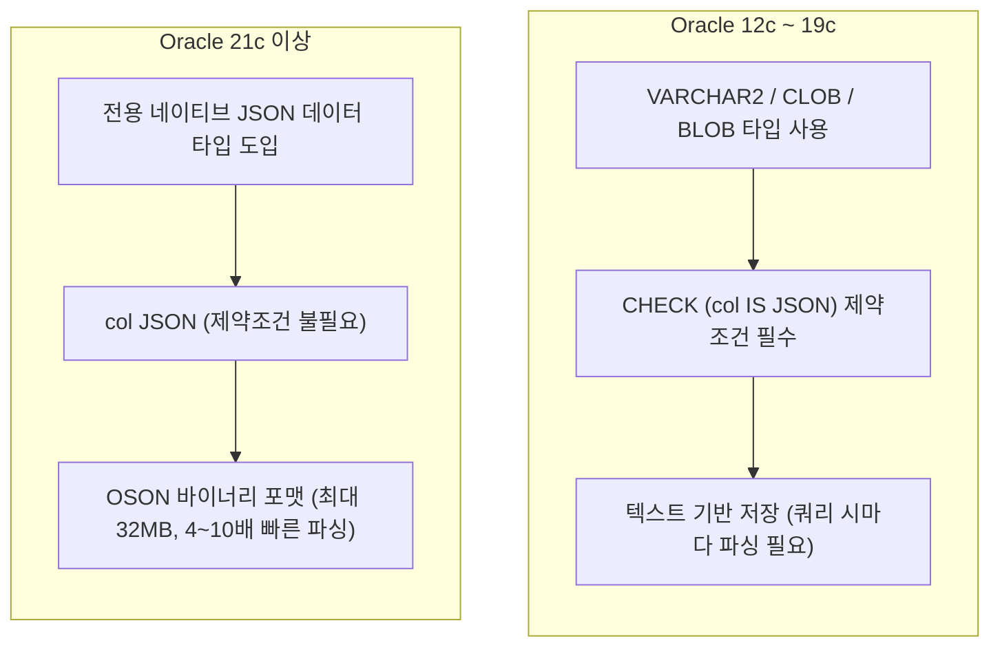

# Oracle JSON 컬럼 저장 및 활용 가이드

Oracle Database 환경에서 JSON 데이터를 테이블 컬럼에 저장하고 조회하기 위한 표준 DDL 작성법, 버전별 차이점 및 실무 활용 팁을 정리합니다.

---

## 1. 결론: `VARCHAR2(1000) CHECK (col IS JSON)` 설정이 맞는가?

```sql
OPT_JSON VARCHAR2(1000) CHECK (OPT_JSON IS JSON)
```

**결론부터 말하면 맞습니다.** 
Oracle 12c(12.1.0.2)부터 19c까지는 별도의 `JSON` 전용 원시 타입이 없었기 때문에, **`VARCHAR2` (또는 `CLOB`/`BLOB`) 컬럼에 `CHECK (컬럼명 IS JSON)` 제약조건을 부여하는 것이 Oracle 공식 표준 권장 방식**입니다.

이 설정을 통해 다음과 같은 핵심 이점을 얻습니다:

- **문법 검증**: 유효하지 않은 JSON 형식의 데이터가 `INSERT` 또는 `UPDATE`될 때 DB 레벨에서 차단됩니다 (`ORA-02290` 제약조건 위반).
- **Oracle JSON 쿼리 최적화 활성화**: 단순 도트 표기법(`table.col.key`), `JSON_VALUE`, `JSON_QUERY`, `JSON_TABLE` 등 다양한 내장 JSON 함수 및 옵티마이저 최적화가 활성화됩니다.

---

## 2. Oracle 버전별 JSON 저장 방식 비교

Oracle 버전에 따라 JSON을 저장하고 관리하는 베스트 프랙티스에 차이가 있습니다.



| 구분 | **Oracle 12c ~ 19c (현재 실무 다수)** | **Oracle 21c 이상 (최신 버전)** |
| :--- | :--- | :--- |
| **컬럼 정의 방식** | `col VARCHAR2(4000) CHECK (col IS JSON)` | `col JSON` |
| **저장 형식** | 일반 텍스트 (문자열) | OSON (Oracle's optimized binary JSON) |
| **제약 조건** | `CHECK (col IS JSON)` 필수 선언 | 내장 (별도 제약조건 불필요) |
| **최대 크기** | `VARCHAR2`: 4,000 Byte (확장 시 32,767 Byte)<br/>대용량 시 `CLOB` / `BLOB` 필요 | 기본 최대 32MB 지원 |
| **성능** | 조회 시 텍스트 파싱 오버헤드 발생 | 바이너리 파싱으로 읽기/조회 속도 최대 4~10배 향상 |

> [!TIP]
> - 현재 운영 환경이 **Oracle 19c 이하**라면 현재 작성하신 `VARCHAR2 + CHECK (IS JSON)` 방식을 그대로 사용하시면 됩니다.
> - **Oracle 21c 이상**으로 업그레이드되었거나 신규 구축하는 환경이라면 `OPT_JSON JSON` 형태의 네이티브 데이터 타입을 사용하는 것이 권장됩니다.

---

## 3. `VARCHAR2(1000)` 사용 시 실무 고려사항

### 1) 용량 한계와 문자셋 (Byte vs Char)
Oracle의 기본 문자열 길이는 세션 및 DB의 문자셋 설정에 따라 바이트(Byte) 기준으로 동작할 수 있습니다.

```sql
-- 바이트 단위 (한글/특수문자 포함 시 한글 1글자당 3바이트 차지)
OPT_JSON VARCHAR2(1000 BYTE) CHECK (OPT_JSON IS JSON)

-- 글자 수 단위 (권장: 한글이 포함된 JSON이라도 1,000자까지 안전하게 저장)
OPT_JSON VARCHAR2(1000 CHAR) CHECK (OPT_JSON IS JSON)
```

- JSON 포맷은 Key 이름(`{"status": "..."}`), 큰따옴표, 중괄호 등 포맷 메타데이터 자체의 길이 차지가 큽니다.
- 데이터가 조금만 확장되어도 `1000 Byte`를 쉽게 초과하여 **`ORA-12899: value too large for column`** 오류가 발생할 수 있습니다.
- 따라서 용량 예측이 유동적인 경우 **`VARCHAR2(4000)`**으로 넉넉하게 잡는 것을 권장합니다 (Oracle의 `VARCHAR2`는 가변 길이이므로 실제 입력된 크기만큼만 공간을 차지합니다).

### 2) 대용량 JSON이 필요한 경우 (CLOB vs BLOB)
4,000 바이트(또는 확장 시 32KB)를 넘는 대형 JSON 문서가 들어올 가능성이 있다면 `CLOB` 또는 `BLOB`을 사용해야 합니다.

```sql
-- 대용량 JSON 저장 시 (19c 이하 기준)
OPT_JSON CLOB CHECK (OPT_JSON IS JSON)
-- 또는 문자셋 변환 오버헤드가 적은 BLOB (바이너리 인코딩)
OPT_JSON BLOB CHECK (OPT_JSON IS JSON)
```

---

## 4. `IS JSON` 체크 제약조건 세부 옵션

Oracle의 `IS JSON` 제약조건은 다양한 수식어를 통해 JSON의 유효성 검사 강도를 조정할 수 있습니다.

```sql
-- 1. 기본형 (느슨한 표준 검사)
CHECK (OPT_JSON IS JSON)

-- 2. STRICT: 엄격한 표준 JSON 규격 준수 (Key에 반드시 큰따옴표 필요 등)
CHECK (OPT_JSON IS JSON (STRICT))

-- 3. WITH UNIQUE KEYS: 객체 내 중복 Key 검출 및 차단
CHECK (OPT_JSON IS JSON (WITH UNIQUE KEYS))

-- 4. 조합 사용
CHECK (OPT_JSON IS JSON (STRICT WITH UNIQUE KEYS))
```

---

## 5. Oracle JSON 데이터 쿼리 및 활용 방법

`CHECK (col IS JSON)` 제약조건이 설정된 컬럼은 Oracle의 풍부한 JSON 연산자를 활용할 수 있습니다.

### 1) 단순 도트 표기법 (Simple Dot Notation)
가장 직관적인 방법으로, 테이블 별칭(Alias)과 함께 객체 프로퍼티처럼 접근할 수 있습니다.

```sql
-- 테이블 별칭 t가 반드시 필요하며 대소문자를 구분합니다.
SELECT t.OPT_JSON.userId,
       t.OPT_JSON.status
FROM MY_TABLE t
WHERE t.OPT_JSON.status = 'ACTIVE';
```

### 2) `JSON_VALUE`: 단일 스칼라 값 추출
JSON 내부에서 숫자, 문자열, 불리언 등 단일 스칼라 값을 꺼낼 때 사용합니다. 반환 데이터 타입을 명시할 수 있습니다.

```sql
SELECT JSON_VALUE(OPT_JSON, '$.userId' RETURNING NUMBER) AS USER_ID,
       JSON_VALUE(OPT_JSON, '$.userName' RETURNING VARCHAR2(50)) AS USER_NAME
FROM MY_TABLE;
```

### 3) `JSON_QUERY`: 복합 객체 또는 배열 추출
JSON 내부의 특정 하위 객체(`{...}`)나 배열(`[...]`) 자체를 다시 JSON 문자열 형태로 꺼낼 때 사용합니다.

```sql
SELECT JSON_QUERY(OPT_JSON, '$.roles') AS USER_ROLES
FROM MY_TABLE;
```

### 4) `JSON_TABLE`: 관계형 테이블(행/열)로 변환
JSON 내부의 배열 또는 중첩 데이터를 일반 SQL 테이블의 행(Row)으로 풀어헤쳐 조인(JOIN)할 때 사용합니다.

```sql
SELECT m.ID, jt.ROLE_NAME
FROM MY_TABLE m,
     JSON_TABLE(m.OPT_JSON, '$.roles[*]'
         COLUMNS (
             ROLE_NAME VARCHAR2(50) PATH '$'
         )
     ) jt;
```

---

## 6. JSON 컬럼 성능을 위한 인덱스 전략

JSON 컬럼 내부의 특정 필드를 `WHERE` 절 조건으로 빈번하게 검색하는 경우, 전체 컬럼을 풀 스캔하지 않도록 **함수 기반 인덱스(FBI: Function-Based Index)**를 생성해야 합니다.

```sql
-- JSON_VALUE 함수를 활용한 함수 기반 인덱스 생성
CREATE INDEX IDX_MY_TABLE_OPT_JSON_USERID 
ON MY_TABLE (JSON_VALUE(OPT_JSON, '$.userId' RETURNING NUMBER));

-- 인덱스를 타는 쿼리
SELECT * 
FROM MY_TABLE 
WHERE JSON_VALUE(OPT_JSON, '$.userId' RETURNING NUMBER) = 1001;
```

---

## 7. 권장 최종 DDL 예시

### Oracle 12c ~ 19c 권장 DDL
```sql
CREATE TABLE MY_TABLE (
    ID          NUMBER GENERATED ALWAYS AS IDENTITY PRIMARY KEY,
    NAME        VARCHAR2(100) NOT NULL,
    OPT_JSON    VARCHAR2(4000 CHAR),
    CREATED_AT  DATE DEFAULT SYSDATE,
    CONSTRAINT CK_MY_TABLE_OPT_JSON CHECK (OPT_JSON IS JSON (STRICT WITH UNIQUE KEYS))
);

-- 자주 조회하는 속성에 함수 기반 인덱스 적용
CREATE INDEX IDX_MY_TABLE_JSON_STATUS 
ON MY_TABLE (JSON_VALUE(OPT_JSON, '$.status' RETURNING VARCHAR2(20)));
```

### Oracle 21c 이상 권장 DDL
```sql
CREATE TABLE MY_TABLE (
    ID          NUMBER GENERATED ALWAYS AS IDENTITY PRIMARY KEY,
    NAME        VARCHAR2(100) NOT NULL,
    OPT_JSON    JSON,
    CREATED_AT  DATE DEFAULT SYSDATE
);
```

---

## References

- [Oracle 19c Database JSON Developer's Guide](https://docs.oracle.com/en/database/oracle/oracle-database/19/adjsn/index.html)
- [Oracle 21c Database JSON Developer's Guide (Native JSON Type)](https://docs.oracle.com/en/database/oracle/oracle-database/21/adjsn/json-data-type.html)
- [Oracle Base - JSON Support in Oracle Database](https://oracle-base.com/articles/12c/json-support-in-oracle-database-12cr1)
