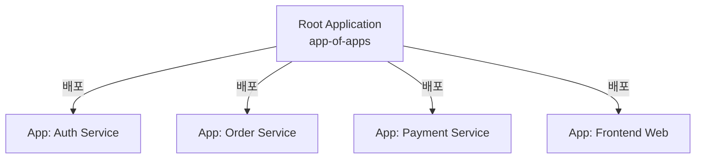

# ArgoCD 실전 사용 예시 (App of Apps, Kustomize, ApplicationSet)

실제 엔터프라이즈 환경에서 마이크로서비스 배포 및 멀티 환경(Dev/Stage/Prod)을 운영할 때 표준적으로 활용되는 구성 패턴 예제들을 다룹니다.

---

## 1. Kustomize 기반 멀티 환경 (Dev / Stage / Prod) 구조

GitOps 저장소에서 환경별 차이점(인스턴스 개수, 리소스 할당량, 환경변수, 이미지 태그)을 관리할 때 가장 널리 사용되는 Kustomize 구조입니다.

### 1.1 디렉터리 트리 구조
```text
k8s-manifests/
├── base/                     # 모든 환경의 공통 매니페스트
│   ├── deployment.yaml
│   ├── service.yaml
│   └── kustomization.yaml
└── overlays/                 # 환경별 오버레이 설정
    ├── dev/
    │   ├── kustomization.yaml
    │   └── replica_patch.yaml
    ├── stage/
    │   ├── kustomization.yaml
    │   └── ingress_patch.yaml
    └── prod/
        ├── kustomization.yaml
        └── hpa.yaml
```

### 1.2 `overlays/prod/kustomization.yaml` 예시
```yaml
apiVersion: kustomize.config.k8s.io/v1beta1
kind: Kustomization

resources:
  - ../../base

namespace: production

# 프로덕션 이미지 및 태그 지정 (CI 도구가 이 부분을 자동 커밋 수정)
images:
  - name: backend-api
    newName: ghcr.io/my-org/backend-api
    newTag: v1.4.2

patchesStrategicMerge:
  - replica_patch.yaml

configMapGenerator:
  - name: app-config
    behavior: merge
    literals:
      - SPRING_PROFILES_ACTIVE=prod
      - LOG_LEVEL=INFO
```

### 1.3 Prod Application 매니페스트
```yaml
apiVersion: argoproj.io/v1alpha1
kind: Application
metadata:
  name: backend-api-prod
  namespace: argocd
spec:
  project: default
  source:
    repoURL: https://github.com/my-org/k8s-manifests.git
    targetRevision: main
    path: overlays/prod
  destination:
    server: https://kubernetes.default.svc
    namespace: production
  syncPolicy:
    automated:
      prune: true
      selfHeal: true
```

---

## 2. App of Apps 패턴 (수십 개 마이크로서비스 단일 관리)

수십 개의 마이크로서비스를 각각 수동으로 ArgoCD에 등록하지 않고, **"다른 Application 리소스들을 생성하고 관리하는 부모 Application"** 하나로 전체 서비스를 한 번에 프로비저닝합니다.



### 부모 Root Application (`root-application.yaml`)
```yaml
apiVersion: argoproj.io/v1alpha1
kind: Application
metadata:
  name: root-apps
  namespace: argocd
spec:
  project: default
  source:
    repoURL: https://github.com/my-org/gitops-infra.git
    targetRevision: main
    path: apps # 이 디렉터리 내에 각 서비스별 Application YAML들이 위치함
  destination:
    server: https://kubernetes.default.svc
    namespace: argocd
  syncPolicy:
    automated:
      prune: true
      selfHeal: true
```

---

## 3. ApplicationSet (현대적인 멀티 클러스터 / 멀티 서비스 자동화)

App of Apps 패턴보다 진화한 기능으로, 템플릿(Template)과 생성기(Generator)를 결합하여 **디렉터리나 Git 저장소, 클러스터 목록에 따라 Application CRD를 자동으로 동적 생성**합니다.

### Git Directory Generator 예시
`services/` 하위의 모든 디렉터리를 스캔하여 자동으로 서비스별 Application을 생성합니다.

```yaml
apiVersion: argoproj.io/v1alpha1
kind: ApplicationSet
metadata:
  name: microservices-appset
  namespace: argocd
spec:
  generators:
    - git:
        repoURL: https://github.com/my-org/k8s-manifests.git
        revision: main
        directories:
          - path: services/* # services/auth, services/payment 등을 자동 탐색
  template:
    metadata:
      name: '{{path.basename}}' # 디렉터리 이름을 앱 이름으로 사용
    spec:
      project: default
      source:
        repoURL: https://github.com/my-org/k8s-manifests.git
        targetRevision: main
        path: '{{path}}'
      destination:
        server: https://kubernetes.default.svc
        namespace: '{{path.basename}}'
      syncPolicy:
        automated:
          prune: true
          selfHeal: true
        syncOptions:
          - CreateNamespace=true
```

---

## 4. Argo Rollouts 연계를 통한 카나리(Canary) 배포

ArgoCD와 **Argo Rollouts** 컨트롤러를 연동하면, 점진적 트래픽 전환(Canary) 및 자동 롤백을 선언적으로 구현할 수 있습니다.

```yaml
apiVersion: argoproj.io/v1alpha1
kind: Rollout
metadata:
  name: order-service-rollout
spec:
  replicas: 10
  strategy:
    canary:
      steps:
        # 1. 신규 버전에 10% 트래픽 할당 후 10분간 대기/모니터링
        - setWeight: 10
        - pause: {duration: 10m}
        # 2. 30%로 트래픽 확대 후 15분 대기
        - setWeight: 30
        - pause: {duration: 15m}
        # 3. 60%로 확대
        - setWeight: 60
        - pause: {duration: 10m}
        # 4. 100% 완전 전환
```

* 배포 중 Prometheus 메트릭 분석(AnalysisTemplate)을 통해 에러율이 기준치를 초과하면 자동으로 이전 버전으로 롤백됩니다.
