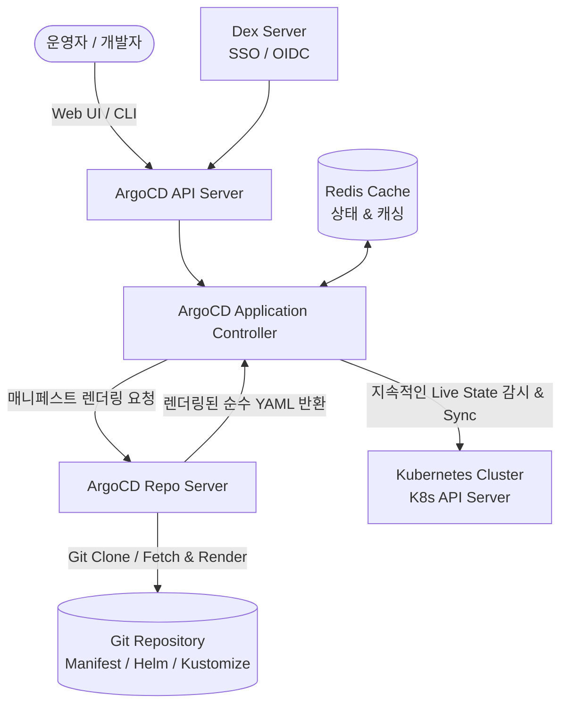
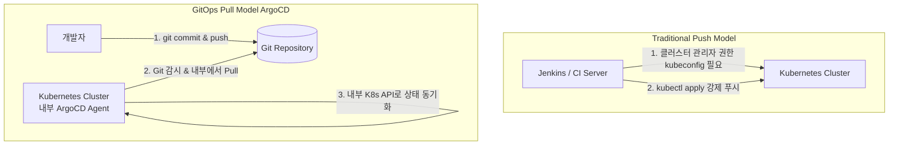

# ArgoCD

**ArgoCD**는 Kubernetes 환경을 위한 **선언적(Declarative) GitOps 지속적 배포(Continuous Delivery, CD)** 엔진입니다.  
Git 저장소를 **"단일 진실의 원천(Single Source of Truth)"**으로 삼아, 저장소에 정의된 Desired State(원하는 상태)와 Kubernetes 클러스터의 Live State(실제 상태)를 지속적으로 감시하고 자동으로 동기화(Sync)합니다.

CNCF(Cloud Native Computing Foundation)의 공식 졸업(Graduated) 프로젝트로서, 쿠버네티스 생태계의 사실상 표준(De-facto Standard) GitOps 배포 도구로 자리잡았습니다.

---

## 1. 아키텍처 및 핵심 컴포넌트

ArgoCD는 Kubernetes 컨트롤러 패턴을 충실히 따르는 분산 컴포넌트 구조로 동작합니다.

* **ArgoCD API Server**:
  * Web UI 및 CLI 요청을 처리하는 gRPC/REST 서버
  * 인증(SSO/OIDC, Dex), 사용자 권한 제어(RBAC), 웹훅 수신
* **ArgoCD Application Controller**:
  * 클러스터의 실제 상태(Live State)와 Git에 정의된 목표 상태(Desired State)를 실시간 비교
  * `OutOfSync` 상태 감지 시 자동/수동 동기화(Sync) 및 `Self-Healing` 수행
* **ArgoCD Repo Server**:
  * Git 저장소의 코드를 로컬에 캐시하고 Kustomize, Helm, Jsonnet 등의 템플릿을 순수 Kubernetes YAML로 변환/렌더링
* **Redis**:
  * 애플리케이션 상태 및 Git 매니페스트 캐싱을 담당하여 API 성능 향상

---

## 2. Push 기반 배포 vs Pull 기반 배포 (GitOps의 핵심)

전통적인 CI/CD 도구(Jenkins, GitLab CI 등)와 ArgoCD의 가장 결정적인 차이는 **배포 주체와 통신 방향(Direction of Control)**에 있습니다.

| 구분 | 전통적 Push 기반 (예: Jenkins 직접 배포) | GitOps Pull 기반 (예: ArgoCD) |
| :--- | :--- | :--- |
| **배포 에이전트 위치** | 클러스터 외부 (CI 서버) | **클러스터 내부 (In-Cluster)** |
| **클러스터 자격증명 (`kubeconfig`)** | CI 서버에 마스터 권한 저장 (보안 취약점 위험) | **외부 노출 없음 (클러스터 내부 ServiceAccount 사용)** |
| **방화벽 / 네트워크** | CI 서버에서 사내/폐쇄망 K8s API로 인바운드 개방 필요 | **K8s 내부에서 외부 Git으로 아웃바운드만 허용** |
| **형상 불일치 (Configuration Drift)** | 클러스터에서 수동 수정(`kubectl edit`) 시 추적 불가 | **자동 감지하여 Git 상태로 강제 원복 (Self-Healing)** |
| **롤백 방식** | CI 파이프라인 재실행 필요 | **`git revert` 커밋 하나로 즉시 롤백** |

---

## 3. ArgoCD의 장점과 단점 (Pros & Cons)

### 👍 장점 (Strengths)

1. **강력한 보안성 (Zero Cluster Credentials Outside)**:
   * 외부 CI 서버에 민감한 `kubeconfig`나 클러스터 관리자 권한을 부여하지 않아도 되므로 보안 공격 표면(Attack Surface)이 획기적으로 줄어듭니다.
2. **Configuration Drift 방지 & Self-Healing**:
   * 누군가 장애 조치를 위해 클러스터 상에서 임의로 Pod 개수나 리소스 스펙을 수정하더라도, ArgoCD가 즉시 불일치를 감지하고 Git에 정의된 상태로 자동 복구합니다.
3. **직관적인 시각화 웹 대시보드**:
   * Kubernetes 리소스 트리(Deployment -> ReplicaSet -> Pod -> Service -> Ingress)와 Pod 상태, 실시간 로그, 이벤트, 매니페스트 차이점(Diff)을 한눈에 확인할 수 있습니다.
4. **선언적 멀티 클러스터 및 멀티 테넌트 지원**:
   * 하나의 ArgoCD 인스턴스로 수십 개의 원격 Kubernetes 클러스터에 애플리케이션을 안전하게 배포하고 관리할 수 있습니다.
5. **다양한 템플릿 도구 기본 통합**:
   * Plain YAML뿐만 아니라 Helm, Kustomize, Jsonnet 등을 별도 도구 설치 없이 완벽 지원합니다.

### 👎 단점 및 한계 (Weaknesses)

1. **Kubernetes 전용 도구**:
   * 순수 Kubernetes 리소스 관리 전용이므로, 전통적인 레거시 VM, 베어메탈 서버, 비-K8s 클라우드 리소스 배포에는 적합하지 않습니다.
2. **CI (빌드 및 테스트) 기능 부재**:
   * ArgoCD는 배포(CD) 전용 엔진이므로, 소스 코드 컴파일, 단위 테스트, Docker 이미지 빌드 및 푸시는 Jenkins, GitHub Actions 등의 CI 도구가 반드시 선행되어야 합니다.
3. **Secret 관리의 추가적 고려 필요**:
   * Git에 모든 설정이 노출되므로 평문 Secret을 올릴 수 없습니다. Sealed Secrets, Vault, External Secrets Operator(ESO), 또는 SOPS와의 결합이 필수적입니다.
4. **대규모 클러스터에서의 Repo Server 부하**:
   * 수백 개 이상의 Application이 복잡한 Helm/Kustomize 렌더링을 빈번하게 수행할 경우 Repo Server의 CPU/메모리 부하 및 Git API Rate Limit 관리가 필요합니다.

---

## 4. Jenkins vs ArgoCD 종합 비교

| 비교 항목 | Jenkins (젠킨스) | ArgoCD (아르고CD) |
| :--- | :--- | :--- |
| **주요 영역** | **CI 중심** (빌드, 테스트, 패키징, 범용 자동화) | **CD 중심** (Kubernetes 전용 GitOps 배포) |
| **배포 방식** | Push 방식 (외부에서 K8s API 호출) | **Pull 방식** (클러스터 내부에서 Git 감시) |
| **상태 관리** | 작업 실행 기록 중심 (Stateless) | **Desired State vs Live State 실시간 추적 (Stateful)** |
| **클러스터 권한 관리**| CI 서버에 `kubeconfig` 저장 필요 | **클러스터 내부 RBAC 사용 (보안 우수)** |
| **대상 인프라** | VM, 물리 서버, 컨테이너, 클라우드 등 모든 환경 | **Kubernetes 클러스터 전용** |
| **설정 언어** | Groovy (`Jenkinsfile`) | **선언적 YAML / Helm / Kustomize** |
| **권장 역할** | 소스 코드 빌드, 테스트, Docker 이미지 생성/푸시 | 이미지 태그가 수정된 Git 저장소를 감지하여 K8s에 동기화 |

---

## 5. 연관 문서

* [ArgoCD 설치 및 초기 설정 가이드](Installation.md)
* [ArgoCD 사용 방법 및 Application 생성/동기화](Usage.md)
* [ArgoCD 실전 예제 (App of Apps, Kustomize 멀티 환경, Image Updater)](Examples.md)
