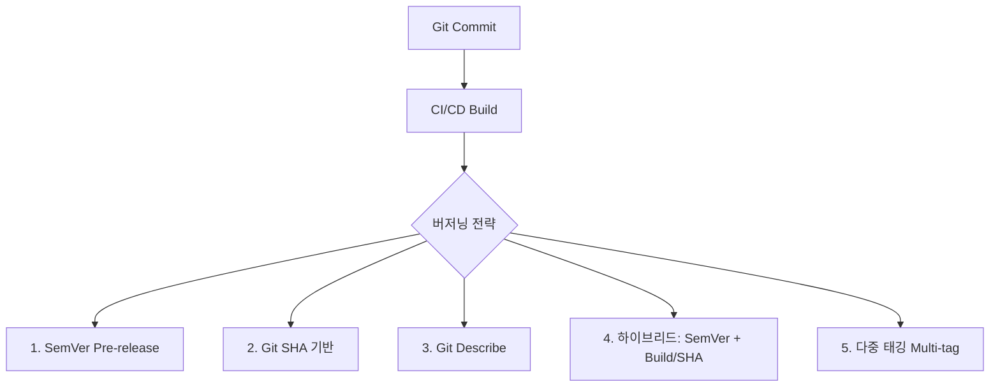
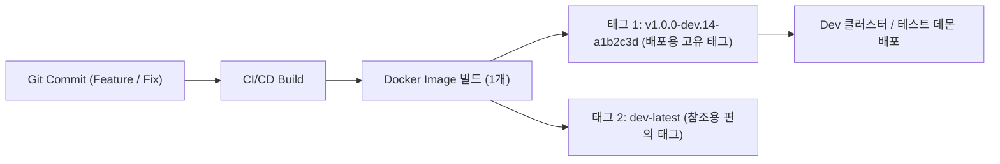

# Docker 이미지 버전 관리(Versioning) 전략

Docker 컨테이너 기반으로 데몬이나 애플리케이션을 개발하고 테스트/개발(Dev) 환경에 배포할 때, 적절한 **이미지 태깅 및 버저닝(Versioning) 전략**을 수립하는 것은 소프트웨어의 추적성, 재현성, 롤백 가능성을 확보하는 핵심 엔지니어링 프랙티스입니다.

---

## 1. 버전 관리의 핵심 원칙

소프트웨어 공학 및 DevOps 환경에서 Docker 이미지 태깅 시 준수해야 하는 핵심 원칙은 다음과 같습니다.

1. **불변성 (Immutability)**
   * 이미 한 번 빌드되어 레지스트리에 푸시된 고유 버전 태그는 덮어쓰지(Overwrite) 않아야 합니다.
   * `v1.0.0-dev`라는 동일 태그를 매 커밋마다 덮어쓰면 노드/러너의 로컬 이미지 캐시 문제, 롤백 불가, 장애 시점 역추적 불가 문제가 발생합니다.
2. **추적성 (Traceability)**
   * 이미지 태그만 보고도 **어떤 Git 커밋(Commit SHA)**에서, **어떤 빌드 번호(Build ID)**로 생성되었는지 즉시 파악할 수 있어야 합니다.
3. **환경 분리 및 승급 (Environment Promotion)**
   * 동일한 소스 코드로 빌드된 이미지는 `Dev -> Staging/QA -> Prod` 파이프라인을 거치며 **재빌드 없이 승급(Promotion)**되어야 합니다.

---

## 2. 소프트웨어 공학의 주요 버저닝 방식 비교

소프트웨어 공학 및 업계(Kubernetes, Docker, CI/CD)에서 널리 활용되는 버저닝 기법은 크게 5가지가 있습니다.



### (1) SemVer 2.0 사전 릴리즈 (Pre-release) 방식
* **형식**: `MAJOR.MINOR.PATCH-<prerelease>` (예: `v1.0.0-dev.1`, `v1.0.0-alpha.2`, `v1.0.1-rc.1`)
* **특징**:
  * Semantic Versioning(유의적 버전 2.0.0) 표준을 준수합니다.
  * 사전 릴리즈 식별자(`-dev.1`, `-dev.2`, `-rc.1`)를 통해 버전 간 우선순위(Precedence) 비교가 가능합니다.
  * *주의 (OCI / Docker 규격)*: SemVer의 빌드 메타데이터 구분자인 `+`(예: `1.0.0+build.1`)는 Docker 태그 허용 문자(`[a-zA-Z0-9_.-]`)에 포함되지 않으므로, Docker에서는 `+` 대신 `.` 또는 `-`를 사용해야 합니다.

### (2) Git Commit SHA 기반 방식
* **형식**: `dev-<short-sha>` 또는 `sha-<short-sha>` (예: `dev-a1b2c3d`, `sha-7f8a9b0`)
* **특징**:
  * Git 커밋 해시와 1:1로 완벽히 매핑되어 코드 변경점을 즉시 파악할 수 있습니다.
  * 커밋마다 고유하므로 불변성이 100% 보장됩니다.
  * 단점: 태그 문자열만 보고는 어떤 기능이 추가되었는지, 버전의 전후 선후관계(시퀀스)를 직관적으로 알기 어렵습니다.

### (3) Git Describe 기반 동적 버저닝
* **형식**: `git describe --tags --always` 결과 활용 (예: `v1.0.0-4-ga1b2c3d`)
  * `v1.0.0`: 가장 최근 Git Tag
  * `4`: 해당 태그 이후 추가된 커밋 수
  * `ga1b2c3d`: `g` (git) + 최근 커밋 short SHA
* **특징**:
  * Git CLI 기본 기능으로 별도의 복잡한 도구 없이 자동 생성 가능합니다.
  * 기준이 되는 메이저/마이너 버전과 최근 커밋 거리를 동시에 알 수 있습니다.

### (4) 하이브리드 (SemVer + CI Build Number + Git SHA)
* **형식**: `v{MAJOR}.{MINOR}.{PATCH}-dev.{BUILD_NUMBER}.{SHORT_SHA}` (예: `v1.0.0-dev.42.a1b2c3d`)
* **특징**:
  * CI/CD 파이프라인 번호로 빌드 순서 정렬(Sortability)을 보장하고, Git SHA로 소스 코드 추적성을 보장합니다.
  * 대규모 엔터프라이즈 및 Kubernetes CD(ArgoCD, Flux) 환경에서 가장 널리 권장되는 방식입니다.

### (5) 다중 태깅 (Multi-tagging) 전략
* 빌드 시 1개의 이미지를 만들고 **2개 이상의 태그**를 동시에 부여하는 전략:
  1. **불변 태그 (Immutable Tag)**: `v1.0.0-dev.42.a1b2c3d` 또는 `dev-a1b2c3d` (실제 배포, 롤백, 감사용)
  2. **가변/별칭 태그 (Floating Tag)**: `dev` 또는 `dev-latest` (로컬 테스트 및 빠른 참조용)

---

## 3. 방식별 장단점 비교 매트릭스

| 버저닝 방식 | 불변성 / 재현성 | 소스 코드 추적성 | 버전 순서 파악 | 자동화 용이성 | 권장 환경 |
| :--- | :---: | :---: | :---: | :---: | :--- |
| **고정 태그** (`dev`, `latest`) | ❌ 불가 | ❌ 불가 | ❌ 불가 | ⭐⭐⭐⭐⭐ 최상 | 로컬 샌드박스 테스트 |
| **수동 SemVer** (`v1.0.0-dev`) | ⚠️ 낮음 | ⚠️ 낮음 | ⭐⭐⭐ 보통 | ⭐ 낮음 (수동 입력 필요) | 소규모 수동 릴리즈 |
| **Git SHA 단독** (`dev-a1b2c3d`) | ⭐⭐⭐⭐⭐ 최상 | ⭐⭐⭐⭐⭐ 최상 | ⚠️ 낮음 | ⭐⭐⭐⭐⭐ 최상 | 마이크로서비스, CD 파이프라인 |
| **Git Describe** (`v1.0.0-4-ga1b2c3d`) | ⭐⭐⭐⭐⭐ 최상 | ⭐⭐⭐⭐⭐ 최상 | ⭐⭐⭐⭐ 높음 | ⭐⭐⭐⭐⭐ 최상 | Git 태그 기반 프로젝트 |
| **하이브리드** (`v1.0.0-dev.42-sha`) | ⭐⭐⭐⭐⭐ 최상 | ⭐⭐⭐⭐⭐ 최상 | ⭐⭐⭐⭐⭐ 최상 | ⭐⭐⭐⭐ 높음 | **Dev 환경 테스트 데몬/엔터프라이즈 CD (추천)** |

---

## 4. 테스트 데몬 및 Dev 환경을 위한 최적의 추천 전략

테스트용 데몬을 빌드하여 dev 환경에 배포할 때 가장 적합한 전략은 **[하이브리드 버저닝 + 다중 태그(Multi-tag)]** 조합입니다.



### 추천 네이밍 컨벤션

#### 1) Dev 브랜치 / 정기 개발 배포
```text
v<Next-Major.Minor.Patch>-dev.<CI_BUILD_NUM>-<SHORT_SHA>
예: v1.0.0-dev.12-a1b2c3d
```
* **장점**: 다음 목표 릴리즈 버전(`v1.0.0`)의 개발 진행 상황을 명확히 인지할 수 있고, 빌드 번호와 커밋 해시가 함께 있어 디버깅이 매우 쉽습니다.

#### 2) PR / 기능(Feature) 브랜치 임시 테스트 데몬
```text
pr-<PR_NUMBER>-<SHORT_SHA>
예: pr-45-f9e8d7c
```
* **장점**: 어떤 PR 검증을 위해 띄운 데몬인지 명확하며, PR이 머지되거나 닫히면 해당 이미지를 안전하게 가비지 컬렉션(GC)할 수 있습니다.

#### 3) 프로덕션 승급 시 (Release Promotion)
* 동일한 이미지를 재빌드하지 않고 Git Release Tag 시점에 프로덕션 태그를 추가:
```text
Dev:  v1.0.0-dev.12-a1b2c3d
QA:   v1.0.0-rc.1
Prod: v1.0.0, v1.0, latest
```

---

## 5. CI/CD 스크립트 구현 예시

### Bash 스크립트 (자동 태그 추출)

```bash
#!/usr/bin/env bash
set -e

# 1. 버전 및 Git 정보 추출
BASE_VERSION="1.0.0"
SHORT_SHA=$(git rev-parse --short=7 HEAD)
BUILD_NUM=${BUILD_NUMBER:-$(date +%Y%m%d%H%M)}
BRANCH_NAME=$(git rev-parse --abbrev-ref HEAD | tr '/' '-')

# 2. 태그 조합
IMMUTABLE_TAG="v${BASE_VERSION}-dev.${BUILD_NUM}-${SHORT_SHA}"
ALIAS_TAG="dev-latest"

IMAGE_REPO="myregistry.example.com/test-daemon"

echo "Building: ${IMAGE_REPO}:${IMMUTABLE_TAG}"

# 3. 도커 빌드 (동일 이미지에 두 태그 동시 적용)
docker build \
  -t "${IMAGE_REPO}:${IMMUTABLE_TAG}" \
  -t "${IMAGE_REPO}:${ALIAS_TAG}" \
  .

# 4. 푸시
docker push "${IMAGE_REPO}:${IMMUTABLE_TAG}"
docker push "${IMAGE_REPO}:${ALIAS_TAG}"
```

### GitHub Actions 워크플로우 예시

```yaml
name: Build & Push Test Daemon

on:
  push:
    branches: [ "dev", "develop" ]
  pull_request:
    branches: [ "dev" ]

jobs:
  build:
    runs-on: ubuntu-latest
    steps:
      - name: Checkout Code
        uses: actions/checkout@v4

      - name: Docker Meta (태그 자동 추출)
        id: meta
        uses: docker/metadata-action@v5
        with:
          images: myregistry.example.com/test-daemon
          tags: |
            type=raw,value=v1.0.0-dev.{{run_number}}-{{sha}}
            type=raw,value=dev-latest,enable={{is_default_branch}}
            type=ref,event=pr,prefix=pr-

      - name: Build and Push
        uses: docker/build-push-action@v5
        with:
          context: .
          push: true
          tags: ${{ steps.meta.outputs.tags }}
          labels: ${{ steps.meta.outputs.labels }}
```

---

## 6. 요약 및 결론

* `v1.0.0-dev` 형태의 단일 고정 태그는 **이미지 덮어쓰기 문제**로 인해 실제 배포 환경에서 장애 추적과 롤백을 불가능하게 만듭니다.
* 따라서 Dev 환경 테스트 데몬의 버저닝은 **`v{목표버전}-dev.{빌드번호}-{Git SHA}`** 형식을 사용하는 것이 소프트웨어 공학적으로 가장 이상적입니다.
* 개발 편의를 위해 `dev-latest`와 같은 별칭(Floating) 태그를 병행(Multi-tag) 푸시하되, 실제 배포 매니페스트(Kubernetes, Docker Compose 등)에는 항상 **고유한 불변 태그**를 명시하여 배포하는 것을 권장합니다.
