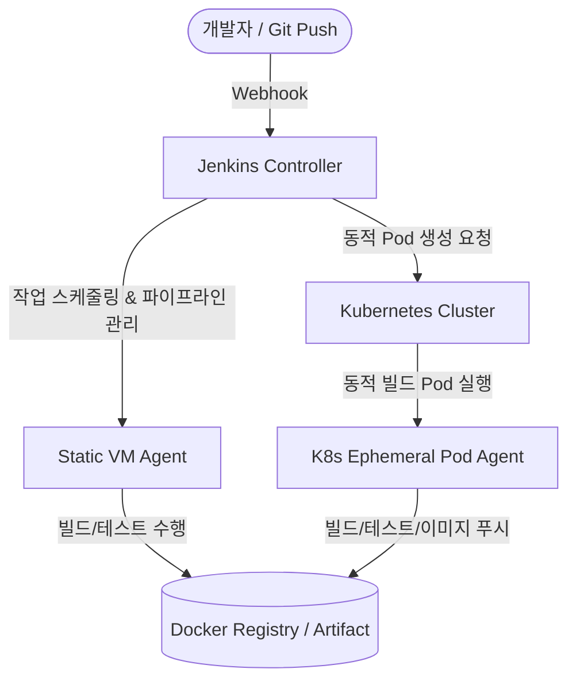

# Jenkins (젠킨스)

**Jenkins**는 소프트웨어 개발 시 지속적인 통합(CI, Continuous Integration)과 지속적인 전달/배포(CD, Continuous Delivery/Deployment)를 지원하는 대표적인 **오픈소스 자동화 서버**입니다.  
Java 기반으로 제작되어 다양한 환경(On-premise, VM, Docker, Kubernetes)에서 구동되며, 1,800개 이상의 방대한 플러그인 생태계를 바탕으로 사실상 전 세계 엔터프라이즈 환경에서 가장 널리 사용되는 CI/CD 표준 도구입니다.

---

## 1. 아키텍처 및 핵심 동작 원리

Jenkins는 안정성과 확장성을 위해 **Controller(이전 Master) - Agent(이전 Slave)** 분산 빌드 아키텍처를 채택하고 있습니다.

* **Jenkins Controller (Master)**:
  * 웹 대시보드 UI 제공 및 사용자 인증/권한 관리(RBAC)
  * 파이프라인 스케줄링 및 빌드 트리거(Webhook, Polling, Cron) 수신
  * 빌드 로그 기록 및 결과 모니터링
  * 플러그인 관리 및 시스템 설정 유지
* **Jenkins Agent (Node)**:
  * 실제 빌드, 테스트, 컴파일, Docker 이미지 패키징 등의 CPU/메모리 부하 작업을 전담
  * **정적 에이전트(Static Agent)**: 전용 VM이나 물리 서버에 SSH/JNLP로 연결
  * **동적 에이전트(Dynamic/Ephemeral Agent)**: Kubernetes 클러스터 상에서 빌드 요청 시 Pod를 동적으로 띄우고, 빌드 완료 후 자동 파기 (클라우드 네이티브 방식 권장)

---

## 2. Jenkins의 장점과 단점 (Pros & Cons)

### 👍 장점 (Strengths)

1. **압도적인 플러그인 생태계와 범용성**:
   * Git, SVN, Maven, Gradle, Docker, Kubernetes, AWS, SonarQube, Jira, Slack 등 현존하는 거의 모든 개발/운영 도구와의 연동 플러그인을 기본 제공합니다.
2. **파이프라인의 극단적인 유연성 (Pipeline as Code)**:
   * Groovy 기반의 `Jenkinsfile`을 통해 단순 빌드부터 복잡한 조건부 실행, 병렬 처리(Parallel Execution), 멀티 스테이지, 인터랙티브 승인(Input Approval)까지 프로그래밍 수준으로 자유롭게 제어할 수 있습니다.
3. **인프라 종속성 없음 (On-premise & Multi-Cloud)**:
   * SaaS형 CI 도구(GitHub Actions, CircleCI)와 달리 폐쇄망(Air-gapped) 환경, 사내 온프레미스 IDC, 특정 클라우드 환경 어디든 제약 없이 자체 호스팅이 가능합니다.
4. **비용 효율성**:
   * 오픈소스(MIT 라이선스)로 라이선스 비용이 없으며, 인프라 자원만 확보되면 빌드 횟수/시간에 따른 추가 과금이 없습니다.
5. **분산 빌드 및 확장성**:
   * 수십~수백 대의 노드로 빌드 워크로드를 분산할 수 있고, K8s와 연동하여 리소스를 탄력적으로 사용할 수 있습니다.

### 👎 단점 및 한계 (Weaknesses)

1. **높은 운영 및 유지보수 오버헤드 (Maintenance Burden)**:
   * Controller 서버의 백업, 디스크 용량 관리(빌드 로그/아티팩트 정리), 플러그인 호환성 테스트 및 주기적인 보안 패치를 운영팀이 직접 관리해야 합니다.
2. **플러그인 지옥 (Plugin Hell)**:
   * 코어 버전 업데이트 시 서드파티 플러그인 간의 의존성 충돌이나 지원 중단 이슈가 발생할 수 있습니다.
3. **UI/UX의 노후화**:
   * 기본 UI가 다소 복잡하고 진입 장벽이 있으며, 현대적인 모던 CI 도구(GitHub Actions, GitLab CI)에 비해 설정 가시성이 떨어질 수 있습니다 (Blue Ocean 플러그인으로 일부 개선 가능).
4. **Push 기반 배포의 보안 한계 (CD 관점)**:
   * Kubernetes 배포를 Jenkins가 직접 수행할 경우, Jenkins 서버에 클러스터 관리자 권한(`kubeconfig`)을 보관해야 하므로 보안 취약점이 발생할 수 있습니다 (이 때문에 CD 영역은 ArgoCD 같은 GitOps 도구로 이관하는 추세).

---

## 3. 현대적 CI/CD에서의 역할과 권장 포지셔닝

| 구분 | CI (지속적 통합) | CD (지속적 배포) |
| :--- | :--- | :--- |
| **Jenkins의 권장 역할** | **주력 도구 (Primary Engine)** • 코드 체크아웃, 단위/통합 테스트, 정적 분석(SonarQube) • Docker 이미지 빌드 및 레지스트리 푸시 • 배포 저장소(GitOps Repo)의 Manifest 태그 수정 | **단순 스크립트 실행 또는 승인 파이프라인** • 전통적인 VM 기반 애플리케이션 배포(Ansible, SSH) • Kubernetes 배포는 ArgoCD에 위임 권장 |

> **💡 베스트 프랙티스 아키텍처**  
> **Jenkins(CI 전담)**가 애플리케이션 빌드, 테스트, 이미지 푸시 후 배포 저장소의 이미지 태그를 Git Commit하면, **ArgoCD(CD 전담)**가 이를 감지하여 Kubernetes 클러스터에 안전하게 동기화(Sync)하는 구조가 현대 클라우드 네이티브 환경의 표준 아키텍처입니다.

---

## 4. 연관 문서

* [Jenkins 설치 가이드 (Docker & K8s)](Installation_Docker_Linux.md)
* [Jenkins 기본 사용법 및 프로젝트 설정](Usage.md)
* [Jenkins 실전 파이프라인 예제 (K8s Pod Agent, Monorepo, Multi-branch)](Examples.md)
