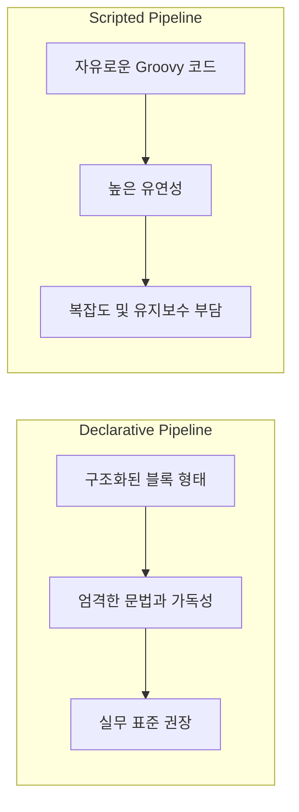
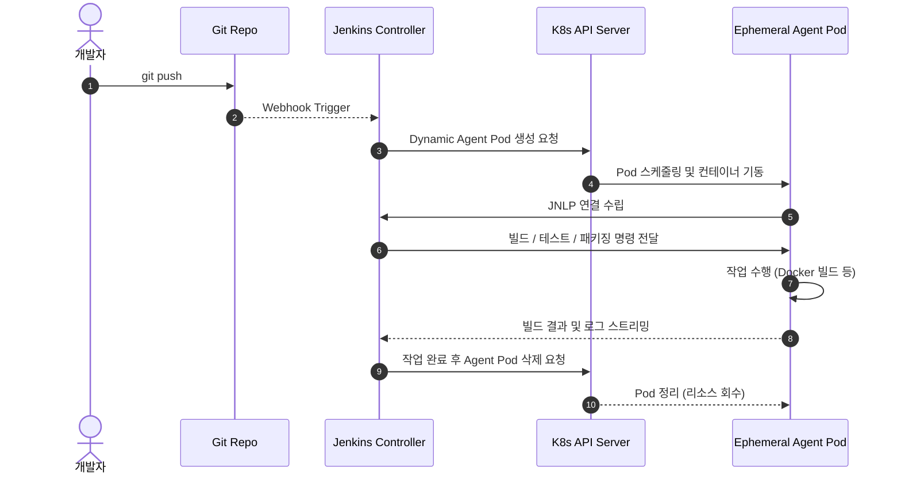

# Jenkins 사용 방법 및 실무 설정 가이드

Jenkins를 프로덕션 환경에서 원활하게 운용하기 위해 필요한 대시보드 관리, 프로젝트(Job) 생성, 자격 증명(Credentials) 관리, 그리고 파이프라인 문법의 핵심을 정리합니다.

---

## 1. 프로젝트(Job) 유형 비교

Jenkins에서 생성할 수 있는 주요 프로젝트 유형은 다음과 같습니다.

| 프로젝트 유형 | 특징 | 권장 사용 환경 |
| :--- | :--- | :--- |
| **Freestyle Project** | 웹 UI 폼에서 마우스 클릭과 입력으로 빌드 단계를 구성하는 전통적 방식 | 단순 쉘 스크립트 실행, 단발성 테스트, 빠른 프로토타이핑 |
| **Pipeline (권장)** | Groovy 기반의 `Jenkinsfile`을 작성하여 버전 관리(Git)와 함께 코드로 파이프라인을 정의하는 방식 | 표준 CI/CD 파이프라인, 멀티 스테이지 빌드, 배포 자동화 |
| **Multibranch Pipeline** | Git 저장소의 모든 브랜치를 스캔하여 `Jenkinsfile`이 존재하는 브랜치마다 개별 파이프라인을 자동 생성 | Git-flow, GitHub PR 빌드 검증, Feature 브랜치 자동 테스트 |

---

## 2. Declarative vs Scripted Pipeline

Jenkins Pipeline은 두 가지 문법 형식을 지원합니다. **실무에서는 가독성이 좋고 표준화된 Declarative 문법이 강력하게 권장**됩니다.



### 1) Declarative Pipeline (선언형 - 권장)
* `pipeline { ... }` 블록으로 시작합니다.
* 구조화되어 가독성이 높고, 에러 발생 시 어느 스테이지에서 실패했는지 직관적으로 파악할 수 있습니다.
* `stages`, `stage`, `steps`, `environment`, `post`, `when` 등의 명시적 키워드를 사용합니다.

### 2) Scripted Pipeline (스크립트형)
* `node { ... }` 블록으로 시작합니다.
* 일반적인 Groovy 프로그래밍 언어의 모든 문법(루프, 예외 처리, 함수 정의 등)을 제약 없이 사용할 수 있습니다.
* 복잡한 로직 구현이 가능하지만 코드가 길어지면 유지보수가 어려워집니다.

---

## 3. 자격 증명 관리 (Credentials Management)

Git 토큰, Docker Registry 비밀번호, SSH Key, API Secret 등 민감한 정보는 `Jenkinsfile`에 직접 노출하지 않고 Jenkins 내부의 암호화된 Credential 저장소에 등록하여 사용합니다.

### 등록 절차
1. **Jenkins 관리 (Manage Jenkins)** -> **Credentials** -> **System** -> **Global credentials (unrestricted)** 이동.
2. **[Add Credentials]** 클릭 후 종류(Kind) 선택:
   * **Username with password**: Docker Hub, Nexus, 사내 레지스트리 계정 등
   * **Secret text**: GitHub Personal Access Token (PAT), Slack Webhook URL, API 토큰 등
   * **SSH Username with private key**: Git SSH 클론용 비공개 키, 서버 원격 접속 키
   * **Secret file**: `kubeconfig`, 인증서 파일 등
3. 식별을 위한 고유 **ID**를 지정합니다 (예: `docker-hub-credentials`, `github-api-token`).

### `Jenkinsfile`에서 사용 예시
```groovy
pipeline {
    agent any
    environment {
        // Secret text 바인딩
        GITHUB_TOKEN = credentials('github-api-token')
        // Username / Password 바인딩 (자동으로 DOCKER_CREDS_USR, DOCKER_CREDS_PSW 생성됨)
        DOCKER_CREDS = credentials('docker-hub-credentials')
    }
    stages {
        stage('Docker Login') {
            steps {
                sh 'echo "$DOCKER_CREDS_PSW" | docker login -u "$DOCKER_CREDS_USR" --password-stdin'
            }
        }
    }
}
```

---

## 4. Git Webhook 연동 (자동 빌드 트리거)

코드가 Git에 Push되거나 Pull Request가 생성되었을 때 Jenkins 빌드가 즉시 자동으로 시작되도록 설정합니다.

### 1) Jenkins Job 설정
1. 대상 Job의 설정 페이지로 이동합니다.
2. **빌드 유발 (Build Triggers)** 섹션에서:
   * **GitHub hook trigger for GITScm polling** 체크 (GitHub 사용 시)
   * 또는 **Generic Webhook Trigger** 플러그인을 사용하여 세부 조건 필터링.

### 2) GitHub Repository 설정
1. GitHub 저장소의 **Settings** -> **Webhooks** -> **[Add webhook]** 클릭.
2. **Payload URL**: `http://<JENKINS_HOST>:<PORT>/github-webhook/` (끝에 슬래시 필수).
3. **Content type**: `application/json` 선택.
4. **Events**: `Just the push event` 또는 `Let me select individual events` (Pushes, Pull requests).
5. **[Add webhook]** 완료 후 푸시를 발생시켜 정상 작동 확인.

---

## 5. Kubernetes 동적 에이전트(Dynamic Agent) 연동

Jenkins Controller가 Kubernetes 클러스터 상에서 빌드 요청이 들어올 때마다 일회성(Ephemeral) Pod를 에이전트로 띄워 빌드를 수행하고, 작업이 끝나면 Pod를 자동 파기하는 최신 클라우드 네이티브 설정 방식입니다.



### 주요 장점
* **리소스 효율성**: 빌드가 없을 때 인프라 자원을 점유하지 않아 비용 절감.
* **빌드 격리성**: 각 빌드가 독립된 컨테이너 환경에서 실행되므로 환경 오염이나 파일 충돌 없음.
* **다양한 빌드 툴 체인 지원**: Java, Node.js, Go, Python 등 프로젝트별로 최적화된 컨테이너 이미지를 에이전트로 동적 지정 가능.
