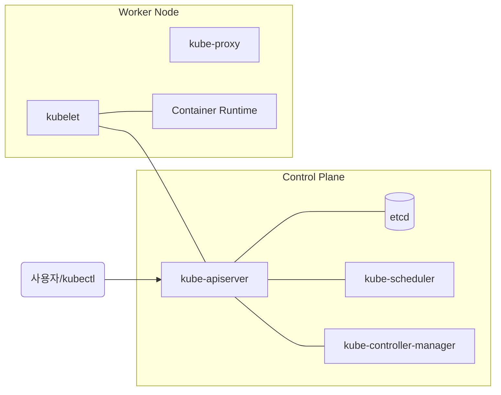

# 1. 클러스터 아키텍처 및 컴포넌트

Kubernetes 클러스터는 시스템을 관리하는 **Control Plane**과 실제 컨테이너가 실행되는 **Worker Node**로 구성됩니다.

---

## 1. 컨트롤 플레인 컴포넌트 (Control Plane Components)

클러스터 전체에 대한 결정(예: 스케줄링)을 내리고 클러스터 이벤트를 감지 및 대응합니다.

### 1.1 kube-apiserver

* **역할**: Kubernetes API를 노출하는 컨트롤 플레인의 프론트엔드입니다. 컴포넌트는 API 서버를 통해 상태를 조회·변경합니다. kubelet과 런타임 사이의 CRI 호출 등 별도 통신도 있습니다.
* **특징**: 수평적으로 확장 가능하도록 설계되었습니다.

### 1.2 etcd

* **역할**: Kubernetes API 리소스의 상태를 저장하는 **Key-Value 저장소**입니다. 애플리케이션이 PV에 쓴 데이터까지 저장하지는 않습니다.
* **중요**: 백업·복원과 quorum을 이해해야 하는 상태 저장 컴포넌트입니다.

### 1.3 kube-scheduler

* **역할**: 새로운 Pod가 생성될 때, 어느 노드에 배치할지 결정합니다.
* **결정 기준**: 리소스 요구사항, 정책, 하드웨어/소프트웨어 제약 등.

### 1.4 kube-controller-manager

* **역할**: 클러스터의 상태를 관찰하며, 원하는 상태(Desired State)와 현재 상태(Current State)를 일치시키는 다양한 컨트롤러를 실행합니다.
* **예**: Node Controller, Deployment Controller, EndpointSlice Controller 등.

---

## 2. 노드 컴포넌트 (Node Components)

모든 노드에서 실행되며 런타임 환경을 유지하고 Pod를 관리합니다.

### 2.1 kubelet

* **역할**: 클러스터의 각 노드에서 실행되는 에이전트입니다. Pod 내의 컨테이너들이 정상적으로 실행되고 있는지 관리합니다.
* **중요**: 노드가 `NotReady` 상태일 때 가장 먼저 점검해야 할 컴포넌트입니다.

### 2.2 kube-proxy

* **역할**: Service의 네트워크 규칙을 관리합니다. CNI가 이를 대체하는 구성에서는 kube-proxy를 사용하지 않을 수 있습니다.
* **동작**: 노드에 네트워크 규칙을 유지하여 내부/외부 통신이 가능하게 합니다.

### 2.3 Container Runtime (CRI)

* **역할**: 컨테이너 실행을 직접 담당하는 소프트웨어입니다.
* **예**: containerd, CRI-O 등 CRI를 지원하는 런타임입니다. Docker Engine에는 cri-dockerd 같은 CRI 어댑터가 필요합니다.

---

## 3. 핵심 아키텍처 요약도

```mermaid
graph LR
    subgraph CP["Control Plane"]
        API[kube-apiserver]
        ETCD[(etcd)]
        SCH[kube-scheduler]
        CM[kube-controller-manager]
        API --- ETCD
        API --- SCH
        API --- CM
    end

    subgraph Worker["Worker Node"]
        KLT[kubelet]
        KPR[kube-proxy]
        CRT[Container Runtime]
        KLT --- CRT
    end

    User(사용자/kubectl) --> API
    KLT --- API
```

## 참고 자료

- [Kubernetes: Components](https://kubernetes.io/docs/concepts/overview/components/)
- [Kubernetes: Container Runtime Interface](https://kubernetes.io/docs/concepts/containers/cri/)
