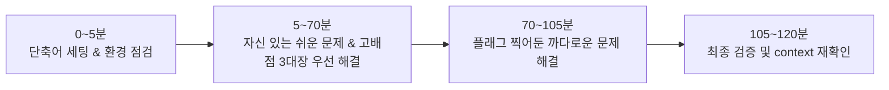

# 부록: Killer.sh 모의고사 공략 및 시험 체크리스트

CKA 시험을 등록하면 공식 모의고사인 **Killer.sh 세션 2회(각 세션당 36시간 접근 가능)**가 무료로 제공됩니다. Killer.sh를 전략적으로 활용하면 본 시험 합격 확률을 95% 이상으로 끌어올릴 수 있습니다.

---

## 1. Killer.sh 특징 및 현실적인 기대치

- **난이도 체감**: Killer.sh는 실제 CKA 시험보다 **약 1.5배 ~ 2배 정도 어렵고 문항 수도 많습니다(25문항)**.
- **점수 목표**: Killer.sh 첫 풀이에서 40~50점이 나와도 절대 좌절할 필요가 없습니다. 첫 회차에서는 시간 내에 다 풀지 못하는 것이 정상입니다.
- **핵심 목표**: 해설(Solution)을 꼼꼼히 정독하고 "어떻게 접근해야 가장 빠르게 풀 수 있는지"를 배우는 것이 진짜 목적입니다.

---

## 2. 2회 세션 활용 전략

### Session 1 (D-3 ~ D-4 일차에 활성화)

1. **1회차 실전 모의 풀이 (2시간 타이머)**:
   - 오픈북 없이 실제 시험처럼 시간을 재고 풀 수 있는 문제부터 풉니다.
   - 막히는 문제는 3분 이상 고민하지 말고 넘깁니다.
2. **오답 정독 및 복습 (나머지 34시간 동안)**:
   - Killer.sh에 제공되는 상세한 모범 답안과 팁을 꼼꼼하게 읽고, 터미널에서 직접 다시 풀어봅니다.
   - 자신이 몰랐던 `kubectl` 옵션이나 공식 문서 위치를 TIL에 정리합니다.

### Session 2 (D-1 ~ D-2 일차에 활성화)

- 세션을 초기화(Reset)하여 새로운 환경에서 다시 한번 25문항 전체를 풀어봅니다.
- 목표 점수: **90점 이상 달성** (이미 풀어본 문제이므로 1시간 30분 내에 끝내는 것을 목표로 함).

---

## 3. 시험 당일 시간 배분 및 운영 전략 (120분)

1. **컨텍스트 확인**: 문제 시작 시 맨 위 상단에 있는 `kubectl config use-context <cluster>`를 무조건 복사하여 터미널에 먼저 실행합니다. (엉뚱한 클러스터에서 작업하면 0점 처리됨)
2. **고배점 3대장 먼저 공략**:
   - `etcd` 백업 및 복원 (~7-9점)
   - `kubeadm` 클러스터 업그레이드 (~8-10점)
   - `NetworkPolicy` 구성 (~6-8점)
   - 이 세 문제만 완벽히 풀어도 합격선(66점)의 절반 가까이를 확보합니다.
3. **5분 룰**: 문제 지문을 읽고 2분 내에 해결 방법이 떠오르지 않거나 5분 이상 헤매고 있다면 플래그(Flag)를 꽂아두고 즉시 다음 문제로 넘어가세요.

---

## 4. 시험 응시 전 환경 체크리스트

- [ ] **유효한 신분증**: 영문 성명이 시험 접수 이름과 정확히 일치하는 **여권(Passport)** 강력 권장. (주민등록증/운전면허증은 감독관에 따라 영문 증빙을 추가 요구할 수 있음)
- [ ] **책상 환경**: 모니터 주변에 종이, 펜, 물병 라벨, 전자기기 등이 전혀 없어야 함. (완전히 비워진 책상)
- [ ] **방 환경**: 밀폐된 조용한 공간, 시험 도중 다른 사람이 들어오면 즉시 실격.
- [ ] **네트워크 및 장비**: 웹캠, 마이크 작동 상태 점검 및 안정적인 유선 인터넷 환경 권장.
- [ ] **브라우저**: PSI Secure Browser 설치 및 사전 시스템 점검(System Check) 완료.
