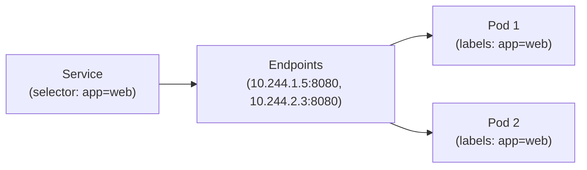

# 3.1 서비스 네트워킹 (Services)

파드(Pod)는 동적으로 생성되고 삭제되며 IP 주소가 수시로 변경됩니다. **서비스(Service)**는 파드 집합에 대한 고정된 단일 진입점(가상 IP 및 DNS 이름)을 제공하고 트래픽을 부하 분산(Load Balancing)합니다.

---

## 1. 포트 용어 완벽 정리 (가장 헷갈리는 포인트)

| 포트 용어 | 설명 | 예시 |
| :--- | :--- | :--- |
| **`port`** | **서비스 자체**가 노출하는 가상 포트 (클러스터 내부에서 서비스에 접속할 때 사용) | 80 |
| **`targetPort`** | 실제 **파드 컨테이너 내부**에서 애플리케이션이 수신 대기 중인 포트 | 8080 |
| **`nodePort`** | NodePort 서비스 사용 시 **각 워커 노드의 외부 IP**에 바인딩되는 포트 (범위: 30000~32767) | 30080 |

---

## 2. 서비스 핵심 타입

### 2.1 ClusterIP (기본값)

- **용도**: 클러스터 내부 통신 전용. 클러스터 외부에서는 직접 접근 불가.
- **명령형 생성**:
  ```bash
  # Deployment를 기반으로 80포트 서비스 노출 (targetPort가 80과 다르면 지정)
  kubectl expose deployment my-deploy --name=my-service --port=80 --target-port=8080

  # 명령어로 직접 생성
  kubectl create service clusterip my-service --tcp=80:8080
  ```

### 2.2 NodePort

- **용도**: 각 워커 노드의 IP와 지정된 고정 포트(`30000-32767`)를 통해 클러스터 외부에서 접근 허용.
- **명령형 생성**:
  ```bash
  kubectl create service nodeport my-np-service --tcp=80:8080 --node-port=30080
  ```

### 2.3 LoadBalancer

- **용도**: 클라우드 공급자(AWS, GCP, Azure 등)의 외부 로드밸런서를 자동으로 프로비저닝.

---

## 3. 서비스와 파드 연결 원리 (Selector & Endpoints)

서비스는 `selector`에 정의된 라벨과 일치하는 파드를 찾아 **Endpoints (또는 EndpointSlice)** 오브젝트를 자동으로 생성합니다.



> [!WARNING]
> 만약 서비스로 요청을 보냈는데 응답이 없거나 `502 Bad Gateway`가 난다면 가장 먼저 `kubectl get endpoints <service-name>`를 확인하세요. 엔드포인트 목록이 비어 있다면 서비스의 `selector` 라벨과 파드의 `metadata.labels`가 불일치하는 것입니다.

---

## 4. 실전 검증 및 디버깅 명령어

### 4.1 임시 파드를 띄워 클러스터 내부 통신 테스트
```bash
# curl 파드를 띄워 즉시 응답 확인 후 자동 삭제
kubectl run tmp-curl --rm -i --tty --image=curlimages/curl -- curl -m 3 http://my-service:80
```

### 4.2 로컬 포트 포워딩 (Port-Forward)
외부 노출 없이 개발자 PC에서 파드나 서비스로 직접 터널링할 때 유용합니다.
```bash
# 로컬 8080 포트를 파드의 80 포트로 포워딩
kubectl port-forward pod/my-pod 8080:80

# 서비스 포워딩
kubectl port-forward svc/my-service 8080:80
```

---

## 💡 CKA 시험 실전 팁

1. YAML을 직접 작성하지 마세요. `kubectl expose pod <pod-name> --name=... --port=... --target-port=...` 명령어를 쓰면 파드의 라벨 셀렉터까지 자동으로 잡아줍니다.
2. 특정 포트(예: NodePort 32000)를 지정하라는 문제가 나오면:
   ```bash
   kubectl create service nodeport my-svc --tcp=80:8080 --node-run=client -o yaml > svc.yaml
   ```
   YAML에서 `spec.ports[0].nodePort: 32000`을 추가한 후 `kubectl apply -f svc.yaml`을 실행합니다.
