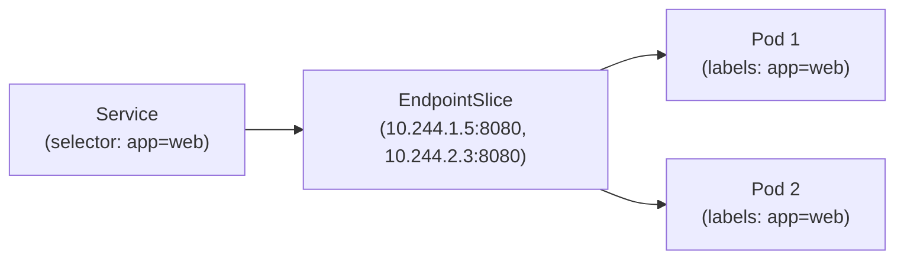

# 3.1 서비스 네트워킹 (Services)

파드(Pod)는 동적으로 생성되고 삭제되며 IP 주소가 수시로 변경됩니다. **서비스(Service)**는 파드 집합의 안정적인 접근 지점과 서비스 검색을 제공합니다. 일반 ClusterIP Service는 가상 IP를 사용하며 headless Service는 별도 ClusterIP를 할당하지 않습니다.

---

## 1. port, targetPort, nodePort

| 포트 용어 | 설명 | 예시 |
| :--- | :--- | :--- |
| **`port`** | **서비스 자체**가 노출하는 가상 포트 (클러스터 내부에서 서비스에 접속할 때 사용) | 80 |
| **`targetPort`** | 실제 **파드 컨테이너 내부**에서 애플리케이션이 수신 대기 중인 포트 | 8080 |
| **`nodePort`** | NodePort 서비스 사용 시 **노드 IP**에서 접근할 수 있는 포트 (기본 범위: 30000~32767, 설정에 따라 변경 가능) | 30080 |

---

## 2. 서비스 핵심 타입

아래 생성 명령은 각각의 예시입니다. `kubectl expose`는 기존 리소스가 필요하고, `kubectl create service`는 파드 존재 여부와 관계없이 Service를 만듭니다. 후자는 기본 selector가 `app=<Service 이름>`이므로 실제 Pod 라벨과 맞춰야 합니다.

### 2.1 ClusterIP (기본값)

- **용도**: 기본적으로 클러스터 내부 접근용. 외부 접근에는 적절한 라우팅·프록시·노출 구성이 필요합니다.
- **명령형 생성**:

    ```bash
    # Deployment를 기반으로 80포트 서비스 노출 (targetPort가 80과 다르면 지정)
    kubectl expose deployment my-deploy --name=my-service --port=80 --target-port=80

    # 명령어로 직접 생성
    kubectl create service clusterip web --tcp=80:80
    ```

### 2.2 NodePort

- **용도**: 노드 IP와 NodePort로 접근합니다. 주소 선택 설정·방화벽·라우팅에 따라 외부 접근 여부가 달라집니다.
- **명령형 생성**:

    ```bash
    kubectl create service nodeport my-np-service --tcp=80:8080 --node-port=30080
    ```

### 2.3 LoadBalancer

- **용도**: 클라우드 연동 또는 별도 LoadBalancer 구현을 통해 노출합니다. 구현이 없으면 외부 주소가 Pending으로 남을 수 있습니다.

---

## 3. 서비스와 파드 연결 원리 (Selector & Endpoints)

selector가 있는 Service는 같은 namespace의 일치하는 Pod를 대상으로 EndpointSlice controller가 **EndpointSlice**를 관리합니다. selector가 없는 Service는 endpoint를 별도로 관리합니다. 기존 Endpoints API는 Kubernetes 1.33부터 deprecated입니다.


```mermaid
flowchart LR
    SVC["Service<br>(selector: app=web)"] --> EP["EndpointSlice<br>(10.244.1.5:8080, 10.244.2.3:8080)"]
    EP --> Pod1["Pod 1<br>(labels: app=web)"]
    EP --> Pod2["Pod 2<br>(labels: app=web)"]
```

!!! warning

    `kubectl get endpointslices -l kubernetes.io/service-name=<service-name>`로 주소·포트·ready 조건을 확인합니다. selector 불일치 외에도 Pod 부재·readiness 실패·targetPort 오류를 구분합니다. HTTP 502는 프록시 등에서 발생할 수 있으므로 그 로그도 확인합니다.

---

## 4. 실전 검증 및 디버깅 명령어

### 4.1 임시 파드를 띄워 클러스터 내부 통신 테스트

```bash
# curl 파드를 띄워 즉시 응답 확인 후 자동 삭제
kubectl run tmp-curl --rm -i --restart=Never --image=curlimages/curl --command -- curl -m 3 http://my-service:80
```

### 4.2 로컬 포트 포워딩 (Port-Forward)

외부 노출 없이 개발자 PC에서 파드나 서비스로 직접 터널링할 때 유용합니다.

```bash
# 로컬 8080 포트를 파드의 80 포트로 포워딩
kubectl port-forward pod/my-pod 8080:80

# 서비스 포워딩
kubectl port-forward svc/my-service 8080:80
```

---

## 💡 CKA 시험 실전 팁

1. 기존 파드로부터 생성할 때는 `kubectl expose pod <pod-name> --name=... --port=... --target-port=...`로 selector의 뼈대를 만들 수 있습니다. 대상 파드와 포트가 맞는지 확인합니다.
2. 특정 포트(예: NodePort 32000)를 지정하라는 문제가 나오면:

    ```bash
    kubectl create service nodeport my-svc --tcp=80:80 --node-port=32000 --dry-run=client -o yaml > svc.yaml
    ```

    생성된 `nodePort`와 selector를 확인한 뒤 `kubectl apply -f svc.yaml`을 실행합니다.

## 참고 자료

- [Kubernetes: Service](https://kubernetes.io/docs/concepts/services-networking/service/)
- [kubectl create service nodeport](https://kubernetes.io/docs/reference/kubectl/generated/kubectl_create/kubectl_create_service_nodeport/)
