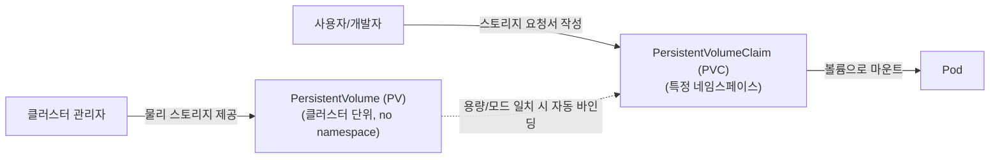

# 4.1 PV & PVC 스토리지 (Persistent Volumes & Claims)

쿠버네티스에서 파드가 재시작되거나 삭제되어도 데이터를 영구히 보존하기 위해 **PersistentVolume(PV)**과 **PersistentVolumeClaim(PVC)** 메커니즘을 사용합니다.

---

## 1. PV vs PVC 역할 분담



---

## 2. 접근 모드 (AccessModes) 및 회수 정책 (ReclaimPolicy)

### 2.1 AccessModes

- **`ReadWriteOnce` (RWO)**: 단일 노드에서만 읽기/쓰기 마운트 가능.
- **`ReadOnlyMany` (ROX)**: 여러 노드에서 읽기 전용으로 동시 마운트 가능.
- **`ReadWriteMany` (RWX)**: 여러 노드에서 읽기/쓰기로 동시 마운트 가능 (예: NFS).
- **`ReadWriteOncePod` (RWOP)**: 단일 파드에서만 읽기/쓰기 허용 (최신 K8s GA 기능).

### 2.2 ReclaimPolicy (PVC 삭제 시 PV 데이터 처리)

- **`Retain`**: PVC가 삭제되어도 PV와 실제 데이터는 보존됨 (수동 정리 필요).
- **`Delete`**: PVC가 삭제되면 기본 스토리지의 실제 볼륨과 데이터도 자동 삭제됨.

---

## 3. 실전 YAML 작성 예제

### 3.1 PersistentVolume (PV) 정의
PV는 클러스터 전체 자원이므로 `namespace`를 명시하지 않습니다.
```yaml
apiVersion: v1
kind: PersistentVolume
metadata:
  name: pv-log-data
spec:
  capacity:
    storage: 1Gi
  volumeMode: Filesystem
  accessModes:
  - ReadWriteOnce
  persistentVolumeReclaimPolicy: Retain
  storageClassName: manual
  hostPath:
    path: /mnt/data
```

### 3.2 PersistentVolumeClaim (PVC) 정의
PVC는 특정 네임스페이스에 속합니다.
```yaml
apiVersion: v1
kind: PersistentVolumeClaim
metadata:
  name: pvc-log-claim
  namespace: default
spec:
  accessModes:
  - ReadWriteOnce
  resources:
    requests:
      storage: 1Gi
  storageClassName: manual
```

### 3.3 Pod에 PVC 마운트하기
```yaml
apiVersion: v1
kind: Pod
metadata:
  name: app-using-pvc
  namespace: default
spec:
  containers:
  - name: web
    image: nginx
    volumeMounts:
    - name: storage-mount
      mountPath: /usr/share/nginx/html
  volumes:
  - name: storage-mount
    persistentVolumeClaim:
      claimName: pvc-log-claim
```

---

## 4. 실전 검증 명령어

```bash
# PV 및 PVC 상태 확인 (STATUS가 'Bound'인지 확인 필수!)
kubectl get pv
kubectl get pvc -n default

# 바인딩 실패(Pending) 시 원인 분석
kubectl describe pvc pvc-log-claim -n default
```

> [!WARNING]
> PVC가 `Pending` 상태로 머물러 있다면 다음 3가지를 점검하세요:
> 1. PV의 용량이 PVC의 요구량보다 크거나 같은가?
> 2. PV와 PVC의 `accessModes`가 동일한가?
> 3. `storageClassName`이 일치하는가? (한쪽에 명시되어 있다면 다른 쪽도 일치해야 함)

---

## 💡 CKA 시험 실전 팁

1. **공식 문서 검색어**: `pv pvc` 또는 `persistent volume`
2. 공식 문서 "Configure a Pod to Use a PersistentVolume for Storage" 페이지의 예제를 복사하면 가장 빠릅니다.
3. PV를 수동으로 만들 때 `storageClassName: manual`이나 `storageClassName: ""`를 명시하지 않으면 기본 StorageClass가 자동 적용되어 엉뚱한 동적 프로비저닝이 일어날 수 있으니 주의합니다.
