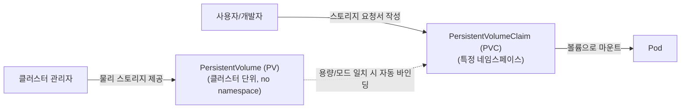

# 4.1 PV & PVC 스토리지 (Persistent Volumes & Claims)

쿠버네티스에서 파드가 재시작되거나 삭제되어도 데이터를 영구히 보존하기 위해 **PersistentVolume(PV)**과 **PersistentVolumeClaim(PVC)** 메커니즘을 사용합니다.

---

## 1. PV vs PVC 역할 분담


```mermaid
flowchart LR
    Admin["클러스터 관리자"] -->|물리 스토리지 제공| PV["PersistentVolume (PV)<br>(클러스터 단위, no namespace)"]
    Dev["사용자/개발자"] -->|스토리지 요청서 작성| PVC["PersistentVolumeClaim (PVC)<br>(특정 네임스페이스)"]
    PV -.->|용량/모드 일치 시 자동 바인딩| PVC
    PVC -->|볼륨으로 마운트| Pod["Pod"]
```

---

## 2. 접근 모드 (AccessModes) 및 회수 정책 (ReclaimPolicy)

### 2.1 AccessModes

- **`ReadWriteOnce` (RWO)**: 단일 노드에서 읽기/쓰기 마운트. 같은 노드의 여러 Pod가 사용할 수 있습니다.
- **`ReadOnlyMany` (ROX)**: 여러 노드에서 읽기 전용으로 동시 마운트 가능.
- **`ReadWriteMany` (RWX)**: 여러 노드에서 읽기/쓰기로 동시 마운트 가능 (예: NFS).
- **`ReadWriteOncePod` (RWOP)**: 단일 Pod의 읽기/쓰기 사용으로 제한. CSI 볼륨에서 지원하며 Kubernetes 1.29에서 stable이 되었습니다.

### 2.2 ReclaimPolicy (PVC 삭제 시 PV 데이터 처리)

- **`Retain`**: PVC가 삭제되어도 PV와 실제 데이터는 보존됨 (수동 정리 필요).
- **`Delete`**: 지원 드라이버에서 PVC 해제 후 PV와 실제 스토리지를 삭제합니다. 보호 finalizer와 드라이버 처리로 완료가 지연될 수 있습니다.

---

## 3. 실전 YAML 작성 예제

### 3.1 PersistentVolume (PV) 정의

PV는 클러스터 자원이므로 `namespace`를 지정하지 않습니다. 아래 hostPath는 단일 노드 실습용이며 여러 노드 간 데이터 공유나 1Gi 사용량 제한을 제공하지 않습니다.

```yaml
apiVersion: v1
kind: PersistentVolume
metadata:
  name: pv-log-data
spec:
  capacity:
    storage: 1Gi
  volumeMode: Filesystem
  accessModes:
  - ReadWriteOnce
  persistentVolumeReclaimPolicy: Retain
  storageClassName: manual
  hostPath:
    path: /mnt/data
    type: DirectoryOrCreate
```

### 3.2 PersistentVolumeClaim (PVC) 정의

PVC는 특정 네임스페이스에 속합니다.

```yaml
apiVersion: v1
kind: PersistentVolumeClaim
metadata:
  name: pvc-log-claim
  namespace: default
spec:
  accessModes:
  - ReadWriteOnce
  resources:
    requests:
      storage: 1Gi
  storageClassName: manual
```

### 3.3 Pod에 PVC 마운트하기

```yaml
apiVersion: v1
kind: Pod
metadata:
  name: app-using-pvc
  namespace: default
spec:
  containers:
  - name: web
    image: nginx
    volumeMounts:
    - name: storage-mount
      mountPath: /usr/share/nginx/html
  volumes:
  - name: storage-mount
    persistentVolumeClaim:
      claimName: pvc-log-claim
```

---

## 4. 실전 검증 명령어

위 YAML을 각각 `pv.yaml`, `pvc.yaml`, `pod.yaml`로 저장한 뒤 순서대로 적용합니다. 정적 PV 예제에서는 같은 `manual` class 값을 사용하므로 별도의 동적 프로비저너가 필요하지 않습니다.

```bash
kubectl apply -f pv.yaml
kubectl apply -f pvc.yaml
kubectl apply -f pod.yaml
kubectl get pod app-using-pvc -n default
```

빈 디렉터리를 nginx의 문서 루트에 마운트하므로 기본 웹 페이지는 가려집니다. HTTP 응답도 시험하려면 볼륨에 `index.html`을 준비합니다.

```bash
# PV 및 PVC가 Bound 상태인지 확인
kubectl get pv
kubectl get pvc -n default

# 바인딩 실패(Pending) 시 원인 분석
kubectl describe pvc pvc-log-claim -n default
```

!!! warning

    PVC가 `Pending` 상태로 머물러 있다면 다음 항목을 점검하세요:

    1. PV의 용량이 PVC의 요구량보다 크거나 같은가?
    2. PV가 PVC에서 요청한 `accessModes`를 모두 지원하는가?
    3. `storageClassName`, `volumeMode`, selector·기존 claimRef가 맞는가?
    4. `WaitForFirstConsumer`라면 소비 Pod와 스케줄링 조건이 준비되었는가?

---

## 💡 CKA 시험 실전 팁

1. **공식 문서 검색어**: `pv pvc` 또는 `persistent volume`
2. 공식 예제를 사용할 때도 스토리지 종류, 접근 모드와 class가 문제 조건에 맞는지 확인합니다.
3. 기본 StorageClass는 class를 생략한 **PVC**에 적용됩니다. 정적 바인딩은 PV/PVC의 class를 맞추고, class 없이 연결하려면 PVC에 `storageClassName: ""`를 명시합니다.

## 참고 자료

- [Kubernetes: Persistent Volumes](https://kubernetes.io/docs/concepts/storage/persistent-volumes/)
- [Kubernetes: hostPath](https://kubernetes.io/docs/concepts/storage/volumes/#hostpath)
