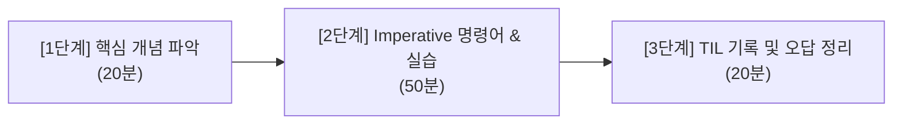

# 📅 CKA 2주 단기 완성 로드맵 (하루 1~2시간)

이 문서는 **CKA (Certified Kubernetes Administrator)** 자격증 시험을 2주(14일) 동안 하루 1~2시간씩 투자하여 합격할 수 있도록 설계된 실전 학습 로드맵입니다.

---

## 🎯 학습 기본 정보

- **시험 형태**: 100% 실습형 (Hands-on Performance-based)
- **문항 수 및 시간**: 15~17문항 / 120분 (문항당 평균 7분 내외)
- **합격 커트라인**: 66% 이상
- **제공 환경**: 브라우저 기반 원격 데스크톱 (XFCE), bash 터미널, 공식 문서(`kubernetes.io/docs`) 1개 탭 검색 허용
- **핵심 전략**: YAML을 처음부터 타이핑하지 않고 **`--dry-run=client -o yaml`**을 활용해 뼈대를 생성하고, 공식 문서 예제를 빠르게 복사·수정합니다.



---

## 📋 14일차 일일 체크리스트

### 1주차: 핵심 도메인 완성 및 고배점 유형 정복 (Day 1 ~ Day 7)

- [ ] **Day 1: 시험 환경 세팅 & 클러스터 핵심 관리**
  - 관련 문서: [0. CKA 시험 개요 및 팁](CKA_Exam_Tips.md), [1.2 ETCD 백업 및 복원](ETCD_Backup_Restore.md), [1.1 설치 및 업그레이드](Kubeadm_Install_Upgrade.md)
  - 핵심 실습:
    - 터미널 단축어(`alias k=kubectl`, `do="--dry-run=client -o yaml"`, vimrc 설정) 손에 익히기
    - `etcdctl snapshot save` & `etcdutl snapshot restore` 단일 멤버 복원 절차 완벽 숙달
    - 마스터 노드/워커 노드 `drain` $\rightarrow$ 패키지 설치 $\rightarrow$ `kubeadm upgrade` $\rightarrow$ `kubelet` 재시작 $\rightarrow$ `uncordon` 순서 체화
  - 목표: 시험에 100% 출제되는 두 문제를 각각 10분 이내에 해결하는 근육 기억 형성

- [ ] **Day 2: RBAC 권한 제어 & 보안**
  - 관련 문서: [1.3 RBAC 권한 제어](RBAC_Authorization.md)
  - 핵심 실습:
    - `kubectl create role`, `kubectl create clusterrole` 명령형 커맨드로 15초 컷 생성
    - `RoleBinding`과 `ClusterRoleBinding` 연결 대상(`--user`, `--serviceaccount`) 구분
    - `kubectl auth can-i <verb> <resource> --as <user> -n <ns>`로 검증 습관화
  - 목표: YAML 직접 작성 없이 명령형 한 줄로 RBAC 문제 완료

- [ ] **Day 3: 워크로드 관리 & ConfigMap/Secret**
  - 관련 문서: [2.1 워크로드 기초](Workloads.md), [2.4 설정 관리 (ConfigMap & Secret)](ConfigMaps_Secrets.md)
  - 핵심 실습:
    - Deployment 롤아웃 업데이트(`set image`), 상태 추적(`rollout status`), 롤백(`rollout undo`)
    - DaemonSet YAML 변환 트릭 (Deployment YAML에서 `replicas`, `strategy` 제거 후 `kind: DaemonSet`)
    - ConfigMap 및 Secret 생성 (`create cm/secret generic`) 후 파드에 `envFrom` 및 Volume 마운트
  - 목표: 환경변수 주입과 볼륨 마운트 설정 자유자재로 적용

- [ ] **Day 4: 스케줄링 & 멀티 컨테이너/사이드카**
  - 관련 문서: [2.2 스케줄링 제어](Scheduling.md), [2.3 리소스 제한](Resource_Limits.md), [2.5 멀티 컨테이너 & 사이드카](Multi_Container_Pods.md)
  - 핵심 실습:
    - `nodeSelector` 및 `nodeAffinity` (required vs preferred) YAML 작성
    - `kubectl taint nodes` 설정 및 Pod `tolerations` 매핑
    - 멀티 컨테이너 파드 로그 조회(`-c <container>`) 및 exec 접속
    - K8s 1.29+ Native Sidecar Container (`initContainers` 내 `restartPolicy: Always`) 구성
  - 목표: 원하는 노드에 파드를 스케줄링하고 사이드카 로그 수집 패턴 구현

- [ ] **Day 5: 서비스 & 인그레스 (네트워킹 1)**
  - 관련 문서: [3.1 서비스 네트워킹](Services.md), [3.2 인그레스 라우팅](Ingress.md)
  - 핵심 실습:
    - `kubectl expose deployment` 및 `kubectl create service`로 ClusterIP/NodePort 생성
    - `kubectl port-forward`를 통한 로컬 포트 임시 터널링
    - Ingress 리소스 작성 (공식 문서 검색어: `ingress`, host/path 기반 라우팅 규칙 복사 및 수정)
    - `curl -H "Host: ..."`로 라우팅 동작 검증
  - 목표: 외부 트래픽을 서비스 및 인그레스를 거쳐 파드로 연결

- [ ] **Day 6: 네트워크 정책 (NetworkPolicy - 단골/고배점)**
  - 관련 문서: [3.3 네트워크 정책](Network_Policy.md)
  - 핵심 실습:
    - NetworkPolicy 기본 구조(podSelector, policyTypes: Ingress/Egress) 파악
    - 네임스페이스 격리 및 특정 라벨 파드로부터의 80번 포트 인바운드만 허용
    - `curlimages/curl` 파드를 이용해 통신 허용/차단 실시간 검증
  - 목표: 괄호/들여쓰기 실수 없이 화이트리스트 정책 작성

- [ ] **Day 7: 스토리지 (Storage)**
  - 관련 문서: [4.1 PV & PVC 스토리지](Storage_PV_PVC.md), [4.2 StorageClass 동적 프로비저닝](Storage_StorageClass.md)
  - 핵심 실습:
    - PersistentVolume(PV) 정의: capacity, accessModes, hostPath/nfs, persistentVolumeReclaimPolicy
    - PersistentVolumeClaim(PVC) 생성 및 PV와의 바인딩(Bound) 상태 확인
    - Pod에 PVC 마운트(`volumes.persistentVolumeClaim` & `volumeMounts`)
    - StorageClass를 통한 동적 볼륨 프로비저닝 확인
  - 목표: PV-PVC-Pod 연결 파이프라인 완벽 구현

---

### 2주차: 트러블슈팅 정복 + 모의고사 + 실전 감각 완성 (Day 8 ~ Day 14)

- [ ] **Day 8: 트러블슈팅 1 - 애플리케이션 및 파드 장애**
  - 관련 문서: [5.1 파드 트러블슈팅](Troubleshooting_Pods.md)
  - 핵심 실습:
    - `CrashLoopBackOff`, `ImagePullBackOff`, `Pending`, `ErrImagePull` 에러 진단
    - `kubectl describe pod`에서 `Events` 확인 및 `kubectl logs --previous` 조회
    - Liveness/Readiness Probe 경로·포트 오류 수정
  - 목표: 파드가 뜨지 않을 때 2분 안에 근본 원인 파악 및 복구

- [ ] **Day 9: 트러블슈팅 2 - 컨트롤 플레인 장애**
  - 관련 문서: [5.2 클러스터 컨트롤 플레인 트러블슈팅](Troubleshooting_Cluster.md)
  - 핵심 실습:
    - Static Pod 매니페스트 경로(`/etc/kubernetes/manifests`) 점검
    - API 서버 다운 시 `crictl ps -a` 및 `crictl logs`로 컨테이너 에러 추적
    - 인증서 경로 오타, 포트 충돌, 매니페스트 문법 오류 해결
  - 목표: 마스터 노드 컴포넌트 장애 발생 시 패닉 없이 침착하게 원인 수정

- [ ] **Day 10: 트러블슈팅 3 - 워커 노드 및 DNS 장애**
  - 관련 문서: [5.3 노드 및 네트워크 트러블슈팅](Troubleshooting_Nodes_Network.md)
  - 핵심 실습:
    - 노드 `NotReady` 상태 원인 분석 (`systemctl status kubelet`, `journalctl -u kubelet -e`)
    - 컨테이너 런타임(`containerd`) 상태 확인 및 소켓 경로 점검
    - CoreDNS 파드 상태, 서비스 엔드포인트, `/etc/resolv.conf` 점검
  - 목표: 노드와 클러스터 내부 도메인 이름 해석 장애 해결

- [ ] **Day 11: 실전 모의고사 1회차 (Killer.sh Session 1)**
  - 관련 문서: [부록: Killer.sh 공략 및 시험 체크리스트](Killer_sh_Strategy.md)
  - 핵심 실습:
    - Killer.sh 환경 활성화 후 1~15번 문제 실전처럼 풀이
    - 문제마다 `kubectl config use-context` 반드시 먼저 실행하는 습관 확인
    - 풀리지 않는 문제는 과감히 `flag` 표시하고 다음 문제로 넘어가는 시간 관리 연습
  - 목표: 실전 시험 환경 체감 (Killer.sh는 본시험보다 난이도가 1.5~2배 높으므로 좌절하지 말 것)

- [ ] **Day 12: 모의고사 1회차 오답 분석 & JSONPath 특훈**
  - 관련 문서: [부록: JSONPath 및 명령형 치트시트](JSONPath_Cheatsheet.md)
  - 핵심 실습:
    - Killer.sh 해설지를 보며 틀린 문제와 비효율적으로 푼 문항 재정리
    - JSONPath 필터링 문법(`-o jsonpath='{.items[*].metadata.name}'`) 연습
    - 커스텀 컬럼 및 `--sort-by` 정렬 명령어 숙달
  - 목표: 모의고사 오답률 0% 달성 및 데이터 추출 문제 대비

- [ ] **Day 13: 핵심 고배점 3대장 타임어택 & 모의고사 2회차**
  - 핵심 실습:
    - 1) ETCD 백업 및 복원 (10분 컷)
    - 2) Kubeadm 클러스터 업그레이드 (10분 컷)
    - 3) NetworkPolicy 생성 및 테스트 (7분 컷)
    - Killer.sh Session 2 또는 취약 유형 반복 숙달
  - 목표: 배점이 높은 3개 문제를 실수 없이 기계적으로 풀어내어 기본 40점 확보

- [ ] **Day 14: 최종 점검 및 시험 준비 완료**
  - 핵심 점검:
    - 웹캠, 마이크, 유효한 신분증(여권 권장), 깨끗한 책상 환경 확인
    - 필수 터미널 단축어(`alias k=kubectl`) 재확인
    - 공식 문서 즐겨찾기 키워드 최종 훑어보기
    - 충분한 수면 및 컨디션 관리!

---

## 💡 CKA 시험장 필수 팁

1. **컨텍스트 확인**: 문제마다 맨 위에 표시되는 `kubectl config use-context <cluster>`를 무조건 복사하여 터미널에 먼저 붙여넣으세요.
2. **단축어 설정**: 시험 시작 즉시 다음 3줄을 실행합니다.
   ```bash
   alias k=kubectl
   complete -F __start_kubectl k
   export do="--dry-run=client -o yaml"
   ```

3. **공식 문서 활용**: 구글 검색은 금지되어 있지만, 공식 문서(`kubernetes.io/docs`) 검색창에서 예제 YAML을 찾아 복사하는 것은 허용됩니다. 예제의 들여쓰기 탭을 스페이스 2칸으로 주의해서 사용하세요.
