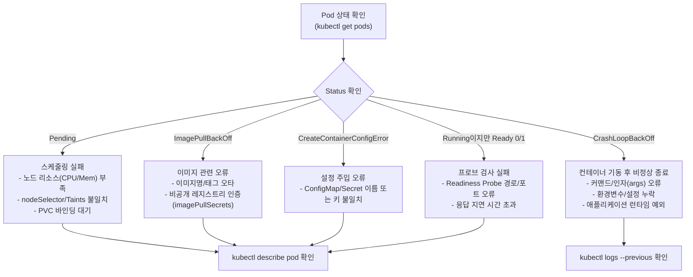

# 5.1 파드 트러블슈팅 (Pod & Application Troubleshooting)

파드가 정상적으로 기동하지 않거나 비정상 종료되는 현상은 CKA 시험에서 가장 높은 빈도로 출제되는 장애 시나리오입니다. 파드의 상태(STATUS)를 보고 즉시 원인을 추적하는 절차를 체화해야 합니다.

---

## 1. 파드 장애 진단 순서도



---

## 2. 주요 에러 유형별 원인 및 해결 방법

### 2.1 Pending

- **원인 1: 노드 리소스 부족 (Insufficient CPU/Memory)**
  - 확인: `kubectl describe pod <name>` 하단 `Events`에 `0/3 nodes are available: 3 Insufficient cpu.`
  - 해결: 파드의 `resources.requests`를 낮추거나 다른 불필요한 파드 정리.
- **원인 2: Taint / NodeSelector 불일치**
  - 확인: `Events`에 `nodes had untolerated taint`
  - 해결: 파드에 적절한 `tolerations` 추가 또는 노드의 라벨 수정.
- **원인 3: PVC가 Pending 상태**
  - 해결: `kubectl describe pvc <claim-name>`으로 PV 바인딩 실패 원인 해결.

### 2.2 ImagePullBackOff / ErrImagePull

- **원인**: 이미지 이름 오타(`nginx:1.200`), 존재하지 않는 태그, 레지스트리 네트워크 오류.
- **확인 및 해결**:
  ```bash
  kubectl describe pod <name> | grep -E "Image:|Failed"
  # 이미지 오타 수정
  kubectl set image pod <name> <container-name>=nginx:latest
  # 또는 yaml 수정 후 교체: kubectl replace --force -f pod.yaml
  ```

### 2.3 CrashLoopBackOff
컨테이너가 시작되자마자 에러 코드(1, 137 등)로 종료되어 쿠버네티스가 계속 재시작을 반복하는 상태입니다.

- **핵심 명령어**:
  ```bash
  # 현재 실행 중인 로그 확인
  kubectl logs <pod-name>
  # 바로 직전에 크래시된 이전 컨테이너의 로그 확인 (필수!)
  kubectl logs <pod-name> --previous
  ```

- **주요 원인**:
  - `command`나 `args`에 잘못된 셸 명령어 지정
  - 필수 환경변수(`env`) 누락으로 인한 앱 기동 실패
  - 메모리 초과로 인한 **OOMKilled (Exit Code 137)**: `kubectl describe pod`에서 `Last State: Terminated / Reason: OOMKilled` 확인 후 `limits.memory` 증설.

### 2.4 Liveness / Readiness Probe 실패

- **증상**: 파드가 `Running`이지만 `READY 0/1`로 머물거나, 주기적으로 재시작됨.
- **원인**: Probe의 `httpGet.path`가 잘못되었거나, 앱 초기 구동 시간이 긴데 `initialDelaySeconds`가 너무 짧은 경우.
- **해결**: `kubectl describe pod` 하단 이벤트에서 `Liveness probe failed: HTTP probe failed with statuscode: 404` 확인 후 포트/경로 수정.

---

## 3. 파드 수정 팁 (CKA 실전 테크닉)

실행 중인 파드의 대부분의 필드(`image` 등 일부 제외)는 `kubectl edit`으로 직접 수정할 수 없습니다.

```bash
# 1. 기존 파드 설정을 yaml로 덤프 후 수정
kubectl get pod <pod-name> -o yaml > pod-fix.yaml
vim pod-fix.yaml

# 2. 강제 교체 (기존 파드 삭제 후 즉시 재생성)
kubectl replace --force -f pod-fix.yaml
```

---

## 💡 CKA 시험 실전 팁

1. 문제가 발생하면 무조건 **`kubectl describe pod <name>`의 맨 아래 Events**부터 보세요. 90%의 원인이 여기에 적혀 있습니다.
2. 애플리케이션 내부 에러는 **`kubectl logs <name> --previous`**로 확인하세요.
3. 멀티 컨테이너 파드라면 로그 볼 때 반드시 `-c <container-name>`을 붙여야 합니다.
