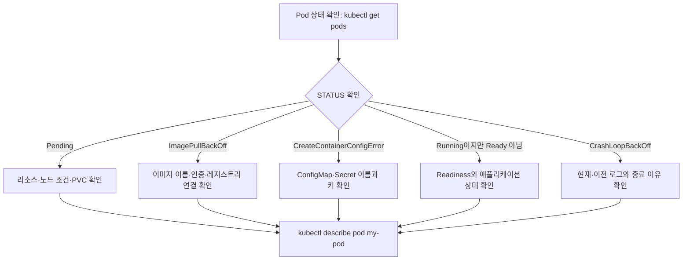

# 5.1 파드 트러블슈팅

파드 상태, 이벤트, 컨테이너 종료 이유와 로그를 함께 확인한다. `kubectl get pods`의 `STATUS`만으로 원인을 확정하지 않는다.

## 1. 파드 장애 진단 순서

먼저 문제에서 지정한 호스트와 네임스페이스를 확인한다. 아래 명령에는 필요한 경우 `-n <namespace>`를 붙인다.


```mermaid
flowchart TD
    Start["Pod 상태 확인: kubectl get pods"] --> Status{"STATUS 확인"}
    Status -->|Pending| Schedule["리소스·노드 조건·PVC 확인"]
    Status -->|ImagePullBackOff| Image["이미지 이름·인증·레지스트리 연결 확인"]
    Status -->|CreateContainerConfigError| Config["ConfigMap·Secret 이름과 키 확인"]
    Status -->|CrashLoopBackOff| Logs["현재·이전 로그와 종료 이유 확인"]
    Status -->|Running이지만 Ready 아님| Probe["Readiness와 애플리케이션 상태 확인"]
    Schedule --> Events["kubectl describe pod my-pod"]
    Image --> Events
    Config --> Events
    Probe --> Events
    Logs --> Events
```

## 2. 상태별 확인 사항

### 2.1 Pending

1. `kubectl describe pod <pod-name>`의 Events를 읽는다.
2. `Insufficient cpu/memory`이면 파드의 requests와 노드의 Allocatable·이미 할당된 requests를 비교한다. 실제 사용량이 낮아도 requests 기준으로 자리가 없을 수 있다. 요구 자원에 맞는 노드를 확보하거나 과도한 requests를 조정한다.
3. `untolerated taint`이면 해당 노드에 배치해도 되는 워크로드인지 확인하고 toleration을 조정한다. nodeSelector·affinity 불일치는 노드 라벨과 선택 조건을 따로 비교한다.
4. PVC가 Pending이면 `kubectl describe pvc <claim-name>`을 확인한다. `WaitForFirstConsumer`는 소비 파드의 스케줄링 조건이 정해질 때까지 바인딩을 기다릴 수 있다.

### 2.2 ImagePullBackOff / ErrImagePull

이미지 이름·태그, 레지스트리 연결, 인증과 `imagePullSecrets`를 확인한다. `describe`의 전체 Events에서 오류 이유를 읽는다.

```bash
kubectl describe pod <pod-name>
kubectl get pod <pod-name> -o jsonpath='{.metadata.ownerReferences}'

# Deployment 소유 파드라면 Deployment의 이미지 수정
kubectl set image deployment/<deployment-name> <container-name>=<correct-image>
kubectl rollout status deployment/<deployment-name>
```

태그를 임의로 `latest`로 바꾸기보다 요구된 이미지와 태그를 사용한다. 소유 컨트롤러가 없는 독립 파드는 `kubectl set image pod/<pod-name> ...`로 이미지 필드를 수정할 수 있다.

### 2.3 CrashLoopBackOff

컨테이너 종료와 재시작이 반복되어 다음 재시작을 기다리는 상태다. 오류 종료뿐 아니라 `restartPolicy: Always`인 컨테이너가 정상 종료 코드 `0`으로 계속 끝날 때도 발생할 수 있다.

```bash
kubectl describe pod <pod-name>
kubectl logs <pod-name> -c <container-name>
kubectl logs <pod-name> -c <container-name> --previous
```

`--previous`는 직전에 종료된 컨테이너 로그가 남아 있을 때 사용할 수 있다. `-c`를 지정하면 멀티 컨테이너 파드에서 진단 대상을 명확히 선택할 수 있다.

- `command`·`args`, 환경변수와 설정 파일, 외부 의존 서비스 연결을 확인한다.
- 종료 코드 `137`만으로 OOM을 단정하지 않는다. `Last State`의 `Reason: OOMKilled`, 메모리 사용량과 노드 상태를 함께 확인한다.
- OOM이면 메모리 누수·애플리케이션 설정·동시 처리량을 점검한 뒤 requests와 limits를 조정한다.

### 2.4 Probe 실패

| 검사 | 실패했을 때의 동작 | 확인할 부분 |
| --- | --- | --- |
| Readiness | 파드가 Ready 상태에서 빠지며 일반적인 Service 트래픽 대상에서 제외됨 | 포트·경로·의존 서비스 상태 |
| Liveness | 실패 임계값에 도달하면 해당 컨테이너를 종료하고 재시작 정책에 따라 처리 | 교착 상태, 너무 짧은 timeout, 과부하 |
| Startup | 초기 기동을 기다리며 성공 전까지 Liveness·Readiness를 시작하지 않음. 실패 임계값에 도달하면 컨테이너 종료 | 실제 초기화 시간과 검사 조건 |

Readiness 실패 자체는 컨테이너를 재시작하지 않는다. 기동이 느린 애플리케이션에는 startupProbe를 검토하고, 검사 실패를 없애려고 probe를 무조건 제거하지 않는다.

## 3. 설정 수정과 복구 확인

1. `ownerReferences`로 Deployment·StatefulSet·DaemonSet 등 소유자를 확인한다. 컨트롤러가 관리하는 파드는 소유자의 Pod template을 수정한다.
2. 독립 파드의 수정 불가능한 필드라면 원본 매니페스트를 고쳐 재생성해야 한다. 현재 YAML을 가져왔다면 `status`, UID·resourceVersion 등 서버가 관리하는 메타데이터를 정리한다. 삭제 전에는 중단 시간과 `emptyDir` 데이터 손실을 확인한다.
3. 정적 파드는 해당 노드의 원본 매니페스트를 수정한다. API의 mirror Pod를 편집해도 원본 설정이 바뀌지 않는다.
4. 변경 후 Ready 상태, 새 이벤트, 로그와 실제 요청 결과를 확인한다. 컨트롤러 변경은 `kubectl rollout status`도 확인한다.

`kubectl replace --force`는 기존 객체를 삭제하고 다시 생성한다. 모든 오류의 기본 해결 명령으로 사용하지 않는다.

## 참고 자료

- [Kubernetes: Debug Pods](https://kubernetes.io/docs/tasks/debug/debug-application/debug-pods/)
- [Kubernetes: Pod Lifecycle](https://kubernetes.io/docs/concepts/workloads/pods/pod-lifecycle/)
- [Kubernetes: Liveness, Readiness, and Startup Probes](https://kubernetes.io/docs/concepts/workloads/pods/probes/)
- [스토리지 바인딩 진단](Storage_StorageClass.md)
