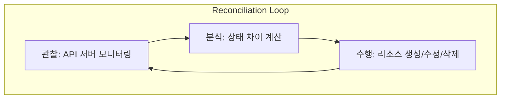

# 🎡 Kubernetes Operator 패턴

**Operator 패턴**은 Kubernetes의 핵심 설계 원칙인 '컨트롤러 패턴'을 확장하여, 도메인 전문가의 운영 지식(Operational Knowledge)을 코드로 구현하고 자동화하는 설계 패턴입니다.

---

## 1. Operator 패턴이란?

Kubernetes는 기본적으로 Deployment, Service와 같은 표준 리소스를 관리하는 컨트롤러를 내장하고 있습니다. 하지만 데이터베이스(DB), 메시지 큐와 같이 설치, 백업, 복구, 확장 과정이 복잡한 애플리케이션은 표준 컨트롤러만으로는 관리하기 어렵습니다.

**Operator**는 이러한 복잡한 애플리케이션을 위해 다음 두 가지를 결합하여 만든 커스텀 컨트롤러입니다.
1.  **CRD (Custom Resource Definition)**: 애플리케이션의 상태를 정의하는 새로운 사용자 정의 리소스.
2.  **커스텀 컨트롤러 (Custom Controller)**: 정의된 리소스를 관찰하며 실제 상태를 원하는 상태로 맞추는 실행 파일.

---

## 2. 작동 원리: 조정 루프 (Reconciliation Loop)

오퍼레이터는 끊임없이 반복되는 **Reconciliation Loop**를 통해 동작합니다.

1.  **관찰 (Observe)**: Kubernetes API를 통해 커스텀 리소스(CR)의 상태와 실제 실행 중인 애플리케이션의 상태를 모니터링합니다.
2.  **분석 (Analyze)**: '사용자가 원하는 상태(Spec)'와 '현재의 실제 상태(Status)' 사이의 차이점을 분석합니다.
3.  **수행 (Act)**: 차이를 해소하기 위해 필요한 작업을 수행합니다. (예: DB 노드 추가, 백업 수행, 설정 변경 등)

---

## 3. Operator의 장점

*   **운영 자동화**: 백업, 장애 복구, 버전 업그레이드 등 사람이 수동으로 하던 작업을 소프트웨어가 대신 수행합니다.
*   **표준화된 관리**: 애플리케이션 관리를 Kubernetes API와 `kubectl` 명령어로 통합하여 일관된 방식으로 운영할 수 있습니다.
*   **복잡성 추상화**: 복잡한 클러스터 구성을 간단한 YAML 파일 하나로 정의하고 관리할 수 있습니다.

---

## 4. 대표적인 예시

*   **Prometheus Operator**: 모니터링 시스템인 Prometheus의 설치 및 타겟 설정을 자동화합니다.
*   **ECK (Elastic Cloud on Kubernetes)**: Elasticsearch 클러스터의 확장, 업그레이드 및 보안 설정을 관리합니다.
*   **Strimzi**: Kubernetes에서 Kafka 클러스터를 배포하고 관리하는 오퍼레이터입니다.

---

## 5. 개발 도구

Operator를 직접 개발할 때는 주로 다음의 도구를 사용합니다.
*   **Operator SDK**: Go, Ansible, Helm을 기반으로 오퍼레이터를 쉽게 개발할 수 있게 도와주는 프레임워크입니다.
*   **Kubebuilder**: Kubernetes API를 확장하기 위한 고수준 도구로, 오퍼레이터의 뼈대를 생성해 줍니다.

---
*참고: Operator는 애플리케이션의 '설치'뿐만 아니라 '지속적인 운영'에 초점을 맞춘다는 점에서 패키징 도구인 Helm과 차이가 있습니다.*
