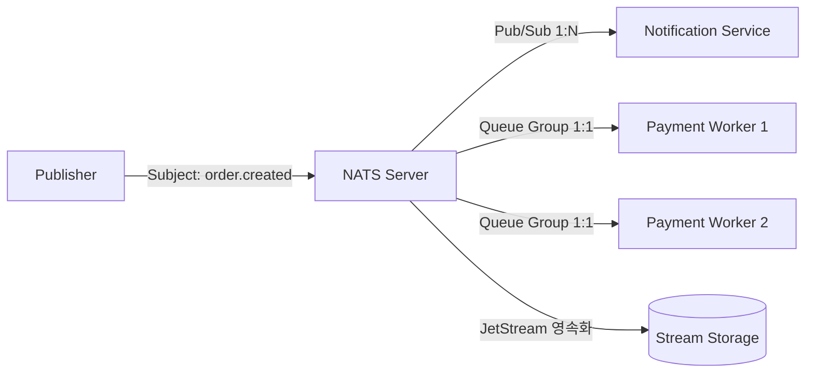

# NATS (Neural Autonomic Transport System)

**NATS**는 Go 언어로 개발된 클라우드 네이티브 환경을 위한 **초경량, 초고성능, 초저지연 분산 메시징 시스템**입니다. CNCF(Cloud Native Computing Foundation) 인큐베이팅 프로젝트이며, 마이크로서비스 간 통신, 엣지(Edge) 컴퓨팅, 실시간 이벤트 스트리밍의 핵심 인프라로 널리 사용됩니다.

---

## 1. NATS의 핵심 철학 및 특징



1. **극도의 단순성과 초경량성 (Simplicity & Lightweight)**
   * 단일 바이너리(~20MB)로 실행되며 외부 의존성(Zookeeper, JVM 등)이 전혀 없습니다.
   * CPU와 메모리 사용량이 극히 적어 소형 IoT 디바이스부터 대규모 쿠버네티스 클러스터까지 동일하게 동작합니다.
2. **초고성능 및 초저지연 (Performance & Low Latency)**
   * 초당 수백만 개의 메시지를 마이크로초(µs) 단위의 극도로 낮은 지연 시간으로 처리합니다.
3. **유연한 토폴로지 (Cluster, Supercluster, Leaf Node)**
   * **Full-Mesh 클러스터링**: 복잡한 설정 없이 노드 간 자동 라우팅 지원.
   * **Leaf Nodes**: 원격 엣지(Edge)나 로컬 환경을 중앙 NATS 클러스터에 손쉽게 브릿지 연결.

---

## 2. NATS의 3대 핵심 메시징 패턴

NATS는 별도의 복잡한 브로커 설정 없이 **서브젝트(Subject)** 기반 라우팅으로 다양한 패턴을 지원합니다.

### 1) Publish-Subscribe (1:N 브로드캐스트)
* 발행자(Publisher)가 특정 서브젝트로 메시지를 보내면, 해당 서브젝트를 구독(Subscribe) 중인 모든 수신자에게 브로드캐스팅됩니다.
* **와일드카드 지원**:
  * `*`: 단일 토큰 매칭 (`orders.*.created` -> `orders.kr.created` 매칭)
  * `>`: 다중/하위 토큰 전체 매칭 (`orders.>` -> `orders.kr.seoul.created` 매칭)

### 2) Request-Reply (초고속 동기식 RPC)
* HTTP REST 통신 대신 메시지 기반으로 즉시 응답을 주고받는 패턴입니다.
* NATS 내부의 `Inbox` 메커니즘을 통해 별도의 큐나 Correlation ID 관리 없이 고성능 RPC를 구현합니다.

### 3) Queue Groups (로드 밸런싱 / 분산 작업자)
* 동일한 큐 그룹 이름(예: `workers`)을 가진 여러 구독자가 있을 경우, 메시지를 해당 그룹 내의 **오직 1개의 작업자에게만 로드 밸런싱(Round-Robin)**하여 전달합니다.
* 워커 프로세스의 수평 확장(Scale-out) 시 유용합니다.

---

## 3. NATS Core vs NATS JetStream

NATS는 크게 순수 인메모리 방식의 **NATS Core**와 메시지 영속성을 제공하는 **JetStream**으로 나뉩니다.

| 구분 | NATS Core (기본) | NATS JetStream (영속화 스트리밍) |
| :--- | :--- | :--- |
| **전송 보장** | At-most-once (최대 1회 전송, Fire-and-forget) | At-least-once, Exactly-once |
| **데이터 저장** | 인메모리 (구독자 없으면 즉시 소멸) | 디스크/메모리 영속화 (Stream Storage) |
| **핵심 기능** | 실시간 초저지연 Pub/Sub, Request-Reply | 메시지 리플레이, 디둡(Deduplication), KV 스토어, Object 스토어 |
| **적합한 작업** | 실시간 메트릭, 텔레메트리, 고속 RPC | 결제 주문 처리, 이벤트 소싱, 감사 로그 |

---

## 4. NATS vs RabbitMQ vs Apache Kafka 비교

| 항목 | NATS (JetStream 포함) | RabbitMQ | Apache Kafka |
| :--- | :--- | :--- | :--- |
| **주요 목적** | 초경량 실시간 메시징, 엣지 통신, RPC | 복잡한 라우팅 규칙 중심 엔터프라이즈 메시징 | 대규모 분산 이벤트 스트리밍 및 로그 수집 |
| **개발 언어 / 런타임** | Go (단일 바이너리, JVM 불필요) | Erlang (BEAM VM) | Java / Scala (JVM 기반) |
| **지연 시간 (Latency)** | **수 마이크로초(µs)** (가장 빠름) | 수 밀리초(ms) | 수 밀리초(ms) |
| **운영 복잡도** | ⭐ 매우 낮음 (Zero Config 지향) | ⭐⭐⭐ 보통 | ⭐⭐⭐⭐⭐ 높음 (ZooKeeper/KRaft, 파티션 튜닝 필요) |
| **리소스 소모량** | 매우 낮음 (~수십 MB RAM) | 보통 | 높음 (수 GB~ 수십 GB RAM) |
| **엣지 / IoT 적합성** | ⭐⭐⭐⭐⭐ 최상 (Leaf Node 지원) | ⚠️ 보통 | ❌ 부적합 (무거움) |

---

## 5. 기본 사용 예제 (CLI / Go)

### 1) NATS Server 실행
```bash
# Docker로 즉시 실행
docker run -d --name nats -p 4222:4222 -p 8222:8222 nats:latest
```

### 2) CLI 메시지 발행 및 구독
```bash
# 터미널 1: 구독
nats sub "time.updates"

# 터미널 2: 발행
nats pub "time.updates" "Hello NATS!"
```

### 3) Go 언어 클라이언트 예시
```go
package main

import (
	"log"
	"time"
	"github.com/nats-io/nats.go"
)

func main() {
	// NATS 서버 연결
	nc, err := nats.Connect(nats.DefaultURL)
	if err != nil {
		log.Fatal(err)
	}
	defer nc.Close()

	// 비동기 구독
	nc.Subscribe("orders.created", func(m *nats.Msg) {
		log.Printf("Received Order: %s", string(m.Data))
	})

	// 메시지 발행
	nc.Publish("orders.created", []byte("Order #12345"))
	time.Sleep(100 * time.Millisecond)
}
```

---

## 6. 요약 및 적용 권장 시점

* **NATS 선택이 유리한 경우**:
  * 마이크로서비스 간에 **초저지연 RPC 및 가벼운 Pub/Sub 이벤트 버스**가 필요할 때
  * 서버 리소스가 제한적이거나 **엣지(Edge) / IoT 환경과 클라우드 간 통신**을 구성할 때
  * Kafka의 높은 운영 복잡성(JVM, 디스크/파티션 관리) 없이 **가벼운 영속 스트림(JetStream)**이 필요할 때
