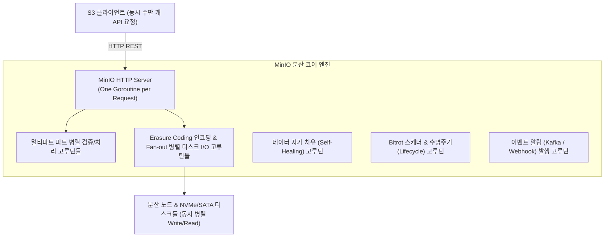

# MinIO와 Goroutine: 고성능 오브젝트 스토리지의 동시성 아키텍처

MinIO는 Amazon S3 API와 100% 호환되는 초고성능 오픈소스 오브젝트 스토리지입니다. C/C++ 같은 저수준 언어가 아닌 Go 언어(Golang)로 구현되었음에도 하드웨어 한계에 근접하는 수십~수백 Gbps의 I/O 대역폭을 낼 수 있는 가장 핵심적인 동력은 **Go 런타임의 경량 동시성 모델인 고루틴(Goroutine)**입니다.

---

## 1. 핵심 개념 비교: OS 스레드 vs Goroutine

MinIO의 아키텍처를 이해하려면 먼저 고루틴이 전통적인 운영체제(OS) 스레드와 어떻게 다른지 파악해야 합니다.

| 구분 | OS 스레드 (전통적 모델) | Goroutine (Go 모델) |
| :--- | :--- | :--- |
| **메모리 오버헤드** | 스레드당 약 **1MB ~ 2MB** 고정 스택 할당 | 고루틴당 **2KB ~ 4KB**로 시작 (동적 가변 스택) |
| **동시 생성 한계** | 수천 개 수준에서 메모리 고갈 및 스레드 풀 병목 | **수십만 ~ 수백만 개** 동시 실행 가능 |
| **컨텍스트 스위칭** | OS 커널 모드 전환(Ring 0) 필요 → 마이크로초 단위 비용 | Go 런타임(GMP 스케줄러)이 사용자 공간에서 처리 → 수 나노초 단위 |
| **I/O 블로킹 처리** | I/O 대기 시 OS 스레드 전체가 블로킹됨 | I/O 대기 시(netpoller) 고루틴만 park 되고 OS 스레드는 다른 작업 수행 |

Go 언어는 개발자가 직관적인 동기식(Synchronous) 코드를 작성하더라도, 런타임 차원에서 완전한 **비동기 논블로킹(Asynchronous Non-blocking)**으로 실행합니다.

---

## 2. MinIO와 Goroutine의 구조적 연관관계

MinIO의 내부 구현은 사실상 **"초고속 고루틴 오케스트레이션 엔진"**으로 동작합니다.

### ① Goroutine-per-Request 모델 (대규모 동시 연결 수용)

- MinIO 서버에 초당 수만 건의 S3 API(`PUT`, `GET`, `LIST`, `DELETE`) 요청이 유입될 때, MinIO는 **각 HTTP 연결 및 요청마다 독립된 고루틴을 생성**하여 격리 처리합니다.
- 고루틴의 메모리 소비가 극도로 적기 때문에(2KB~4KB), 전통적인 WAS처럼 스레드 풀 고갈(Thread Starvation)에 빠지지 않고 수만 개의 동시 접속을 최소 메모리로 유지합니다.

### ② 분산 Erasure Coding의 디스크 병렬 I/O (가장 핵심)

- MinIO는 객체를 저장할 때 단일 디스크에 쓰지 않고, 데이터 블록과 패리티 블록으로 청크를 쪼개어 분산 저장합니다. (예: 16개 드라이브 기준 12 Data + 4 Parity).
- **업로드(Write)**: 들어온 데이터를 청크로 분할한 뒤, **16개의 고루틴을 동시에 띄워(Fan-out)** 16개의 독립된 디스크 및 네트워크 노드에 **동시에 병렬 기록**합니다.
- **다운로드(Read)**: 여러 드라이브에 흩어진 청크를 고루틴들로 병렬 수집하며, 가장 빠르게 응답하는 정상 청크들을 조합해 파일을 즉시 재구성합니다.
- 단일 디스크 속도의 한계를 넘어 클러스터 전체 드라이브의 총 대역폭을 100% 이끌어내는 원동력입니다.

### ③ 대용량 멀티파트 업로드(Multipart Upload) 가속

- 수십 GB ~ 수 TB에 이르는 초대형 파일 업로드 시, 클라이언트는 5MB~5GB 단위의 Part로 나누어 전송합니다.
- MinIO 내부에서는 고루틴 워커 풀을 통해 각 파트의 해시 체크섬(MD5/SHA256) 검증, Erasure Coding 연산, 스토리지 쓰기를 완전히 병렬로 나누어 처리하여 병목을 없앱니다.

### ④ 무중단 백그라운드 자가 치유 및 유지보수 데몬

- MinIO는 데이터 I/O 외에도 다양한 백그라운드 작업을 쉬지 않고 수행합니다:
  - **Bitrot 스캐너**: 디스크의 물리적 손상 여부를 백그라운드 순회 탐색
  - **자가 치유 (Self-Healing)**: 손상되거나 교체된 드라이브의 청크를 패리티로부터 실시간 복원
  - **수명 주기 관리 (Lifecycle)**: 만료된 객체 및 이전 버전 자동 정리
  - **버킷 알림 (Bucket Notifications)**: 객체 생성 시 Kafka, NATS, Webhook으로 비동기 이벤트 전송
- 이 작업들은 독립된 **경량 고루틴 워커 풀(Worker Pool)**로 실행되며, Go의 채널(`chan`)과 컨텍스트(`context.Context`)를 통해 메인 S3 트래픽에 영향을 주지 않도록 I/O 속도를 동적으로 조절합니다.

### ⑤ Go 스케줄러(GMP)와 SIMD CPU 가속의 결합

- MinIO는 높은 수준의 동시성 제어와 네트워크 I/O는 **Go 언어의 고루틴**에 맡기고, CPU 연산 집약적인 작업(Erasure Coding의 갈루아 필드 행렬 연산, SHA256 해시, 암호화)은 Intel **AVX-512**, ARM **NEON** 등 **CPU 어셈블리(SIMD)**로 직접 최적화했습니다.
- 이를 통해 **"초경량 동시 I/O 제어(Goroutine) + 초고속 연산(SIMD 어셈블리)"**의 시너지를 내며 C++ 이상의 처리 속도를 달성합니다.

---

## 3. 요약 정리

1. **MinIO**는 대규모 비정형 데이터를 초고속으로 처리하는 **S3 호환 오픈소스 오브젝트 스토리지**입니다.
2. **Goroutine**은 Go 런타임이 관리하는 **2~4KB 초경량 사용자 공간 스레드**로, 논블로킹 I/O와 초고속 컨텍스트 스위칭을 제공합니다.
3. **연관관계**: MinIO는 100% Go로 작성되었으며, **대규모 동시 S3 API 수용(Goroutine-per-Request), 분산 Erasure Coding의 병렬 디스크 I/O, 멀티파트 병렬 업로드, 백그라운드 자가 치유** 등 시스템의 모든 고성능 스토리지 기능이 Goroutine의 동시성 모델을 기반으로 구현되어 있습니다.

---

## 🔗 관련 문서

- [MinIO 개요 및 주요 특징](README.md)
- [MinIO 버저닝 (Versioning)](Versioning.md)
- [MinIO 수명 주기 관리 (Lifecycle)](Lifecycle.md)
- [Java Client 예제](Java_Client_Examples.md)
