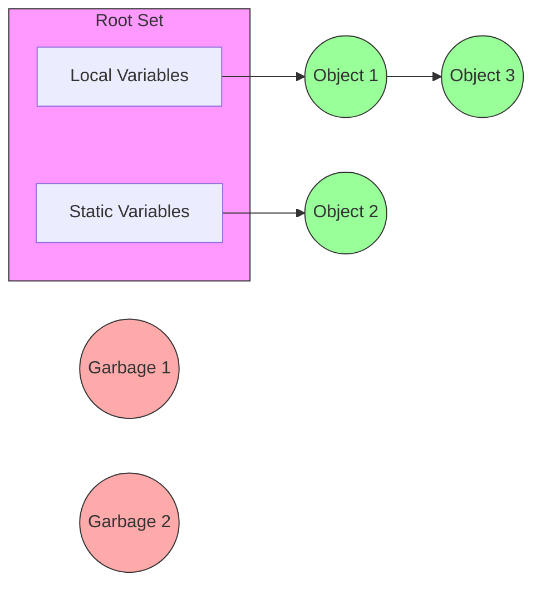
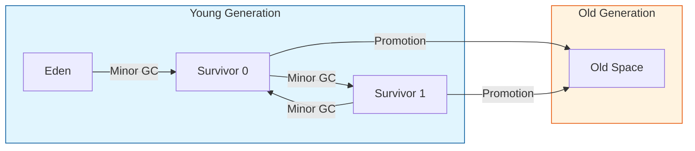

# Java Garbage Collection (GC)

**Garbage Collection(GC)**은 힙(Heap) 영역에서 더 이상 사용되지 않는 객체(Unreachable Object)를 메모리에서 해제하는 JVM의 자동 메모리 관리 프로세스입니다. 개발자가 명시적으로 메모리를 해제할 필요가 없어 메모리 누수를 방지하고 개발 생산성을 높여줍니다.

## 1. GC의 기본 원리: Reachability
GC는 객체가 유효한 참조를 가지고 있는지 판단하기 위해 **Reachability**라는 개념을 사용합니다.

*   **Reachable:** Root Set(스택의 지역 변수, static 변수 등)으로부터 참조 사슬이 이어져 있는 객체. (녹색)
*   **Unreachable:** 참조가 끊겨 더 이상 접근할 수 없는 객체. -> **GC 대상** (붉은색)

## 2. GC 동작 과정 (Mark and Sweep)
대부분의 GC 알고리즘은 기본적인 과정을 따릅니다.
1.  **Mark (마킹):** Root Set에서부터 참조를 따라가며 사용 중인 객체(Reachable)를 식별하고 마킹합니다.
2.  **Sweep (스윕):** 마킹되지 않은 객체(Unreachable)를 힙에서 제거합니다.
3.  **Compact (압축, 옵션):** 파편화된 메모리를 정리하여 빈 공간을 모읍니다. (알고리즘에 따라 다름)

## 3. Heap 구조와 Generational GC
객체의 수명 특성(Weak Generational Hypothesis)을 반영하여 힙을 두 영역으로 나눕니다.

> "대부분의 객체는 금방 접근 불가능 상태(Unreachable)가 된다."

### 3.1 Young Generation
*   새롭게 생성된 객체가 할당되는 곳입니다.
*   대부분의 객체가 여기서 금방 사라지므로, 여기서 일어나는 GC를 **Minor GC**라고 합니다.
*   **구조:** Eden 영역 1개 + Survivor 영역 2개 (S0, S1)

### 3.2 Old Generation
*   Young 영역에서 오랫동안 살아남은 객체가 이동(Promotion)되는 곳입니다.
*   Young 영역보다 크기가 크며, 여기서 일어나는 GC를 **Major GC (Full GC)**라고 합니다.
*   Full GC는 비용이 크고 애플리케이션 멈춤(Stop-The-World) 시간이 깁니다.

## 4. 주요 GC 알고리즘

### 4.1 Serial GC
*   단일 스레드로 GC를 수행합니다.
*   Stop-The-World 시간이 길어 멀티 코어 환경에는 부적합합니다.

### 4.2 Parallel GC
*   Young 영역의 GC를 멀티 스레드로 수행합니다. (Java 8의 기본 GC)
*   throughput(처리량) 중심입니다.

### 4.3 CMS GC (Concurrent Mark Sweep)
*   애플리케이션 스레드와 GC 스레드를 동시에 실행하여 Stop-The-World 시간을 최소화합니다.
*   메모리 파편화 문제가 있어 Java 9부터 deprecated 되었습니다.

### 4.4 G1 GC (Garbage First)
*   힙을 물리적으로 나누지 않고 **Region**이라는 논리적 단위로 쪼개어 관리합니다.
*   가비지가 많은 Region을 우선적으로 청소합니다.
*   Java 9 이상의 기본 GC이며, 대용량 메모리에 적합하고 예측 가능한 일시 정지 시간을 제공합니다.

### 4.5 ZGC (Z Garbage Collector)
*   Java 15부터 정식 도입된 확장 가능한 저지연(Low Latency) GC입니다.
*   대용량 힙(수 TB)에서도 Stop-The-World 시간을 10ms 이하로 보장하는 것을 목표로 합니다.

## 5. Stop-The-World (STW)
GC를 실행하기 위해 **JVM이 애플리케이션 실행을 멈추는 것**을 말합니다. GC 튜닝의 주된 목적은 이 STW 시간을 줄이는 것입니다.
