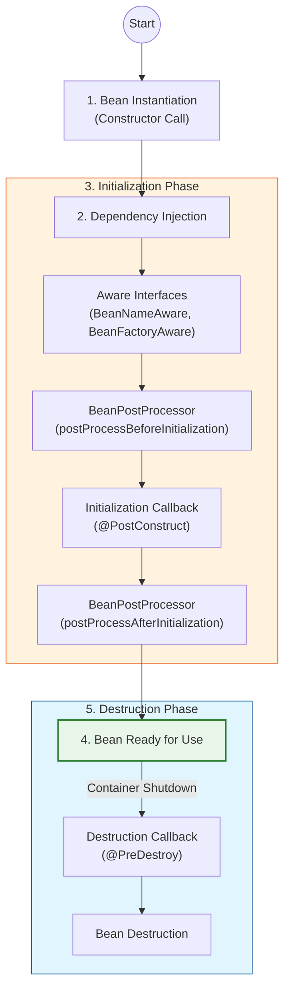

# Spring Bean Lifecycle

스프링 컨테이너에 의해 관리되는 객체인 **Bean**의 생명주기(생성부터 소멸까지)에 대해 설명합니다.

## 1. 생명주기 전체 흐름

스프링 빈은 객체 생성과 의존성 주입이 끝난 후에야 필요한 데이터를 사용할 준비가 완료됩니다. 기본적으로 다음과 같은 라이프사이클을 가집니다.

> **스프링 컨테이너 생성** → **스프링 빈 생성** → **의존관계 주입** → **초기화 콜백** → **사용** → **소멸 전 콜백** → **스프링 종료**

## 2. 생명주기 콜백 (Callback) 지원 방법

스프링은 빈의 초기화 작업(예: DB 연결, 소켓 연결)과 종료 작업(예: 자원 해제)을 위해 3가지 방법을 제공합니다.

### 2.1 인터페이스 (InitializingBean, DisposableBean)
*   스프링 전용 인터페이스에 의존하므로 코드가 스프링에 종속됩니다.
*   초기화 및 종료 메소드의 이름을 변경할 수 없습니다.
*   현재는 거의 사용하지 않습니다.

### 2.2 빈 등록 초기화, 소멸 메소드 지정
*   설정 정보에 `@Bean(initMethod = "init", destroyMethod = "close")` 처럼 지정합니다.
*   코드를 고칠 수 없는 외부 라이브러리에 적용할 때 유용합니다.

### 2.3 어노테이션 (@PostConstruct, @PreDestroy) - 권장 👍
*   최신 스프링에서 가장 권장하는 방법입니다.
*   Java 표준(JSR-250)이므로 스프링이 아닌 다른 컨테이너에서도 동작합니다.
*   컴포넌트 스캔과 잘 어울립니다.

## 3. 상세 라이프사이클 다이어그램

