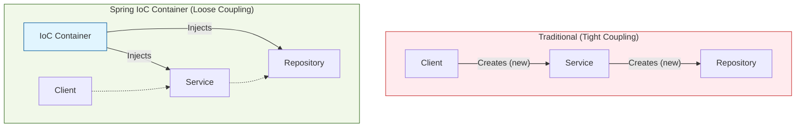

# Dependency Injection (DI) & Inversion of Control (IoC)

Spring Framework의 가장 핵심적인 개념인 **IoC(제어의 역전)**와 **DI(의존성 주입)**에 대해 설명합니다.

## 1. 개념 정의

### 1.1 Inversion of Control (IoC, 제어의 역전)
일반적인 프로그래밍에서는 개발자가 객체의 생성, 호출, 소멸 등 생명주기를 직접 제어합니다. 하지만 Spring에서는 **스프링 컨테이너(IoC Container)**가 이 역할을 대신 수행합니다.
*   **"Don't call us, we'll call you."** (할리우드 원칙)
*   제어권이 개발자에게서 프레임워크로 넘어갔다는 의미입니다.

### 1.2 Dependency Injection (DI, 의존성 주입)
IoC를 구현하는 대표적인 디자인 패턴입니다. 객체가 필요로 하는 의존 객체(Dependency)를 직접 생성(`new`)하는 것이 아니라, 외부(컨테이너)로부터 주입받는 방식을 말합니다.

## 2. DI의 장점
1.  **결합도(Coupling) 감소:** 객체 간의 의존성이 줄어들어 유연한 코드를 작성할 수 있습니다.
2.  **테스트 용이성:** Mock 객체를 주입하기 쉬워 단위 테스트가 수월해집니다.
3.  **코드 재사용성 증가:** 의존성이 외부에서 관리되므로 컴포넌트 재사용이 쉬워집니다.

## 3. 의존성 주입 방식

### 3.1 생성자 주입 (Constructor Injection) - 권장 👍
생성자를 통해 의존성을 주입받습니다.
*   **불변성(Immutability):** 객체 생성 시점에 의존성이 결정되므로 변경되지 않음을 보장합니다.
*   **순환 참조 방지:** 애플리케이션 구동 시점에 순환 참조 오류를 감지할 수 있습니다.
*   `final` 키워드 사용이 가능합니다.

```java
@Service
public class UserService {
    private final UserRepository userRepository;

    public UserService(UserRepository userRepository) {
        this.userRepository = userRepository;
    }
}
```

### 3.2 필드 주입 (Field Injection) - 비권장 👎
`@Autowired`를 필드에 바로 붙이는 방식입니다. 코드는 간결하지만 외부에서 의존성을 변경할 수 없어 테스트가 어렵습니다.

### 3.3 Setter 주입 (Setter Injection)
Setter 메소드를 통해 주입받습니다. 선택적인 의존성이나 변경 가능성이 있는 경우에 사용합니다.

## 4. 개념도 비교 (Traditional vs Spring DI)


