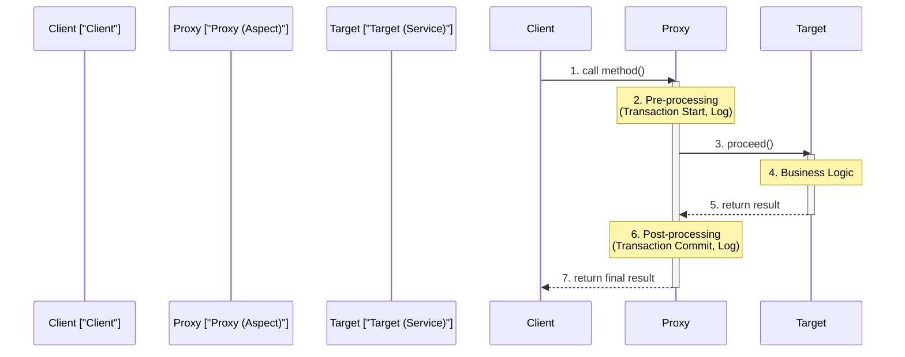

# Aspect-Oriented Programming (AOP)

**AOP(관점 지향 프로그래밍)**는 애플리케이션의 핵심 비즈니스 로직과 공통 관심사(Cross-cutting Concern)를 분리하여 모듈화하는 프로그래밍 패러다임입니다.

## 1. 핵심 개념

### 1.1 공통 관심사 (Cross-cutting Concern)
여러 로직에서 공통적으로 사용되는 기능입니다.
*   예: 로그(Logging), 보안(Security), 트랜잭션(Transaction), 성능 측정 등.

### 1.2 주요 용어
*   **Target:** 부가 기능(Advice)을 적용할 대상 객체 (핵심 비즈니스 로직).
*   **Aspect:** 흩어진 관심사(공통 기능)를 모듈화한 것. (Advice + Pointcut)
*   **Advice:** 실질적인 부가 기능 로직 (What & When).
    *   `@Before`, `@After`, `@Around` 등.
*   **Pointcut:** 부가 기능을 적용할 위치를 선별하는 기능 (Where).
*   **JoinPoint:** Advice가 적용될 수 있는 모든 위치 (메소드 실행 시점 등).
*   **Proxy:** Target을 감싸서 요청을 가로채는 객체.

## 2. AOP 동작 원리 (Proxy Pattern)

스프링 AOP는 **프록시(Proxy)** 기반으로 동작합니다.
1.  클라이언트가 Target 객체를 호출하면, 실제로는 Proxy 객체가 호출됩니다.
2.  Proxy는 부가 기능(Advice)을 실행하고, 실제 Target 메소드를 호출(`proceed()`)합니다.
3.  Target 메소드 실행 후 다시 Proxy로 제어권이 돌아와 후처리를 수행합니다.

## 3. 프록시 호출 흐름 다이어그램



## 4. 예제 코드 (Logging)

```java
@Aspect
@Component
public class LoggingAspect {

    @Around("execution(* com.example.service.*.*(..))")
    public Object logExecutionTime(ProceedingJoinPoint joinPoint) throws Throwable {
        long start = System.currentTimeMillis();
        
        // Target 메소드 실행
        Object proceed = joinPoint.proceed();
        
        long executionTime = System.currentTimeMillis() - start;
        System.out.println(joinPoint.getSignature() + " executed in " + executionTime + "ms");
        
        return proceed;
    }
}
```
