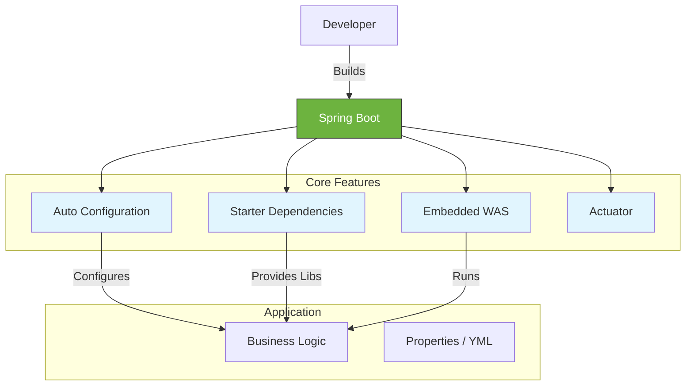

# Spring Boot Introduction

**Spring Boot**는 Spring Framework 기반의 애플리케이션을 빠르고 쉽게 개발할 수 있도록 도와주는 도구입니다. "Spring Framework를 더 쉽게(Opinionated)" 사용할 수 있도록 복잡한 설정을 자동화하고, 자주 사용되는 의존성을 관리해줍니다.

## 1. Spring Boot의 핵심 목표
*   **빠른 개발 시작:** 복잡한 XML 설정 없이 바로 코딩을 시작할 수 있습니다.
*   **독립 실행 (Standalone):** 별도의 WAS(Tomcat, Jetty 등) 설치 없이, `java -jar` 명령어로 실행 가능한 JAR 파일을 생성합니다.
*   **Opinionated Defaults:** 자주 사용되는 라이브러리와 설정을 기본값으로 제공하여 설정의 피로를 줄입니다.

## 2. 주요 특징 (Key Features)

### 2.1 Auto Configuration (자동 설정)
`@EnableAutoConfiguration` 또는 `@SpringBootApplication` 어노테이션을 통해, 클래스패스에 있는 라이브러리를 감지하고 자동으로 빈(Bean)을 등록하고 설정을 구성합니다.
*   예: `spring-boot-starter-web`이 있으면 자동으로 내장 Tomcat과 Spring MVC를 설정합니다.

### 2.2 Starter Dependencies
프로젝트에 필요한 의존성들을 그룹화하여 제공합니다. 버전 호환성을 신경 쓸 필요 없이 스타터 하나만 추가하면 관련 라이브러리들이 모두 포함됩니다.
*   `spring-boot-starter-web`: RESTful, Spring MVC 개발용
*   `spring-boot-starter-data-jpa`: JPA, Hibernate 개발용
*   `spring-boot-starter-test`: JUnit, Mockito 등 테스트 도구 모음

### 2.3 Embedded Server (내장 서버)
Tomcat, Jetty, Undertow 같은 웹 서버를 애플리케이션 내부에 포함하여 배포와 실행을 단순화합니다.

### 2.4 Actuator (운영용 기능)
애플리케이션의 상태(Health check), 메트릭(Metrics), 환경 설정 정보 등을 모니터링할 수 있는 엔드포인트를 제공합니다.

## 3. Spring Framework vs Spring Boot

| 특징 | Spring Framework (Legacy) | Spring Boot |
| :--- | :--- | :--- |
| **설정** | XML 또는 Java Config (매우 복잡함) | `application.properties/yml` 및 자동 설정 |
| **웹 서버** | 별도의 WAS 설치 및 WAR 배포 필요 | 내장 WAS (JAR 배포) |
| **의존성 관리** | 각 라이브러리 버전 호환성 직접 체크 | Starter로 통합 관리 (버전 호환성 보장) |
| **생산성** | 초기 설정에 많은 시간 소요 | 비즈니스 로직에 바로 집중 가능 |

## 4. 요약 다이어그램 (Spring Boot Architecture)

