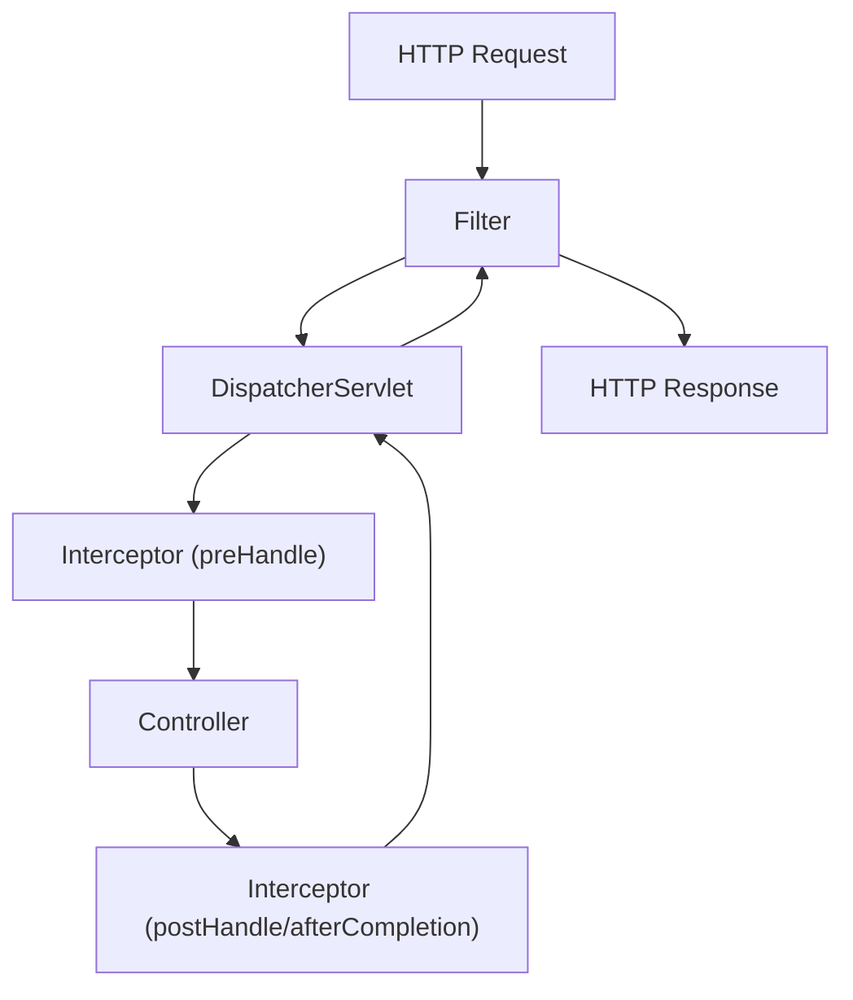

# Filter vs Interceptor

Spring Boot 애플리케이션에서 요청을 가로채서 공통된 로직(로깅, 인증, 권한 체크 등)을 처리할 때 사용하는 두 가지 핵심 기술입니다.

## 1. Filter (필터)

필터는 **서블릿 컨테이너(Servlet Container)** 수준에서 실행됩니다. Spring Context 외부에 위치하며, DispatcherServlet에 요청이 전달되기 전과 후에 동작합니다.

- **실행 위치**: 서블릿 컨테이너 (Tomcat 등)
- **주요 용도**:
    - 모든 요청에 대한 로깅 및 필터링
    - 인코딩 변환 (UTF-8)
    - XSS 방어
    - 스프링과 무관한 전역적인 보안 처리 (Spring Security의 기반)

## 2. Interceptor (인터셉터)

인터셉터는 **Spring MVC**가 제공하는 기술입니다. DispatcherServlet이 컨트롤러를 호출하기 전과 후에 요청을 가로챕니다. Spring Context 내부에서 실행되므로 모든 Bean에 접근할 수 있습니다.

- **실행 위치**: Spring MVC (DispatcherServlet과 Controller 사이)
- **주요 용도**:
    - 세션 및 쿠키 체크 (로그인 여부)
    - 세밀한 권한 체크
    - 컨트롤러로 전달되는 데이터 가공

---

## 3. 비교 요약

| 특징 | Filter | Interceptor |
| :--- | :--- | :--- |
| **관리 컨테이너** | 서블릿 컨테이너 | 스프링 컨테이너 (Spring MVC) |
| **실행 위치** | DispatcherServlet 이전/이후 | Controller 이전/이후 |
| **Request/Response 객체 조작** | 가능 (완전히 다른 객체로 교체 가능) | 불가능 (객체 내부 데이터만 수정 가능) |
| **적용 범위** | 웹 애플리케이션 전반 | Spring MVC 내의 요청 |
| **예외 처리** | Filter 내부에서 직접 처리 필요 | `@ControllerAdvice` 등 스프링 기술 활용 가능 |

---

## 4. 실행 순서 다이어그램



---

## 5. 코드 예제

### 5.1 Filter 구현

```java
@Component
public class MyFilter implements Filter {
    @Override
    public void doFilter(ServletRequest request, ServletResponse response, FilterChain chain) 
            throws IOException, ServletException {
        // 전처리 로직
        System.out.println("Filter: Request 가로채기");
        
        chain.doFilter(request, response); // 다음 필터나 서블릿으로 전달
        
        // 후처리 로직
        System.out.println("Filter: Response 가로채기");
    }
}
```

### 5.2 Interceptor 구현

```java
@Component
public class MyInterceptor implements HandlerInterceptor {
    @Override
    public boolean preHandle(HttpServletRequest request, HttpServletResponse response, Object handler) {
        System.out.println("Interceptor: Controller 호출 전");
        return true; // false를 반환하면 컨트롤러를 호출하지 않음
    }

    @Override
    public void postHandle(HttpServletRequest request, HttpServletResponse response, Object handler, ModelAndView modelAndView) {
        System.out.println("Interceptor: Controller 호출 후 (View 렌더링 전)");
    }

    @Override
    public void afterCompletion(HttpServletRequest request, HttpServletResponse response, Object handler, Exception ex) {
        System.out.println("Interceptor: 모든 작업 완료 후 (View 렌더링 완료 후)");
    }
}
```
