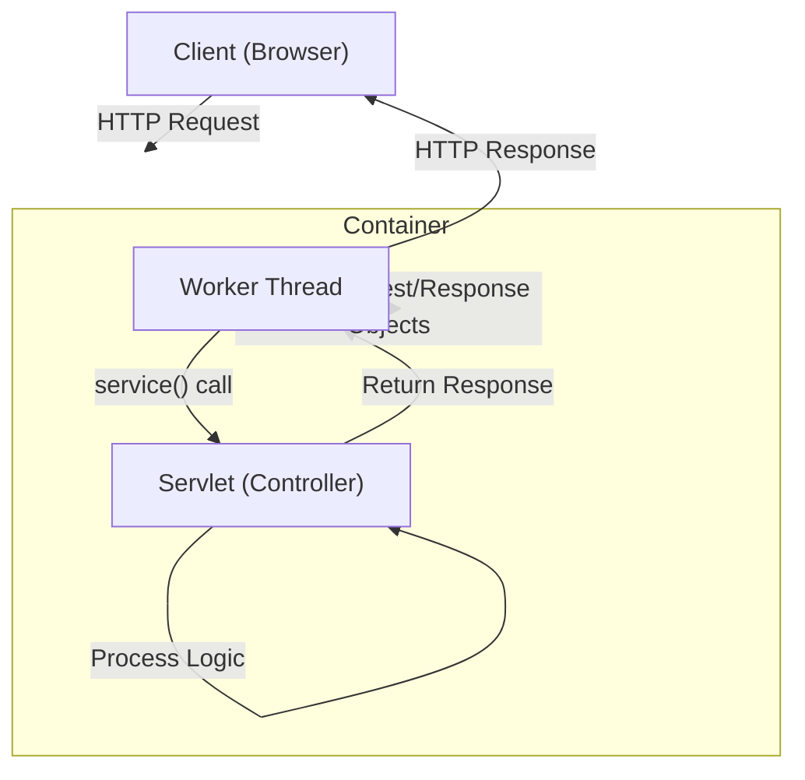

# Servlet vs Servlet Container

자바 엔터프라이즈 웹 애플리케이션 개발의 기반이 되는 **서블릿(Servlet)**과 이를 관리하고 실행하는 환경인 **서블릿 컨테이너(Servlet Container)**의 개념과 차이를 설명합니다. Spring Boot와 같은 모던 프레임워크도 내부적으로는 이 기술들을 기반으로 동작합니다.

## 1. Servlet (서블릿)

서블릿은 **자바를 사용하여 웹 페이지를 동적으로 생성하는 서버 측 프로그램**입니다. 클라이언트(브라우저)의 요청을 받아 처리하고, 그 결과를 응답으로 돌려주는 역할을 수행합니다.

- **주요 특징**:
    - 자바 클래스로 구현되며, `javax.servlet.Servlet` 인터페이스를 구현해야 합니다.
    - HTML을 사용하여 응답을 생성하거나, JSON 데이터를 반환하는 등 동적인 콘텐츠 처리에 특화되어 있습니다.
    - 스레드 기반으로 동작하여 효율적인 동시성 처리를 지원합니다.

## 2. Servlet Container (서블릿 컨테이너)

서블릿 컨테이너는 **서블릿의 생명주기(Life Cycle)를 관리하고, 서블릿과 웹 서버(Apache 등)가 통신할 수 있도록 지원하는 소프트웨어**입니다. 대표적인 예로 **Apache Tomcat**, Jetty, Undertow 등이 있습니다.

- **주요 역할**:
    - **통신 지원**: 웹 서버와 소켓 통신, 입출력 스트림 처리 등을 대신 수행하여 개발자가 비즈니스 로직에 집중할 수 있게 합니다.
    - **생명주기 관리**: 서블릿 클래스의 로딩, 인스턴스화, 초기화(`init()`), 서비스 실행(`service()`), 소멸(`destroy()`) 과정을 전적으로 관리합니다.
    - **멀티스레딩 관리**: 요청이 들어올 때마다 새로운 스레드를 생성(또는 스레드 풀에서 할당)하여 서블릿의 `service()` 메서드를 실행합니다.
    - **선언적 보안 관리**: 보안 설정을 XML(`web.xml`)이나 어노테이션으로 처리할 수 있도록 지원합니다.

---

## 3. 비교 요약

| 특징 | Servlet (서블릿) | Servlet Container (서블릿 컨테이너) |
| :--- | :--- | :--- |
| **정의** | 웹 요청을 처리하는 자바 프로그램 (코드) | 서블릿을 관리하고 실행하는 런타임 환경 (서버) |
| **역할** | 비즈니스 로직 처리, 응답 생성 | 서블릿 생명주기 관리, 네트워크 통신, 멀티스레딩 |
| **개발자 관점** | 개발자가 직접 구현 (`doGet`, `doPost` 등) | 개발자가 설정 및 배포 (Tomcat 설치 등) |
| **Spring과의 관계** | `DispatcherServlet`이 서블릿의 일종임 | Spring Boot는 내장 톰캣(Embedded Tomcat)을 포함함 |

---

## 4. 동작 과정 다이어그램

클라이언트가 요청을 보내면 서블릿 컨테이너가 이를 받아 적절한 서블릿을 찾아 실행하는 과정입니다.



---

## 5. 서블릿 생명주기 (Life Cycle)

서블릿 컨테이너는 서블릿 객체를 **싱글톤**으로 관리하며, 다음과 같은 순서로 생명주기를 제어합니다.

1.  **초기화 (`init()`)**: 서블릿 요청 시 최초 1회 실행. 서블릿 객체를 생성하고 초기화합니다.
2.  **서비스 (`service()`)**: 클라이언트의 매 요청마다 실행. `doGet()`, `doPost()` 등의 메서드로 분기됩니다.
3.  **소멸 (`destroy()`)**: 애플리케이션 종료 또는 서블릿 제거 시 1회 실행. 리소스를 정리합니다.

```java
@WebServlet("/hello")
public class HelloServlet extends HttpServlet {
    
    @Override
    public void init() throws ServletException {
        System.out.println("Servlet Initialized (최초 1회)");
    }

    @Override
    protected void doGet(HttpServletRequest req, HttpServletResponse resp) 
            throws ServletException, IOException {
        System.out.println("Service Method Called (요청마다 실행)");
        resp.getWriter().write("Hello, Servlet!");
    }

    @Override
    public void destroy() {
        System.out.println("Servlet Destroyed (종료 시)");
    }
}
```
