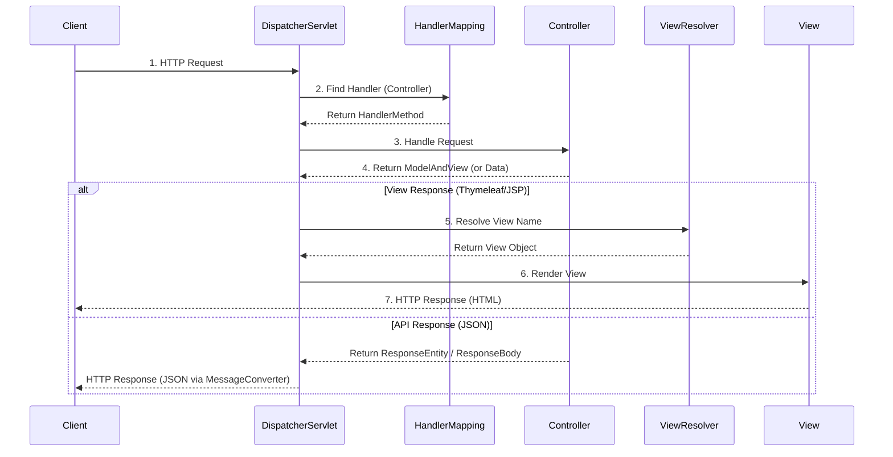

# Spring MVC (Model-View-Controller)

**Spring MVC**는 서블릿(Servlet) API를 기반으로 구축된 독창적인 웹 프레임워크입니다. **Model-View-Controller** 디자인 패턴을 도입하여 비즈니스 로직과 화면(View)을 분리하고, 웹 요청을 효율적으로 처리합니다.

## 1. MVC 패턴 구조

*   **Model:** 애플리케이션의 정보(데이터)를 나타냅니다. (DTO, Domain Object 등)
*   **View:** 사용자에게 보여주는 화면 인터페이스입니다. (Thymeleaf, JSP, JSON Response 등)
*   **Controller:** 사용자의 요청을 받아 비즈니스 로직을 호출하고, 그 결과를 Model에 담아 View로 전달하는 중개자 역할을 합니다.

## 2. 핵심 동작 원리: DispatcherServlet

Spring MVC의 핵심은 **Front Controller** 패턴을 구현한 `DispatcherServlet`입니다. 모든 클라이언트의 요청을 가장 먼저 받아 적절한 핸들러(Controller)에게 위임합니다.

### 2.1 요청 처리 흐름 (Request Lifecycle)

## 3. 주요 구성 요소

### 3.1 @Controller & @RestController
*   `@Controller`: 주로 View(HTML)를 반환할 때 사용합니다.
*   `@RestController`: `@Controller` + `@ResponseBody`. JSON/XML 형태의 데이터를 반환하는 RESTful API를 만들 때 사용합니다.

### 3.2 Service & Repository (Layered Architecture)
MVC는 주로 프레젠테이션 계층(Controller)을 담당하며, 실제 비즈니스 로직과 데이터 접근은 계층을 분리하여 관리합니다.
*   **Controller:** 요청 매핑, 파라미터 검증.
*   **Service:** 비즈니스 로직 구현, 트랜잭션 처리.
*   **Repository:** DB 접근 (DAO).

## 4. 자주 사용하는 어노테이션
*   `@RequestMapping`: 요청 URL 매핑 (클래스/메소드 레벨).
*   `@GetMapping`, `@PostMapping`, `@PutMapping`, `@DeleteMapping`: HTTP 메소드별 매핑.
*   `@RequestParam`: 쿼리 파라미터 추출 (`?name=value`).
*   `@PathVariable`: 경로 변수 추출 (`/users/{id}`).
*   `@RequestBody`: HTTP 요청 바디(JSON)를 객체로 매핑.
*   `@ResponseBody`: 객체를 HTTP 응답 바디(JSON)로 매핑.
