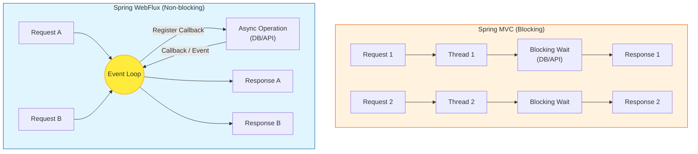

# Spring WebFlux (Reactive Stack)

**Spring WebFlux**는 Spring 5.0부터 추가된 리액티브 웹 프레임워크로, 비동기(Asynchronous)와 논블로킹(Non-blocking) 리액티브 스트림(Reactive Streams)을 지원합니다.

## 1. WebFlux vs Spring MVC

| 특징 | Spring MVC (Servlet Stack) | Spring WebFlux (Reactive Stack) |
| :--- | :--- | :--- |
| **I/O 모델** | Blocking I/O (Thread-per-Request) | Non-blocking I/O (Event Loop) |
| **기본 서버** | Tomcat (Servlet Container) | Netty (Event Loop based) |
| **동시성 처리** | 많은 스레드 필요 (Context Switching 비용 ↑) | 적은 스레드로 많은 요청 처리 (CPU 효율 ↑) |
| **적합한 사용처** | 전통적인 CRUD, 동기적 처리가 편한 경우 | 고성능, 높은 동시성, 스트리밍 서비스 |

## 2. 핵심 타입: Publisher (Reactor)

WebFlux는 [Project Reactor](https://projectreactor.io/)를 기반으로 하며, 두 가지 핵심 타입을 사용합니다.

### 2.1 Mono (`0..1`개의 데이터)
*   0개 또는 1개의 결과를 발생시키는 Publisher입니다.
*   예: `Mono<User> findById(id)`

### 2.2 Flux (`0..N`개의 데이터)
*   0개부터 N개(무한대 가능)의 결과를 발생시키는 Publisher입니다.
*   스트림 처리에 적합합니다.
*   예: `Flux<User> findAll()`

## 3. 동시성 모델 비교 다이어그램



## 4. 언제 WebFlux를 써야 할까?
*   **추천:**
    *   마이크로서비스 아키텍처(MSA)에서 서비스 간 호출이 잦은 게이트웨이(Gateway) 서비스.
    *   대용량 트래픽을 처리해야 하지만, 요청 처리 시간이 길지 않은 경우.
    *   실시간 스트리밍 데이터 처리.
*   **비추천:**
    *   단순한 CRUD 애플리케이션 (개발 복잡도가 높음).
    *   블로킹 라이브러리(JDBC 등)를 반드시 써야 하는 경우 (성능 이점 감소).
    *   팀원들이 리액티브 프로그래밍에 익숙하지 않은 경우.

## 5. 구현 방식 및 예제

Spring WebFlux는 두 가지 프로그래밍 모델을 지원합니다.

### 5.1 Annotated Controller (기존 MVC 스타일)
Spring MVC와 동일한 어노테이션(`@RestController`, `@GetMapping` 등)을 사용하되, 반환 타입이 `Mono` 또는 `Flux`입니다.

```java
@RestController
@RequestMapping("/users")
public class UserController {

    private final UserRepository userRepository;

    public UserController(UserRepository userRepository) {
        this.userRepository = userRepository;
    }

    // 단일 데이터 조회 (0 or 1)
    @GetMapping("/{id}")
    public Mono<User> getUser(@PathVariable String id) {
        return userRepository.findById(id);
    }

    // 다건 데이터 조회 (0 to N)
    @GetMapping
    public Flux<User> getAllUsers() {
        return userRepository.findAll();
    }
    
    // 스트리밍 예제 (Server-Sent Events)
    @GetMapping(value = "/stream", produces = MediaType.TEXT_EVENT_STREAM_VALUE)
    public Flux<User> streamUsers() {
        return userRepository.findAll()
                .delayElements(Duration.ofMillis(100)); // 0.1초마다 데이터 전송 시뮬레이션
    }
}
```

### 5.2 Functional Endpoints (함수형 스타일)
Java 8 람다식을 활용하여 라우팅과 요청 처리를 분리하는 방식입니다. `RouterFunction`과 `HandlerFunction`을 사용합니다.

```java
@Configuration
public class UserRouter {

    @Bean
    public RouterFunction<ServerResponse> route(UserHandler handler) {
        return RouterFunctions
                .route(GET("/users/{id}"), handler::getUser)
                .andRoute(GET("/users"), handler::getAllUsers);
    }
}

@Component
public class UserHandler {

    private final UserRepository userRepository;

    public UserHandler(UserRepository userRepository) {
        this.userRepository = userRepository;
    }

    public Mono<ServerResponse> getUser(ServerRequest request) {
        String id = request.pathVariable("id");
        return userRepository.findById(id)
                .flatMap(user -> ServerResponse.ok().bodyValue(user))
                .switchIfEmpty(ServerResponse.notFound().build());
    }

    public Mono<ServerResponse> getAllUsers(ServerRequest request) {
        return ServerResponse.ok().body(userRepository.findAll(), User.class);
    }
}
```