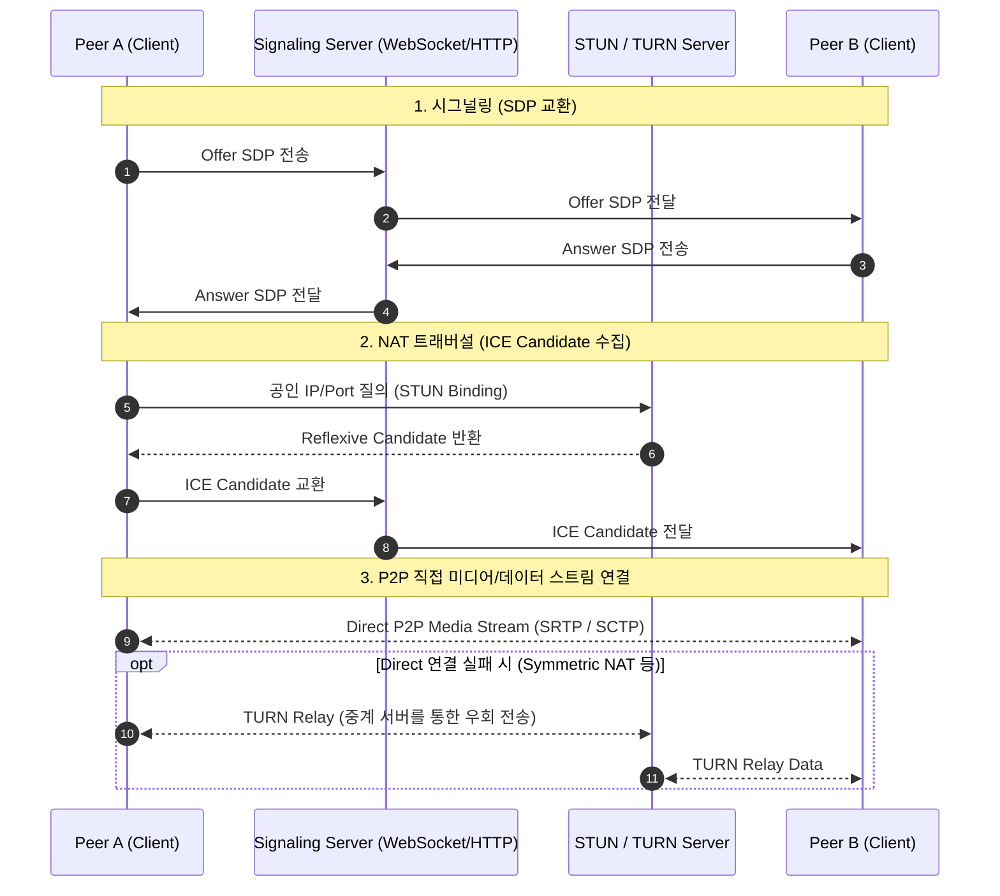

# 🌐 WebRTC (Web Real-Time Communication)

**WebRTC (Web Real-Time Communication)**는 웹 브라우저 및 모바일 애플리케이션 간에 별도의 플러그인이나 중계 서버(데이터 릴레이 제외) 없이 **P2P(Peer-to-Peer) 방식으로 실시간 음성, 영상, 데이터 스트림을 교환**할 수 있도록 W3C와 IETF가 표준화한 오픈소스 기술입니다.

---

## 1. WebRTC 핵심 아키텍처 및 통신 절차

WebRTC는 P2P 연결을 위해 **시그널링(Signaling)**과 **NAT 트래버설(NAT Traversal)** 과정을 거칩니다.



---

## 2. 주요 개념 및 프로토콜

### 1) Signaling (시그널링)
* WebRTC 표준 자체에는 시그널링 규격이 정의되어 있지 않으므로, 개발자가 WebSocket, Socket.io, SIP, HTTP 등을 통해 구현합니다.
* **SDP (Session Description Protocol)**: 오디오/비디오 코덱, 해상도, 암호화 키, 네트워크 파라미터 등의 세션 메타데이터를 교환합니다.

### 2) NAT Traversal 기술 (STUN & TURN)
* **NAT (Network Address Translation)**: 사설 IP 주소를 공인 IP 주소로 변환하는 기술입니다.
* **STUN (Session Traversal Utilities for NAT)**:
  * 클라이언트가 자신의 공인 IP와 포트 번호를 파악하여 직접 P2P 연결을 수립할 수 있도록 돕는 경량 서버입니다.
* **TURN (Traversal Using Relays around NAT)**:
  * Symmetric NAT이나 엄격한 방화벽으로 인해 직접 P2P 통신이 불가능할 때, 중간에서 모든 미디어 트래픽을 릴레이(Relay)해 주는 중계 서버입니다.
* **ICE (Interactive Connectivity Establishment)**:
  * STUN, TURN, 로컬 네트워크 주소를 조합하여 최적의 연결 경로(Candidate)를 자동으로 탐색하고 결정하는 프레임워크입니다.

### 3) 전송 계층 프로토콜
* **SRTP (Secure Real-time Transport Protocol)**: 음성 및 영상 미디어 스트림을 암호화하여 전송 (UDP 기반)
* **SCTP (Stream Control Transmission Protocol)**: WebRTC DataChannel을 통해 신뢰성/비신뢰성 임의 데이터를 양방향 전송 (DTLS 암호화 적용)

---

## 3. 브라우저 UDP 포트 범위 설정

엔터프라이즈 방화벽 환경이나 고정 포트 정책이 필요한 경우 브라우저 레벨에서 WebRTC UDP 포트 범위를 제한할 수 있습니다.

### Chrome 정책 설정 (`WebRtcUdpPortRange`)
Chrome 브라우저의 정책 설정을 통해 로컬 UDP 포트 범위를 지정할 수 있습니다:

```bash
# Linux (Chrome Policy) 예시: /etc/opt/chrome/policies/managed/webrtc_policy.json
{
  "WebRtcUdpPortRange": "10000-20000"
}
```

* **Windows**: `HKEY_LOCAL_MACHINE\SOFTWARE\Policies\Google\Chrome` 경로에 `WebRtcUdpPortRange` (REG_SZ) 등록
* **지원 기능**: 지정한 포트 범위 내에서만 WebRTC 미디어 채널이 바인딩되도록 강제하여 보안 정책을 준수할 수 있습니다.

---

## 4. References
* [W3C WebRTC 1.0: Real-Time Communication Between Browsers](https://www.w3.org/TR/webrtc/)
* [MDN Web Docs - WebRTC API](https://developer.mozilla.org/ko/docs/Web/API/WebRTC_API)
* [RFC 5245: Interactive Connectivity Establishment (ICE)](https://tools.ietf.org/html/rfc5245)
