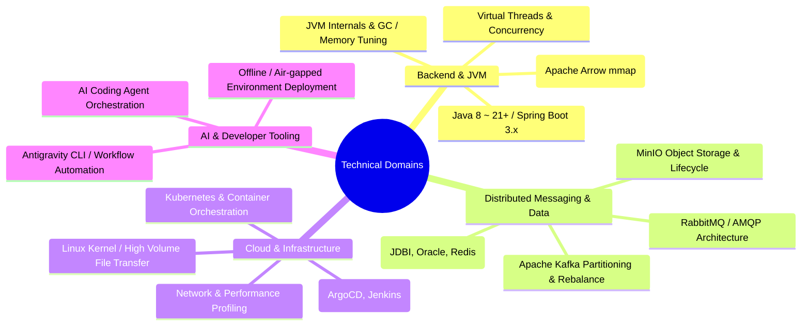

# 📚 My TIL (Today I Learned) Wiki

> **"대용량 트래픽, 분산 시스템, 그리고 성능 최적화에 대한 실무 지식과 배움을 기록하는 기술 위키입니다."**

복잡한 시스템의 병목을 진단하고, JVM/가상 스레드, 분산 메시징(Kafka), Zero-copy 메모리 공유, 클라우드 네이티브(K8s) 환경에서 신뢰성 높은 아키텍처를 설계하고 운영한 경험과 기술적 깊이를 기록합니다.

---

## 🎯 기술 도메인 및 핵심 역량

---

## 🚀 대표 기술 분석 & 트러블슈팅

| Category | Deep-Dive Article | Key Topic & Impact |
| :--- | :--- | :--- |
| **Concurrency / JVM** | [**Java Virtual Threads: FTP Pinning 이슈 분석**](Language/Java/Virtual_Threads_FTP_Pinning.md) | 레거시 라이브러리의 `synchronized`로 인한 캐리어 스레드 고갈 및 락 최적화 |
| **High Performance** | [**Apache Arrow & mmap 기반 Java-Python Zero-Copy 데이터 교환**](Language/Java/Java_Python_Shared_Memory_Arrow.md) | IPC 오버헤드 제거 및 공유 메모리 매핑을 통한 대용량 데이터 전송 극대화 |
| **Distributed Queue** | [**Kafka Producer Partitioner 진화 및 파티션 불균형 해결**](Infrastructure/MessageBroker/Kafka/Partitioner_Evolution_and_Imbalance.md) | DefaultPartitioner 변경에 따른 메시지 쏠림 원인 분석 및 배치 전략 튜닝 |
| **Cloud / Database** | [**JDBI 가상 스레드 Pinning 해결 및 하이브리드 풀링**](Language/Java/SpringBoot/JDBI_VT_Pinning_Solution.md) | DB Blocking I/O 구간에서 가상 스레드 고갈 방지 및 전용 풀링 아키텍처 구축 |
| **Storage Engine** | [**MinIO 버저닝 활성화 환경에서의 파일 영구 삭제 메커니즘**](Troubleshooting/MinIO_Versioning_Deletion_Issue.md) | Delete Marker 누적에 따른 스토리지 비대화 해결 및 라이프사이클 튜닝 |
| **AI Engineering** | [**AI Coding Agent Orchestrator 아키텍처 비교**](AI/AI_Coding_Agent_Orchestrators_Orca_Paseo.md) | 멀티 에이전트 오케스트레이션 및 엔지니어링 생산성 자동화 파이프라인 |

---

## 🧭 위키 카테고리 안내

왼쪽 사이드바의 목차 또는 아래 링크를 통해 각 도메인의 상세 기술 문서를 탐색할 수 있습니다:

* ☕ **[Language](Language/README.md)**: Java(JVM 내부 동작, Virtual Threads, Spring Boot 3.4), Python(FastAPI, Pika, Concurrency), Node.js(libuv)
* 🏗️ **[Infrastructure](Infrastructure/README.md)**: Kafka 파티셔닝/컨슈머, Kubernetes, Docker 이미지 전략, ArgoCD & Jenkins 파이프라인, MinIO, Linux
* 💾 **[Data & Storage](Data/README.md)**: 분산 데이터베이스, 락킹 전략, Oracle LOB 튜닝, Redis 캐싱, 로그 수집 아키텍처
* 🧠 **[AI & LLM Development](AI/README.md)**: AI 코딩 에이전트, Antigravity CLI(agy) 스킬 개발, LLM 개발 체크리스트
* 🏛️ **[Computer Science](ComputerScience/README.md)**: 고가용성 아키텍처, 디자인 패턴, 분산 파일시스템(HDF5/LMDB), 보안(OAuth2/OIDC/JWT), 네트워크(OSI 7 Layer, Socket, RPC)
* ⚙️ **[Tools](Tools/README.md)**: Git 고급 기능(Monorepo, Submodules), Maven 빌드/Shade 플러그인, Spotless 코드 포맷팅
* 🛠️ **[실전 트러블슈팅 아카이브](Troubleshooting/README.md)**: 실무에서 발생한 복잡한 장애/병목에 대한 근본 원인 분석 및 해결 사례 모음
* 📄 **[이력서 초안 (Resume Profile)](Resume.md)**: 별도 프론트엔드 포트폴리오 프로젝트용 경력 및 프로젝트 원본 데이터

---

## 📬 Links

* 💻 **GitHub**: [https://github.com/DevDooly](https://github.com/DevDooly)
* 🌐 **TIL Wiki**: [https://devdooly.github.io/TIL/](https://devdooly.github.io/TIL/)
* 🕒 **[최근 변경 내역 (Recent Changes)](Recent_Changes.md)** | 📚 **[전체 사이트맵 (Sitemap)](Sitemap.md)**
