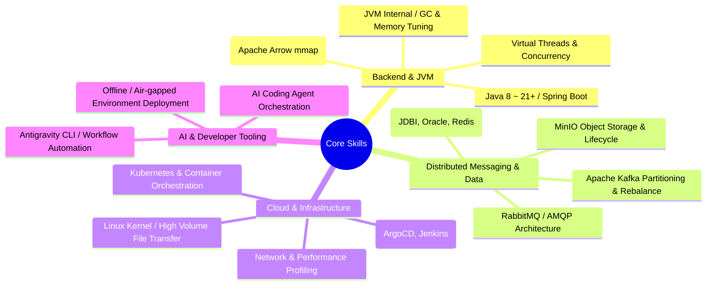

# 👨‍💻 Engineering Portfolio & Tech Archive

> **"대용량 트래픽, 분산 시스템, 그리고 성능 최적화에 깊은 관심을 가진 백엔드 & 분산 시스템 엔지니어입니다."**

복잡한 시스템의 병목을 진단하고, JVM/가상 스레드, 분산 메시징(Kafka), Zero-copy 메모리 공유, 클라우드 네이티브(K8s) 환경에서 신뢰성 높은 아키텍처를 설계하고 운영한 실무 경험과 기술적 깊이를 기록합니다.

---

-   :material-card-account-details: **[온라인 이력서 (Resume)](Resume.md)**

    ---

    경력 사항, 프로젝트 수행 이력, 핵심 기술 스택 및 문제 해결 성과를 확인하실 수 있습니다.

    [:octicons-arrow-right-24: 이력서 바로가기](Resume.md)

-   :material-bug-check: **[실전 트러블슈팅 아카이브](Troubleshooting/README.md)**

    ---

    가상 스레드 Pinning, Kafka 파티션 불균형, 분산 네트워크 지연 등 실무에서 디버깅하고 해결한 심층 사례 모음입니다.

    [:octicons-arrow-right-24: 트러블슈팅 보기](Troubleshooting/README.md)

---

## 🎯 Core Competencies

---

## 🚀 Featured Engineering Deep-Dives

실무에서 깊이 파고들어 문제를 해결하거나 시스템을 최적화한 대표 기술 문서입니다.

| Category | Deep-Dive Article | Key Topic & Impact |
| :--- | :--- | :--- |
| **Concurrency / JVM** | [**Java Virtual Threads: FTP Pinning 이슈 분석**](Language/Java/Virtual_Threads_FTP_Pinning.md) | 레거시 라이브러리의 `synchronized`로 인한 캐리어 스레드 고갈 및 락 최적화 |
| **High Performance** | [**Apache Arrow & mmap 기반 Java-Python Zero-Copy 데이터 교환**](Language/Java/Java_Python_Shared_Memory_Arrow.md) | IPC 오버헤드 제거 및 공유 메모리 매핑을 통한 대용량 데이터 전송 극대화 |
| **Distributed Queue** | [**Kafka Producer Partitioner 진화 및 파티션 불균형 해결**](Infrastructure/MessageBroker/Kafka/Partitioner_Evolution_and_Imbalance.md) | DefaultPartitioner 변경에 따른 메시지 쏠림 원인 분석 및 배치 전략 튜닝 |
| **Cloud / Database** | [**JDBI 가상 스레드 Pinning 해결 및 하이브리드 풀링**](Language/Java/SpringBoot/JDBI_VT_Pinning_Solution.md) | DB Blocking I/O 구간에서 가상 스레드 고갈 방지 및 전용 풀링 아키텍처 구축 |
| **Storage Engine** | [**MinIO 버저닝 활성화 환경에서의 파일 영구 삭제 메커니즘**](Troubleshooting/MinIO_Versioning_Deletion_Issue.md) | Delete Marker 누적에 따른 스토리지 비대화 해결 및 라이프사이클 튜닝 |
| **AI Engineering** | [**AI Coding Agent Orchestrator 아키텍처 비교**](AI/AI_Coding_Agent_Orchestrators_Orca_Paseo.md) | 멀티 에이전트 오케스트레이션 및 엔지니어링 생산성 자동화 파이프라인 |

---

## 🛠 Tech Stack Overview

### Languages & Frameworks

### Messaging & Storage

### Infrastructure & DevOps

---

## 🧭 Navigation Guide

* ☕ **[Language](Language/README.md)**: Java(JVM 내부 동작, Virtual Threads, Spring Boot 3.4), Python(FastAPI, Pika, Concurrency), Node.js(libuv)
* 🏗️ **[Infrastructure](Infrastructure/README.md)**: Kafka 파티셔닝/컨슈머, Kubernetes, Docker 이미지 전략, ArgoCD & Jenkins 파이프라인, MinIO, Linux
* 💾 **[Data & Storage](Data/README.md)**: 분산 데이터베이스, 락킹 전략, Oracle LOB 튜닝, Redis 캐싱, 로그 수집 아키텍처
* 🧠 **[AI & LLM Development](AI/README.md)**: AI 코딩 에이전트, Antigravity CLI(agy) 스킬 개발, LLM 개발 체크리스트
* 🏛️ **[Computer Science](ComputerScience/README.md)**: 고가용성 아키텍처, 디자인 패턴, 분산 파일시스템(HDF5/LMDB), 보안(OAuth2/OIDC/JWT), 네트워크(OSI 7 Layer, Socket, RPC)
* ⚙️ **[Tools](Tools/README.md)**: Git 고급 기능(Monorepo, Submodules), Maven 빌드/Shade 플러그인, Spotless 코드 포맷팅

---

## 📬 Contact & Links

* 💻 **GitHub**: [https://github.com/DevDooly](https://github.com/DevDooly)
* 🌐 **Portfolio Wiki**: [https://devdooly.github.io/TIL/](https://devdooly.github.io/TIL/)
* 🕒 **[최근 변경 내역 (Recent Changes)](Recent_Changes.md)** | 📚 **[전체 사이트맵 (Sitemap)](Sitemap.md)**
